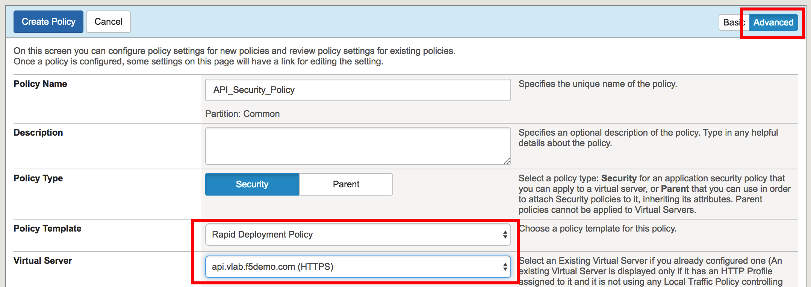
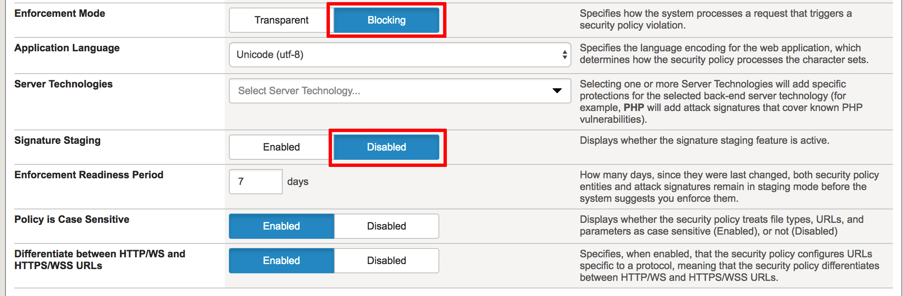
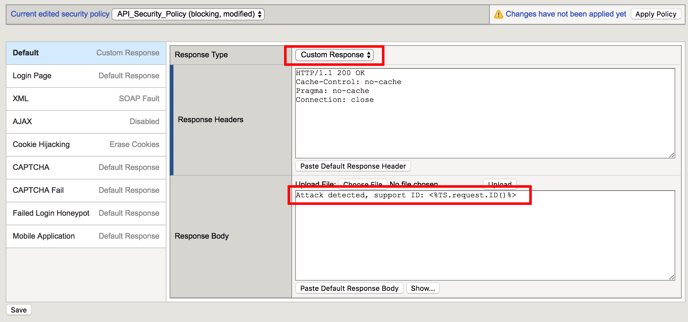
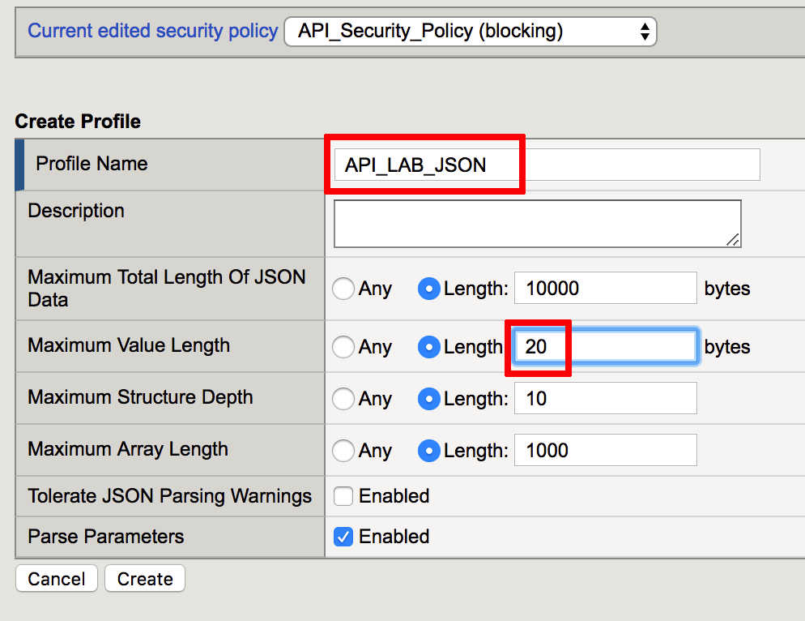
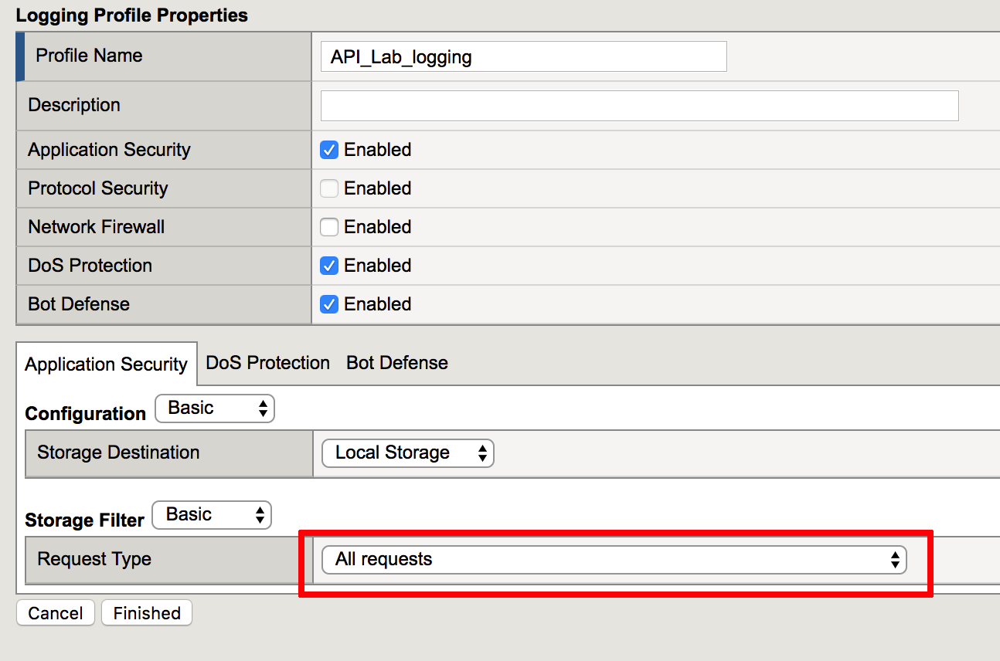
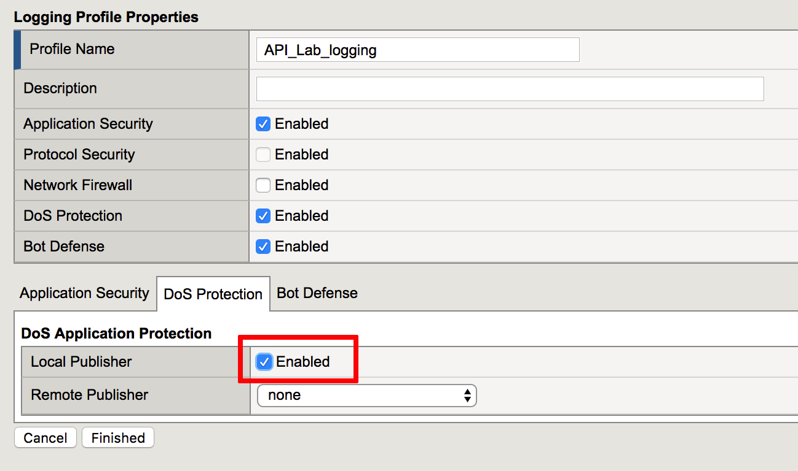
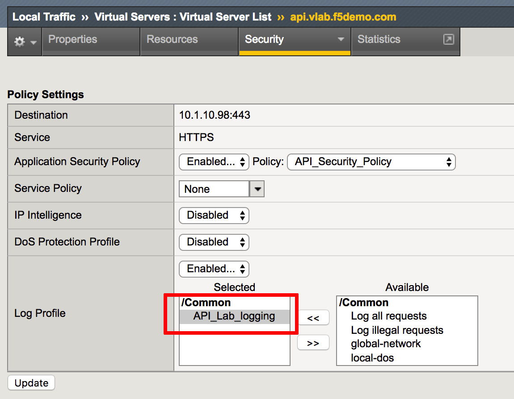

Base API Security Policy
=========================================

.. toctree::
   :maxdepth: 1
   :glob:

If you want to skip configuration section and use prebuilt objects proceed to `policy binding. <#binding>`__  Keep in mind, you will have to use objects with **prebuilt** suffix.

Create a new Application Security Policy
------------------------------------------------

In this task, you will create a Rapid deployment new application
security policy.

1. Log into TMUI

2. Create new Application Security policy (Security -> Application
   Security -> Security Policies).

3. Define the policy name “API\_Security\_Policy”

4. Switch into Advanced mode on the top right corner. Select policy template in the dropdown menu - **Rapid Deployment Policy**

5. Select Virtual Server in the dropdown menu - **api.vlab.f5demo.com**

6. Change Enforcement Mode into **Blocking** and Signature Staging into **Disabled**. Make sure "Policy is Case Sensitive" and "Differentiate between HTTP/WS and HTTPS/WSS URLs" are set to **Enabled**

7. Click **Create Policy** in the upper left corner. The policy will be created and assigned to Virtual Server

Create custom response for API Security
----------------------------------------

In this task you will create response action when triggered API Security policy violation.

1. Navigate to response page (Security -> Application Security -> Policy -> Response Pages).

2. Select **Custom Response** in the Response Type dropdown menu. Replace default response in Response Body with **Attack detected, support ID: <%TS.request.ID()%>**

3. Click Save

Create JSON profile for API Security
-------------------------------------

In this task you will create JSON profile which will be used in API security policy.

1. Navigate to Security -> Application Security -> Content Profiles -> JSON Profiles and click Create

2. Specify profile name **API_LAB_JSON** and Maximum Value Length **20** bytes, other settings should remain default

3. Click Create

4. Click on Apply Policy

Create a new Logging profile
------------------------------------

In this task, you will create a logging profile to log all requests.

1. Create logging profile (Security -> Event Logs -> Logging Profiles). Define a name **API_Lab_logging** and set checkboxes for **Application Security**, **DoS Prevention** and **Bot Defense**

2. On the Application Security tab for the Request Type select **All requests**

3. On the DoS Protection tab set Local Publisher into **Enabled**

4. On the Bot Defense tab set to **Enabled** all available options as per screenshot below.

 .. image:: images/image385.png

5. Click Finished

Binding
------------------------------------

1. Apply the “API\_Lab\_Logging” profile to the virtual server. Navigate to Local Traffic => Virtual Servers => Virtual Server List, select **api.vlab.f5demo.com** and click the Security tab and move in Log profile API\_Lab_Logging to selected.

.. NOTE::
   If you are using prebuilt objects, make sure you enable **Application Security Policy** and specify the policy **prebuilt_API_Security_Policy**

2. Click Update.
