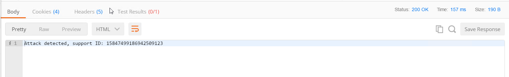
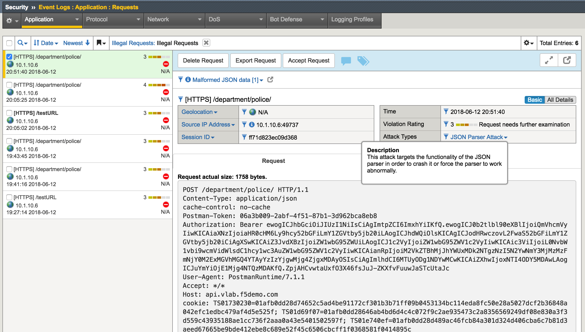

Illegal Content Type Protection
=========================================

.. toctree::
   :maxdepth: 1
   :glob:

In this module you will examine security controls for checking allowed content type within API calls. You will use Postman client to simulate API call with illegal content-type. If you are using prebuilt objects proceed to `policy validation. <#validation>`__  Keep in mind, you will have to use objects with **prebuilt** suffix.

Examine unprotected API environment
-----------------------------------

1. Launch Postman application

2. Click Collections -> HR_API_Illegal -> Non-JSON request. Click **Body** and examine the payload of API POST call

 .. image:: images/image398.png

3. Make sure authorization type is set to **OAuth 2.0**. From the list of available tokens select **hruser** and click **Preview Request**. Then click **Send**

 .. image:: images/image390.png

3. Examine the output

 .. image:: images/image397.png

At this time we don't have any specific security policy related to illegal content type, so the API call is expected to come through. API server is not able to decode non-JSON payload.

Illegal content type protection configuration
----------------------------------------------

1. In the BIG-IP GUI go to Security -> Application Security -> URLs —> Allowed URLs -> Allowed HTTP URLs

2. Click on **/department***

3. Select **Header-Based Content Profiles** tab and define **Content-Type** in the Request Header Name form

4. In the Request Header Value form specify ***json***

5. In the Request Body Handling dropdown menu select **JSON** and in the Profile Name specify **API_LAB_JSON**

 .. image:: images/image500.png

6. Click Add, Update and Apply Policy

Validation
-----------------------------------

1. Go back to Postman and run **Non-JSON request** again - this API call should be blocked

2. In the BIG-IP GUI to Security -> Event Logs -> Application - Requests and examine the last log message

