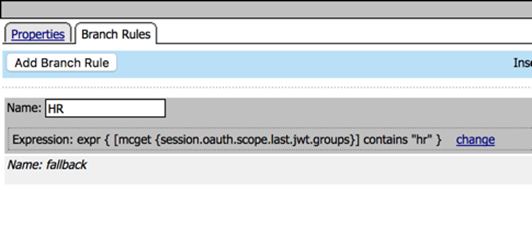

Adding Fine-Grain Authorization
==============================================

.. toctree::
   :maxdepth: 1
   :glob:

Adding Fine-Grain Authorization
-------------------------------

In this module you will add fine-grain controls to your policy to
restrict access to parts of the API based on parameters in the JWT. The
example will relate to user group membership, but it could be many
parameters (e.g. company, user, group, as source, etc).

The goal is to restrict access to any person's API requests to only
members of the HR department.

You can complete this lab using prebuilt objects to save time
or create your own. If you are using prebuilt objects, skip ahead to `policy validation. <#validation>`__

------------------------------------------------

Add URL Branching to the Per Request Policy
---------------------------------------------------------------------------------

In this task you will add URL branching and a groups check to the per request policy

1.	Go to Access -> Profiles / Policies -> **Per Request Policies**

2.	Click Edit on **api-prp**

3.	Clik the **+** between Start and Allow

4.  Select the **General Purpose** tab

5.	Select **URL Branching** from the General Purpose tab and click **Add Item**

6.	Click the **Branch Rules** tab

7.	Change the name of the branch rule from Allow to person

8.	Click **change** on the rule

9.	Change URL Contains from domain.com to /person

10.	Click **Finished**

11.	Result should look like this:

 .. image:: images/image52.png

12.	Click **Save**

13.	On the fallback branch change Reject to Allow. The result should look like this:

 .. image:: images/image53.png

Add Groups Check to the Per Request Policy
---------------------------------------------------------------------------------

 In this task you will add a group check to the URL branch created in the last step

1.	Click **+** on the person branch between URL Branching and Allow

2.	Select **Empty** from the General Purpose tab and click **Add Item**

3.	Change Name to **“Group Check”**

4.	Click **Branch Rules** tab

5.	Click **Add Branch Rule**

6.	Change name to **HR**

7.	Click **change** on the expression

8.	Click **Advanced** tab

9.	Enter the following in the advanced box:

	**expr { [mcget {session.oauth.scope.last.jwt.groups}] contains "hr" }**

10.	Click **Finished**, the result should look like this:

11.	Click **Save**

12.	On the branches after Group Check change the endings as follows:

::
	HR -> Allow

	Fallback -> Reject

The result should be:

.. image:: images/image55.png

Validation
---------------------------------------------------------------------------------

In this task you will test the settings you just put in the per request
policy. You are expecting to be denied access to the /person URL because
**employeeuser** is not in the **HR** group that you have marked as a required
value in the JWT.

1. On the left side, select **List Employee Record**. It will now appear
   in another tab in the middle section and you should select it if it
   is not already.

2. Under Authorization type select **OAuth 2.0** for the type

3. From the **Available Tokens** drop down, select **employeeuser**

4. Make sure Add Authorization Data is set to **Request Headers**

5. Click **Preview Request** and note the header has been inserted

 .. image:: images/image30.png

6. Click **Send**

7. The result should be a **401 unauthorized** with no data in the body.
   The header will report an invalid token.

 .. image:: images/image31.png

You were denied access because the JWT retrieved by this user is not
allowed to access that data. We can resolve this by using credentials
that will generate a JWT valid for this request.

Acquire a JWT for hruser and validate it can access /person
-----------------------------------------------------------

In this task you will get another JWT and use that to gain access to the
/person portion of the API.

1.  Click **Get New Access Token**

 .. image:: images/image32.png

2.  Change the token name to **hruser**, the rest of the settings should
    be already correct.

 .. image:: images/image33.png

3.  Click **Request Token**

4.  Select **hruser** at the logon page and press logon.

 .. image:: images/image34.png

5.  A JWT should be returned and your JWT management token window will
    look like this:

 .. image:: images/image35.png

6.  Notice you now have two tokens, and click the X to close the window

7.  Select **hruser** from the Available Tokens drop down

8.  Click **Preview Request**

 .. image:: images/image36.png

9.  Click Send, you should get a 200 OK response and data in the
    response body like this:

 .. image:: images/image37.png

10. You can now change the token used on any request by using this
    process:

    a. Select the request

    b. Select the Authorization tab

    c. Select OAuth 2.0 from the type drop down menu

    d. Select the correct token from the Available Tokens drop down menu

    e. Make sure Authorization Data is set to Request Headers

    f. Click Preview Request to add the token to the headers

    g. Click Send on the request

In this module we’ve used group membership to restrict access to
particular URIs, but in production you may encounter many different
variations. For example, an iRule can set an APM session variable equal
to the request method (e.g. GET, POST, etc) and then in the Per Request
Policy you can branch on method, only allowing POST from certain users,
groups, IPs, etc

JWTs are typically short lived and may or may not use refresh tokens. In
this lab the JWTs have been set as valid for several hours so you will
not need to get new JWTs during the lab.
