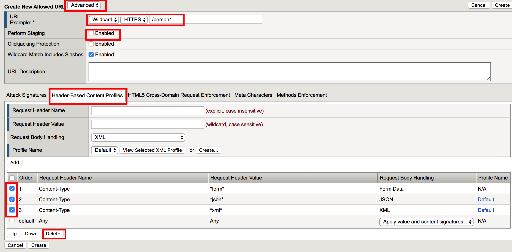
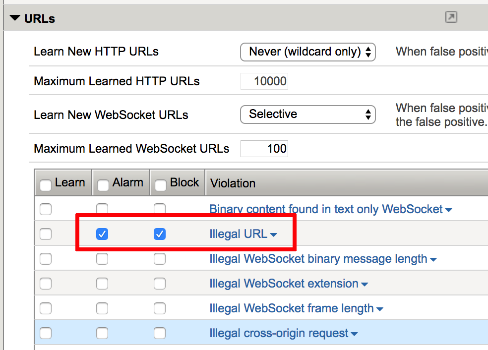
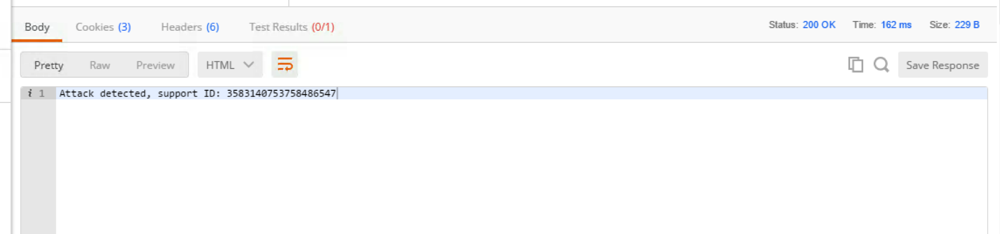
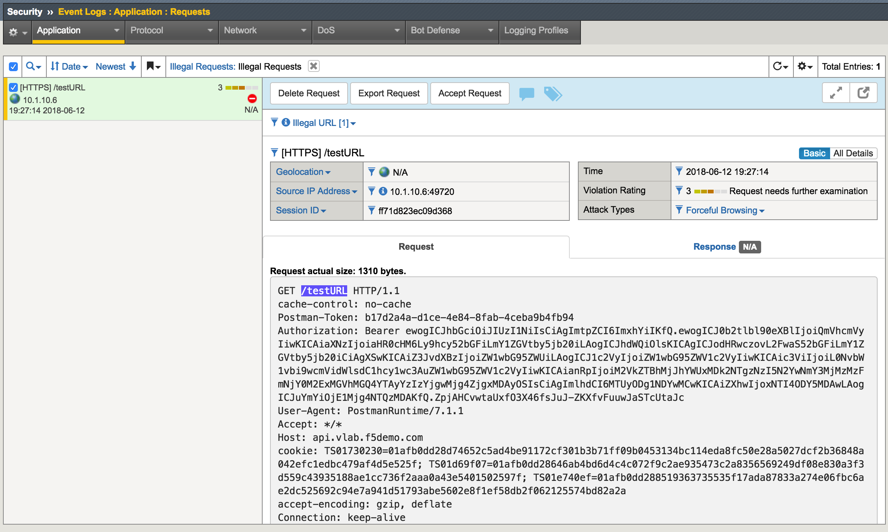

Illegal URL Protection
=========================================

.. toctree::
   :maxdepth: 1
   :glob:

In this module you will examine security controls for accessing allowed URLs with API calls. You will use Postman client to simulate API call to illegal URL. If you are using prebuilt objects proceed to `policy validation. <#validation>`__  Keep in mind, you will have to use objects with **prebuilt** suffix.

Examine unprotected API environment
-----------------------------------

1. Launch Postman application

2. Click Collections -> HR_API_Illegal -> Disallowed URL. Make sure authorization type is set to **OAuth 2.0**. From the list of available tokens select **hruser** and click **Preview Request**. Then click **Send**

 .. image:: images/image390.png

3. Examine the output

 .. image:: images/image391.png

API call have passed through access control checks because security token is still valid. At this time we don't have any specific security policy related to illegal URL so the API call is expected come through. Although this URL is not exist on the API server, hence the response from the back end is expected.

Illegal URL protection configuration
--------------------------------------

1. In the BIG-IP GUI go to Security -> Application Security -> URLs —> Allowed URLs -> Allowed HTTP URLs

2. Select both wildcard items, click **Delete** and confirm your selection

3. Click **Create** and define allowed URL - Select **Advanced** from dropdown menu, define **Wildcard** and **HTTPS**; in the URL form specify **/person*** and uncheck checkbox **Perform Staging**. Select **Header-Based Content Profiles** and delete items 1, 2 and 3.

4. Click **Create**

5. Create another URL **/department*** with the same settings

6. Go to Security -> Application Security -> Policy Building -> Learning and Blocking Settings

7. Expand **URLs** section and set checkboxes for **Illegal URL** violation for "alarm" and "block"

8. Click Save on the bottom of the screen and Apply Policy in the top right corner. You have just defined allowed URLs. Everything which is not allowed should be blocked by security policy

Validation
-----------------------------------

1. Go back to Postman and run **Disallowed URL** API call again - this API call should be blocked

2. In the BIG-IP GUI to Security -> Event Logs -> Application - Requests and examine the last log message

3. Go back to Postman, expand **HR_API** collection, make sure you are using **hruser** token just like in the previous task and run the API call - it should return the list of departments
