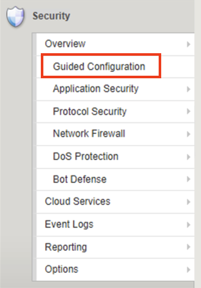
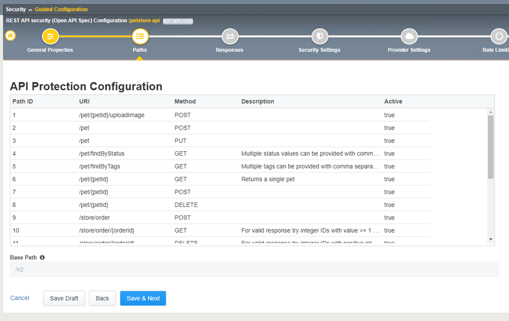
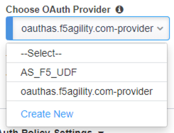
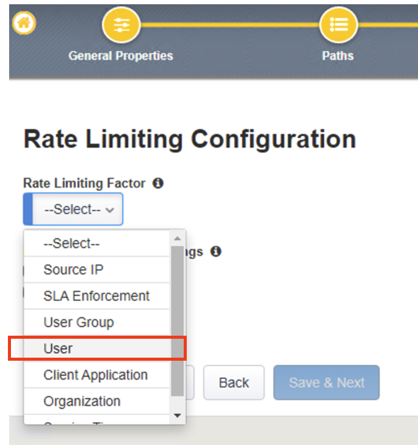
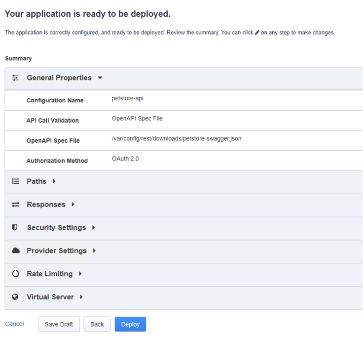
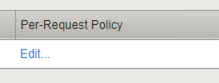

Lab 2 - Protecting API Endpoints
===================================

**Narrative:** PetStore realizes the API endpoints they recently exposed are susceptible to many security 
vulnerabilities. We will deploy the API Security Protection Guided Configuration in F5 Application Security 
Manager module to help PetStore secure their API endpoints. 

1. Open Google Chrome > in the bookmark click on F5 BIG-IP. 

.. image:: images/chrome2.png

2. Log in with username/password: **admin/admin**

.. image:: images/f5_login.png

3. Click on **Security** > **Guided Configuration**

4. Click on **API Security Protection** > Click on **REST API Security** > Click **Next**

.. image:: images/security-gc2.png

.. image:: images/security-gc3.png

5.  In the **API Protection Properties** set the following properties

    **Configuration Name:** petstore-api
    **Import OpenAPI Spec File** click on **Choose File** in the File Explore window 
    click on petstore-swagger.json file > Click **Open** 

    If you do not see the JSON file click on lab_files folder on the left pane of the explore window, this should open the lab_files directory.

.. image:: images/swagger.png
    
    
Check **Use Rate Limiting** box
Check **OAuth 2.0** box
**DNS Resolver:** DNS_pub

The result should be like the following, Click **Save** and **Next**

.. image:: images/security-gc4.png
  :width: 600 px

6.  **API Protection Configuration** step shows the imported paths and base path properties
    imported from the swagger file you imported in the previous step.
    Click **Save** and **Next**

7.	**API Protection Responses** shows the response code that will be used for Access Control, and Rate Limiting.
    Click **Save** and **Next**
 

.. image:: images/security-api-responses.png

8. Web Application Security Policy Properties step sets F5 Application Security Manager Enforcement mode to either blocking or transparent mode. 
   
   **Blocking** enforcement mode, the system will start blocking either connection from attacking IP addresses or requests to attacked URLs. 

   **Transparent** enforcement mode, the system does not block the request but instead reviews and logs the violation event. 

    In the lab we will leave the setting to **Blocking** > Click **Save** and **Next**

.. image:: images/security-gc5.png

9.  In the **OAuth General Properties step**, the setting allows for the BIG-IP to act as an OAuth provider 
    to request a JSON Web Token also known as a JWT token from the Authorization Server. 

    Note: OpenID Connect is not used in this scenario, even though it can be used as a way to help identify attributes to use for rate limiting. 

    In this step please select the following

    **OAuth Provider Type:** F5
    **Choose OAuth Provider** click on the drop-down and select **oauthas.f5agility.com-provider**

    The result should look like the screen below, click **Save**

.. image:: images/security-oauth.png

10.  In the **OAuth Provider List** screen confirmed the OAuth provider selected from the previous 
     step is shown here, then click **Save** and **Next**

.. image:: images/security-gc7.png

    The pre-configured provider allows for OAuth authorization for the user, using a LocalDB on the APM device. 
    Access Tokens are issued from APM and included in the token are certain claims which we can use to determine 
    the rate limiting, which are configured in Step 11.

11.  **Rate Liming Configuration** step, sets the maximum number of requests that are allowed
     in a time interval. When the threshold is met the request is dropped. 
    
    For this lab set the following criteria:

    **Rate Limiting Factor:** User

    User ID Key: **subsession.oauth.scope.last.jwt.family**
    Check **Enable Rate Limiting Settings** box
    Allow **5** requests per **1** minute

    The end result should look like the following, Click **Save** and **Next**

.. image:: images/security-gc9.png

12.  In the Virtual Server Properties screen allows for the creation of a new virtual server or use 
     an existing virtual server.

    Check the **Assign Policy to Virtual Server(s)** box

    **Virtual Server** select the **Use Existing** radio button

    Assign **Virtual Servers** > Select **VS_API_petstore** virtual server and move it to the right
    **Selected** box as in the diagram below, click **Save** and **Next**

.. image:: images/security-gc10.png

13.  Summary step, click on **Deploy**

     Note: this step may take a minute to complete. 

14.  When the deployment is completed successfully and deployed, you should see the following screen

.. image:: images/security-gc12.png

    Click Finish at the bottom. This should take you back to the Guided Configuration dashboard. 
    The new policy you created should show up on the list green, and deployed. 

.. image:: images/security-gc13.png

15.  Let’s verify an Access Policy Manager API Protection policy was created for the Authentication request. 

     Click on Access Module > Click on API Protection

.. image:: images/apm-auth1.png

    Observe an Access Policy was automatically created from the Application Security Guided Configuration in the previous exercise

.. image:: images/apm-auth2.png

   Click on **Edit** link under Per-Request Policy to open the Visual Policy Editor

   Observe the authentication and authorization flow. Click **Close** at the top right-hand corner. 

.. image:: images/apm-auth4.png

16.  Let’s verify the Access Policy and Security Policy have been applied to the PetStore virtual server.

     Click on **Local Traffic** module, click **Virtual Servers**

.. image:: images/ltm-vs1.png

     At the top right corner find the **Partition box**, click on the drop-down arrow, and switch to 
     the **petstore-prod** partition

    Click on the **VS_API_petstore** virtual server listen on port 443

.. image:: images/ltm-vs-list.png

    Scroll down to **API Protection**, verify **petstore-api** Access Policy is applied 

.. image:: images/ltm-vs5.png

   Scroll to the top, select **Security** tab > Policies, verify **Application Security Policy** is set to
   **Enabled** and the **petstore-api** Application Security Policy is applied

.. image:: images/ltm-vs7.png

17.  Now the Access Policy has been deployed, let’s go back to the Postman Collection and see
     what the behavior is now that we have applied the policy. 

     Click on the **Place Order for Pet Request** under **PetStore** > **Test API** 

.. image:: images/pm-place-order.png

    
     Noticed the Status is 403 Forbidden. The Access Policy Manager is blocking the access 
     because no authentication was passed in the request. 

18.  Let’s set the authentication using a JSON web token (JWT)

     Click on the **Authorization** tab > Click on the drop-down arrow under **Type**, Select **OAuth2.0**

.. image:: images/pm-authorize-place-order.png

.. image:: images/pm2-auth2.png  

     In the **Configure New Token** window scroll down to the bottom. 

     It is security best practice to set variables to hide Auth URL, Access Token URL, Client ID, and
     Client Secret as seen in the image below. These values are configured as part of the APM 
     Access->Federation->OAuth Client /Resource Server -> OAuth Server -> Client Settings
     and would be provided in a production environment as part of the application configuration.

    Click on the orange button **Get New Access Token**

 .. image:: images/pm2-get-token.png 

    Note: if you are still having authentication problems sending the request through, you can try
    clicking on the **Clear cookies** button above the Get New Access Token.
 
    In the pop window for authentication, enter username: **user1** and password: **user**, and click 
    **Logon**

 .. image:: images/pm2-userauth.png

    In the next screen, click on **Authorize**

 .. image:: images/pm-auth-approval.png 

    Click on **Proceed**   

 .. image:: images/pm2-auth-complete.png 

    A JWT token name user1-oauth has been created. Click on Use **Token**

 .. image:: images/pm2-token.png 

    Send the request for **Place Order for Pet** through again by clicking the blue **Send** button

.. image:: images/pm2-petorder-ok.png

    Notice the request status now is 200 OK

19.  Let’s try sending some attack requests to the API endpoints
     
     In Postman PetStore collection go to the Attacks folder. Select a couple of attack requests
     and send the requests. What is the response code? 

.. image:: images/pm-injection1.png

20.  Testing Rate Limiting

     Next, we will validate the rate limit setting defined in the Security Policy is working as expected.
     Recall in the security policy we set the rate-limiting factor as the user and the session famil
     name. This information is how the security policy identifies requests. If there are more than 5
     API requests in 1 minute, the 6th request will not be processed. 

     1. In the Windows 2019 host, open Postman
     2. Click on **Check Status of Order** request and click **Send** once. Observe a successful 200
        response. Now click **Send** 5 more times, and noticed the response error message. 

.. image:: images/pm-api-requests.png