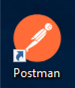
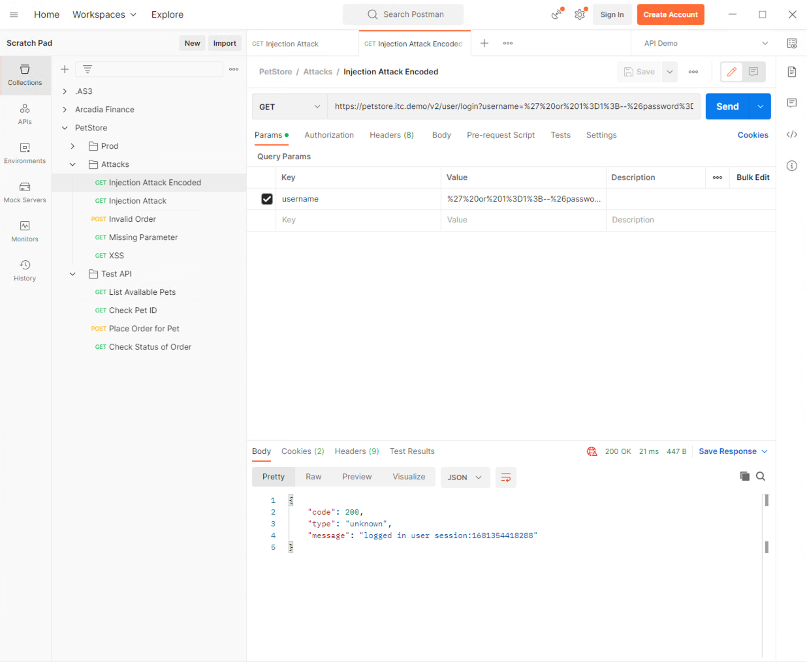

Lab 1 - Uprotected API
==========================================

**Narrative** PetStore has exposed their web application API via an HTTPS virtual server. We will demonstrate some of the vulnerabilities of leaving these endpoints unprotected. 

1. Go to the UDF course and Log into the Client Workstation

.. image:: images/access_method.png

2. Click the Access > RDP and this will download the RDP shortcut link locally
   
3. Open the RDP session, and type the following username/password: **user**/**user** > Click **Continue**

.. image:: images/rdp_win.png

4. You may get a certificate validatity security warning, click **Continue.**
   
   

.. image:: images/certificate-warning.png

5. In the Windows Client Workstation open the **Postman Desktop** application. There should be a shortcut on the desktop. 
   

6. In the *Postman Desktop* application, expand the **PetStore Collection**, and **Test API** folder 

.. image::  images/postman_test_api1.png

7. Click on **List Available Pets** request but **'do not'** click **Send** yet
Observe Authorization, Headers, and the GET request
Notice the auth type, and Headers we’re passing in the request. 

8. Click on **Send** at the far-right side of the Postman window.
Observe the request Status is 200 Ok, in the body of the API response lists all the available pets.

9.	Let’s run through the same steps above on the **Place Order** for Pet and **Check Status** of Order requests.

What is the cause for concern with these last two requests? What will happen if numerous requests are sent to the server? 

10.	Let’s run through the same steps as the previous two exercises but this time we will simulate an injection attack. 
In Postman, click on the **Attacks** folder under **PetStore**, and click on the **Injection Attack request**. 
Observe the request URL, and the Parameters, click **Send**. Observe the response. Was the request successful? Why is this a concern?

What these exercises demonstrate are common security vulnerabilities of unprotected API endpoints. 
Even simple query API like List Available Pets can be susceptible when hundreds or thousands of requests are being sent to the server causing the server resource to be overloaded. 
To protect API endpoints from attacks, ensure proper authorization, and reduce resource starvation, we can implement solutions such as F5 Application Security Manager API Security Protection configuration. 

