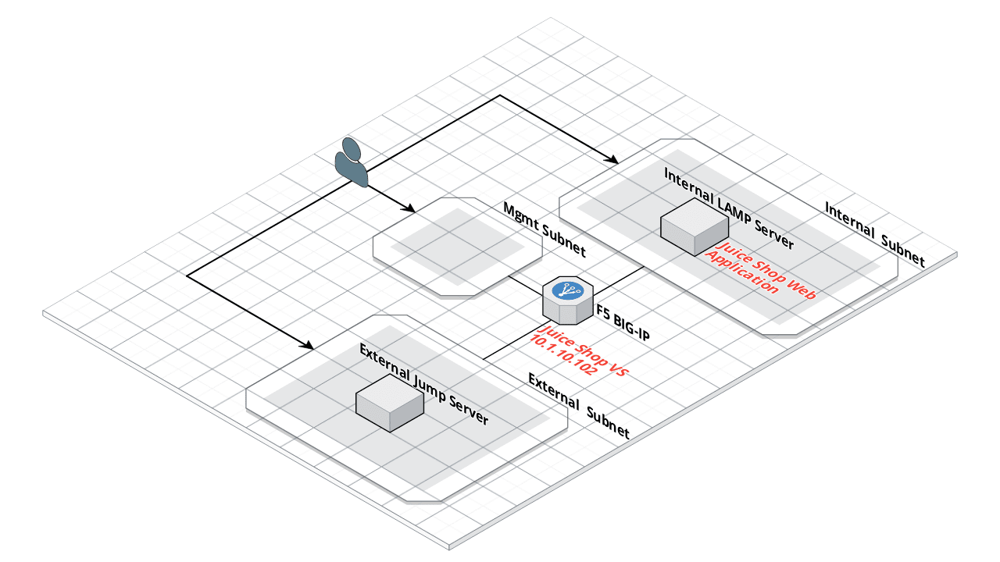

Lab Environment & Topology 
~~~~~~~~~~~~~~~~~~~~~~~~~~~

Environment
-----------

**External Jump Server**

WAF Policy Assessment Tool:

* `F5 WAF Tester <https://github.com/f5devcentral/f5-waf-tester>`_ - WAF Assessment Tool

**Internal LAMP Server**

Docker Containers:

* Juice Shop - Extremely Vulnerable Web Application

**F5 BIG-IP**

* Version 15.1
* Best Bundle (LTM, AFM, APM, ASM, DNS)
* Advanced WAF add-on

Lab Topology
------------

The network topology implemented for this lab is very simple. The following
components have been included in your lab environment:

-  1 x F5 BIG-IP VE (v15.1) licenced with Best Bundle and Advanced WAF upgrade
    - external interface (external subnet)
    - management interface (management subnet)
    - internal interface (internal subnet)
-  1 x Ubuntu Linux 18.04 External Jump Server
    - interface connected to external subnet
-  1 x Ubuntu Linux 18.04 Internal LAMP Server
    - interface connected to internal subnet

A network diagram of the lab:

|lab-diag|
