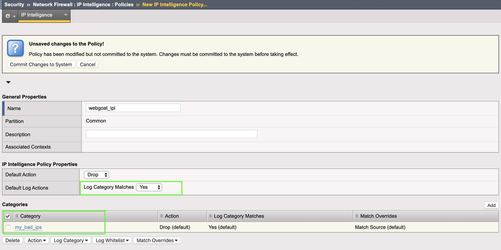
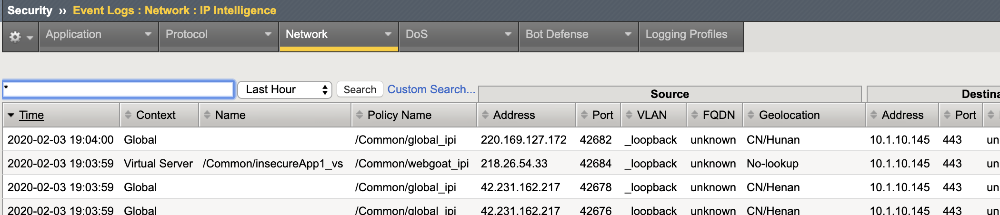
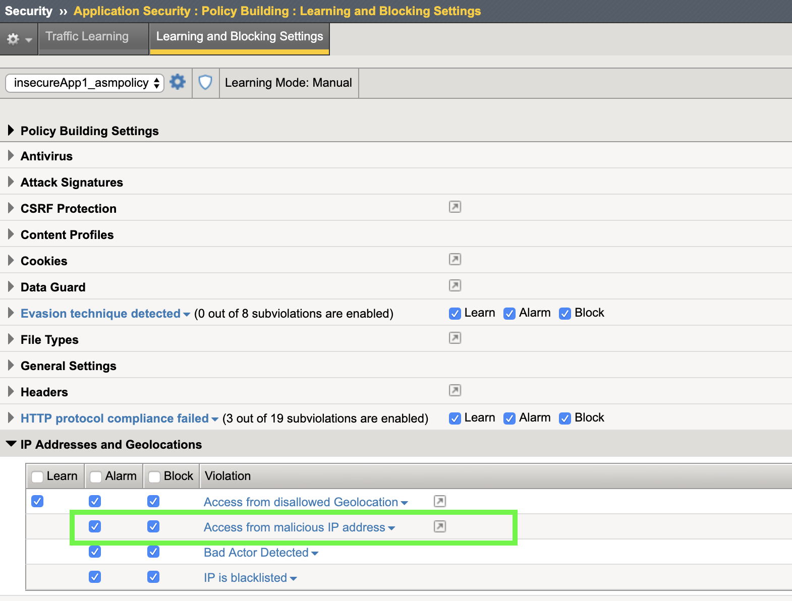
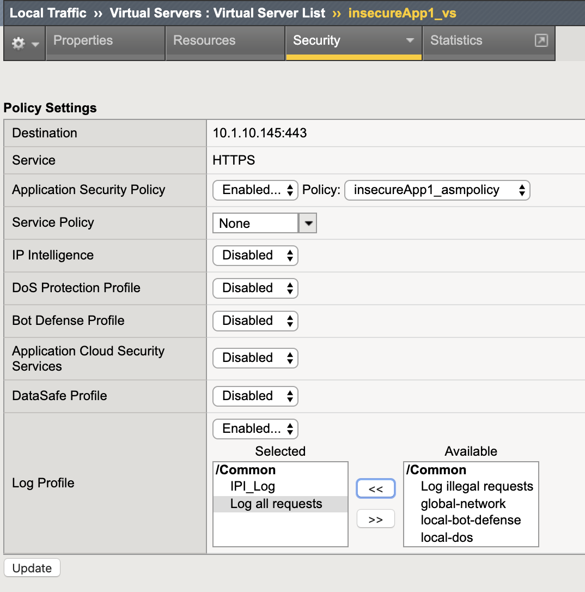
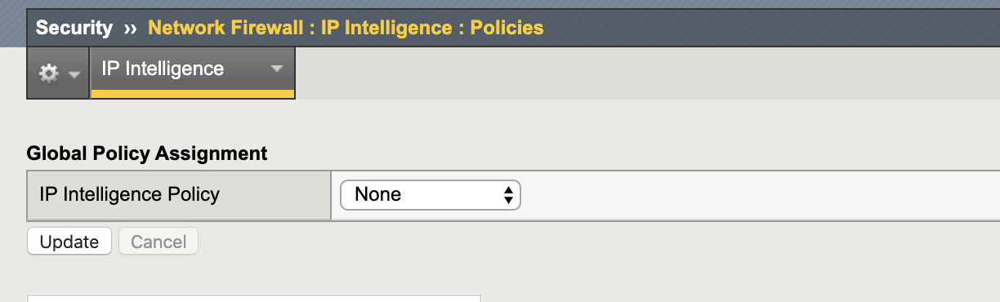
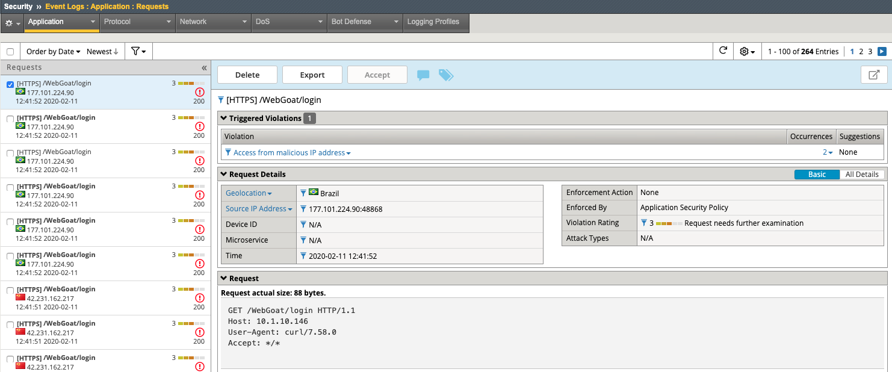

Exercise 1.1: IP Intelligence Policy
---------------------------------------
Objective
~~~~~~~~~

- Configure Global IPI Profile & Logging
- Review Global IPI Logs
- Configure Custom Category and add an IP 
- Create your first WAF Policy and implement IPI  

- Estimated time for completion: **30** **minutes**.

#. RDP to Linux Client and launch Google Chrome Browser. **Do not click multiple times**. It can take a few moments for the browser to launch the first time. 

#. Click the BIG-IP bookmark and login to TMUI. admin/<password>. 

Create Your 1st L3 IPI Policy
~~~~~~~~~~~~~~~~~~~~~~~~~~~~~
An IPI policy can be created and applied globally, at the virtual server (VS) level or within the WAF policy itself. 
We will be applying a IPI via a Global Policy to secure layer 3 device-wide, as well as a WAF policy to validate any IP's present at Layer 7. 

.. image:: images/ipi_options.png
  :width: 600 px

In this lab we will start by enabling a Global IPI Policy, then configure a VS specific profile with a custom category. 
We will also explore the configuration of IPI within the WAF policy itself. 

#. On the Main tab, click **Security > Network Firewall > IP Intelligence > Policies**. 

.. image:: images/ipi.png
  :width: 600 px

#. Click on the **Create** button. 

#. For the name:  **global_ipi** 

#. Under **IP Intelligence Policy Properties**: For the Default Log Action choose: **yes** to Log Category Matches

#. Browse to the inline **Help** tab at the top left of the GUI and examine the Default Log Action settings. Note that hardware acceleration is not available when logging all matches. 

#. Click **Add** under the categories section. 

#. From the category section choose **botnets** and click **Done editing**.

#. Repeat this process and add the following additional categories: **infected_sources**, **scanners**, **spam_sources**, & **denial_of_service**.

.. image:: images/ipi_global.png
  :width: 600 px

#. Commit the Changes to the System.

Setup Logging for Global IPI
~~~~~~~~~~~~~~~~~~~~~~~~~~~~~
#. Navigate to **Security > Event Logs > Logging Profiles** and click on **global-network**
#. Under the Network Firewall section configure the IP Intelligence publisher to use **local-db-publisher**
#. Check **Log GEO Events**
#. Click **Update**

.. image:: images/ipi_global_log.png
  :width: 600 px

Apply Global IPI & Test
~~~~~~~~~~~~~~~~~~~~~~~~~~~~~
#. Navigate to: **Security > Network Firewall > IP Intelligence > Policies**.
#. Apply the **global_ipi** policy and click **Update**.

.. image:: images/global_policy.png
  :width: 600 px

#. RDP to the client01 jumphost
#. Open a terminal and navigate to **/home/f5student/waf141/agility2020wafTools**
#. Run the following command to send some traffic to the site: **./ipi_tester**.

.. NOTE:: The script should continue to run for the remainder of Lab 1 & 2. Do NOT stop the script. 

#. Navigate to **Security > Event Logs > Network > Ip Intelligence** and review the entries. Notice the Geolocation Data as well as the Black List Class to the right of the log screen. 

.. image:: images/global_event.png
  :width: 600 px

Create Custom Category 
~~~~~~~~~~~~~~~~~~~~~~~~~~~~~
#. Navigate to: **Security > Network Firewall > IP Intelligence > Blacklist Categories** and click **create**.
#. Name: **my_bad_ips** with a match type of **Source**
#. Click **Finished**
#. Select the category name **my_bad_ips** and click **Add To Category**

.. image:: images/add_to_cat.png
  :width: 600 px

#. Enter the ip address: **42.231.162.22** and set the seconds to **3600** (1 hour)
#. Click **Insert Entry**

.. image:: images/add_ip.png
  :width: 600 px

Create VS Specific L3 IPI Policy
~~~~~~~~~~~~~~~~~~~~~~~~~~~~~~~~~
#. Navigate to  **Security > Network Firewall > IP Intelligence > Policies** and click **create**. 
#. Name: **webgoat_ipi**
#. For Default Log Action choose **yes** to log category matches. 
#. Under Categories click **Add** and choose the **my_bad_ips** custom category. 
#. Click **Done Editing** and **Commit the Changes To System**.

Create IPI Logging Profile
~~~~~~~~~~~~~~~~~~~~~~~~~~~~~~~~~
#. Navigate to **Security > Event Logs > Logging Profiles** and click **Create**.
#. Name: **IPI_Log**
#. Select **Network Firewall** and **local-db-publisher** under IP Intelligence and then click **Create**.

.. image:: images/ipi_log.png
  :width: 600 px

Apply IPI Policy and Logging Profile to VS
~~~~~~~~~~~~~~~~~~~~~~~~~~~~~~~~~~~~~~~~~~~~
#. Navigate to **Local Traffic > Virtual Servers** and click on **insecureApp1_vs**
#. Under the **Security tab > Policies** in the top middle of the GUI, enable the webgoat IPI profile and associated logging profile.
#. Click Update.

.. image:: images/vs_sec.png
  :width: 600 px

Verifying the Configuration
~~~~~~~~~~~~~~~~~~~~~~~~~~~~~~~~~~~~~~~~~~~~
#. Navigate to **Security > Event Logs > Network > Ip Intelligence** and review the entries. You should now see Global and VS Specific Violations.

Create your first WAF Policy & Configure L7 IPI
~~~~~~~~~~~~~~~~~~~~~~~~~~~~~~~~~~~~~~~~~~~~~~~~~~
#. Navigate to **Security > Application Security > Security Policies** and click the Plus (+) button. 
#. Name the policy: **insecureApp1_asmpolicy**
#. Select Policy Template: **Rapid Deployment Policy**
#. Select Virtual Server: **insecureApp1_vs**
#. Notice that the enforement mode is already in **Transparent Mode** and Signature Staging is **Enabled**
#. Click **Save**.

.. image:: images/waf_policy.png
  :width: 600 px

#. Navigate to **Security > Application Security > Policy Building > Learning and Blocking Settings** and expand the **IP Addresses and Geolocations** section. Notice that **Access from malicious IP address** is set to **Alarm** and **Block**. We will cover these concepts later in the lab but for now the policy is still transparent so the blocking setting has no effect. 

#. Navigate to **Local Traffic > Virtual Servers** and click on **insecureApp1_vs**.
#. Under the Security tab in the top middle of the GUI click on **Policies** and your policy settings should look like this. 

.. image:: images/policy_setting.png
  :width: 600 px

#. Disable the IP Intelligence Profile and enable the **Log all requests** logging profile as shown below, then click **update**. 

#. Navigate to **Security > Network Firewall > IP Intelligence > Policies** and set the Global IP Intelligence Policy to **none** and click **update**. 

#. Navigate to **Security > Application Security > IP Addresses > IP Intelligence** and enable IP Intelligence. 
#. Notice at the top left that you are working within the insecureApp1_asmpolicy policy context. Enable **Alarm** and **Block** for each category. 
#. Click **Save** and **Apply Policy**

.. image:: images/waf_ipi.png
  :width: 600 px

#. Navigate to **Security > Event Logs > Application > Requests** and review the entries. You should now see IPI violations. If you browse to the site via Firefox on Client01 you should see good traffic as well in the event logs since we are logging all requests and not all IP's are malicious. 

.. image:: images/events.png
  :width: 600 px

#. Click on one of the alerts and review the violation details. Note that you can see the entire request details even though this site was using strong TLS for encryption. 

.. NOTE:: It is best practice to enable Trust XFF in the policy when configuring IPI via WAF policy. XFF inspection is one of the advantages to consider when deploying IPI and can only be done via WAF policy. Although this setting is not needed to demonstrate this lab, it is strongly recommended to have it enabled. 

.. image:: images/trust_xff.png
  :width: 600 px

As you can see, there are several methods of configuring IP Intelligence on the BIG-IP and each has it's own pro's and con's. It will be up to you to decide which method works best for your organization but at least now you know and knowing is most of the battle in IT. 

**This completes Lab 1.1**
