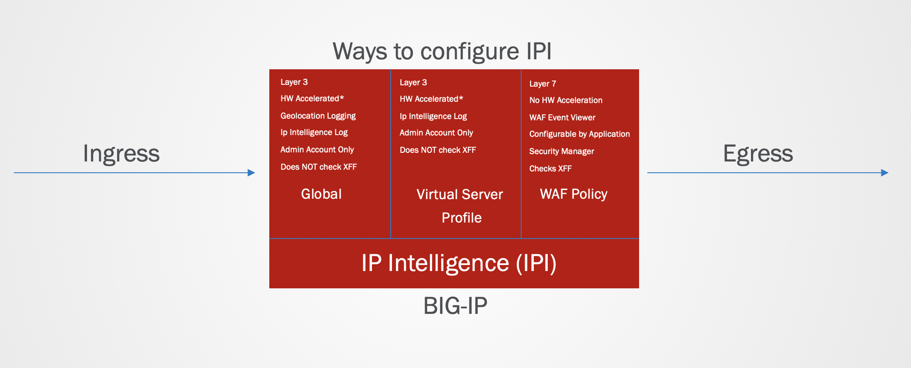
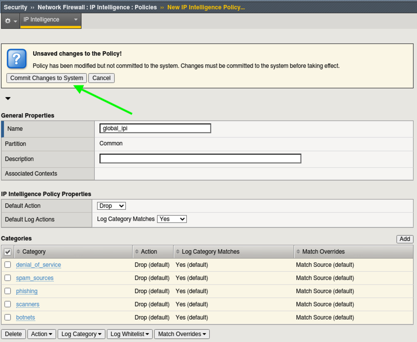
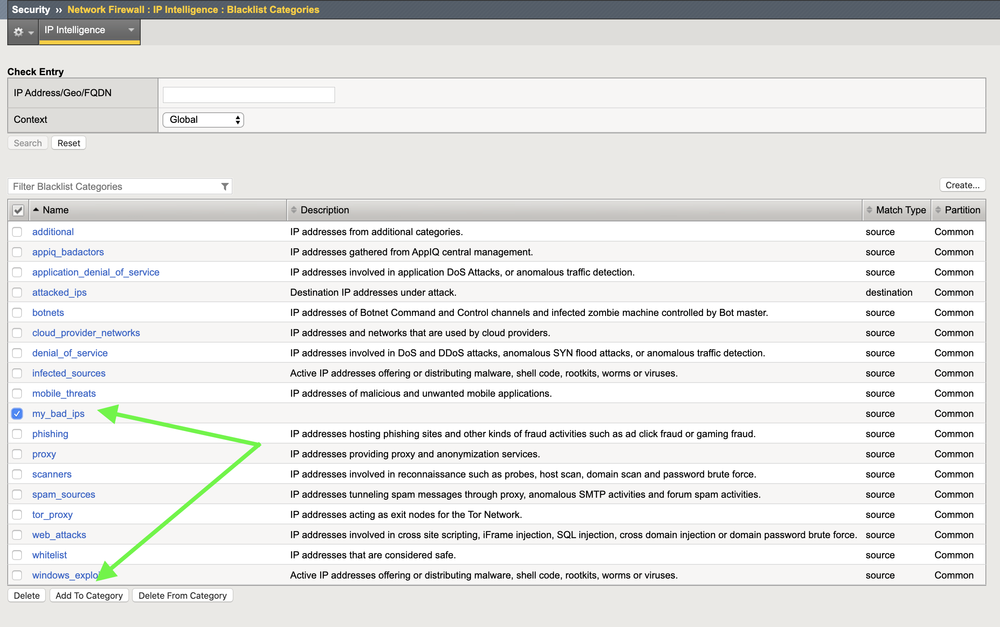
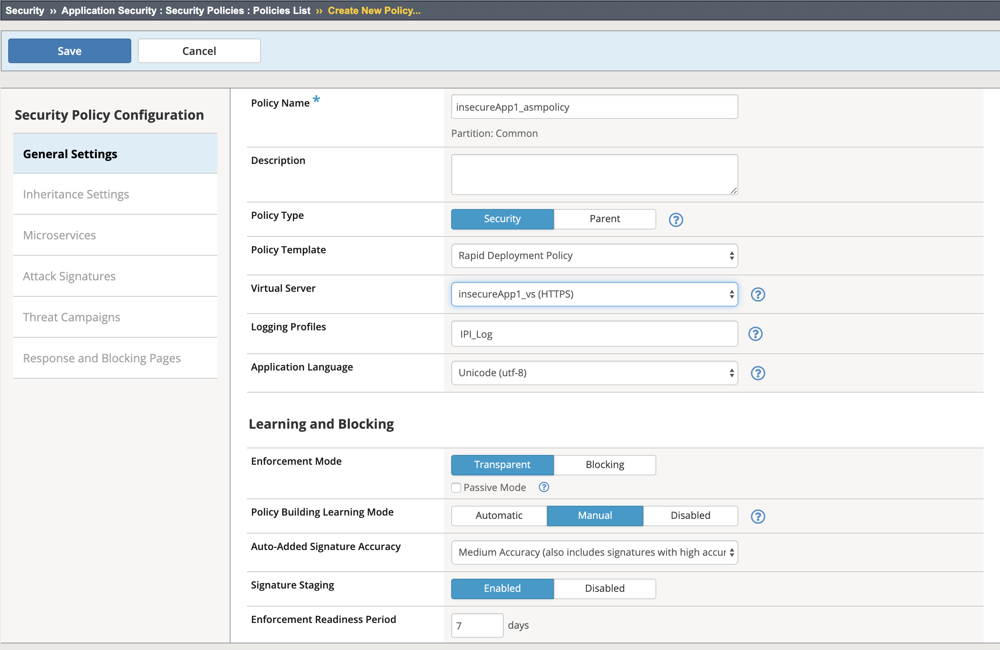
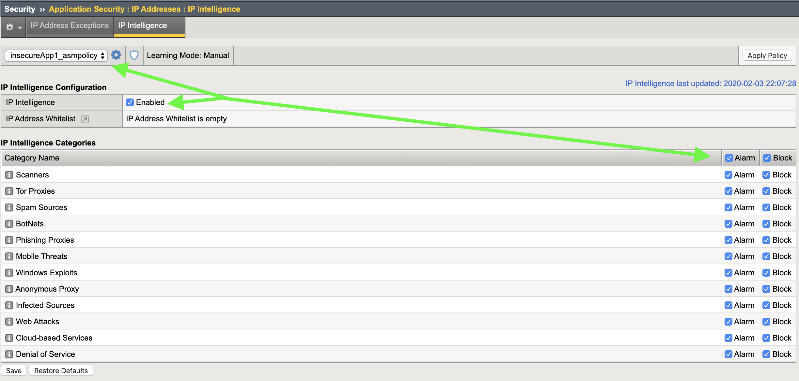
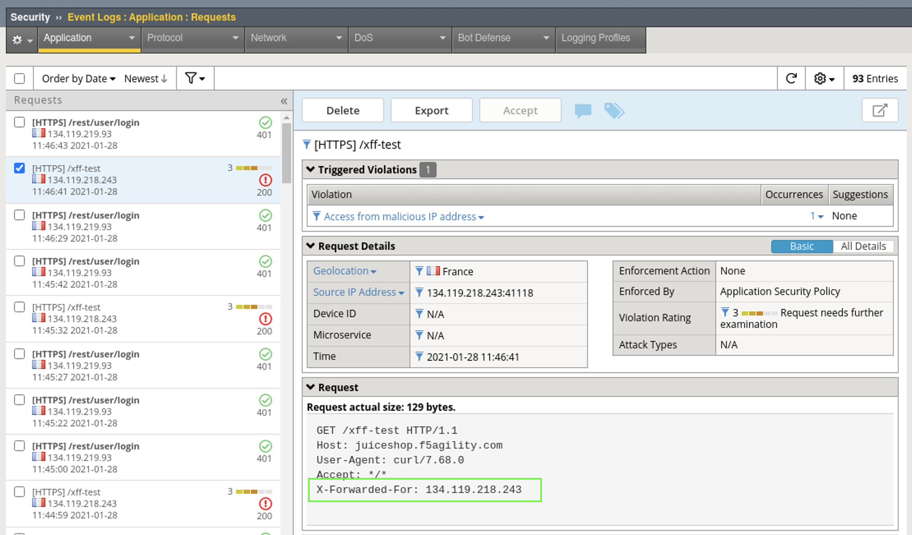

Exercise 1.1: IP Intelligence Policies
---------------------------------------
Objective
~~~~~~~~~

- Configure Global IPI Profile & Logging
- Review Global IPI Logs
- Configure Custom Category and add an IP 
- Create your first WAF Policy and implement IPI w/ XFF inspection

- Estimated time for completion: **30** **minutes**.

Create Your 1st L3 IPI Policy
~~~~~~~~~~~~~~~~~~~~~~~~~~~~~
An IPI policy can be created and applied globally, at the virtual server (VS) level or within the WAF policy itself. 
We will follow security best-practice by applying IPI via a Global Policy to secure layer 3 device-wide and within the layer 7 WAF policy to protect the App by inspecting the HTTP X-Forwarded-For Header.

In this first lab, we will start by enabling a Global IPI Policy; much like you would do, as a day 1 task for your WAF:

#. RDP to Linux Client and launch Google Chrome Browser. **Do not click multiple times**. It can take a few moments for the browser to launch the first time. 

#. Click the **F5 Advanced WAF bookmark** and login to TMUI. admin/<password>. 

#. On the Main tab, click **Local Traffic > Virtual Servers** and you will see the Virtual Servers that have been pre-configured for your lab. Essentially these are the listening IP's that receive requests for your application and proxy the request to the backend "real" servers.

| You will see 3 Virtual Servers: 

.. image:: images/virtual_servers.png
  :width: 600 px

|

| * **juiceshop-test.f5agility.com** - Will be used later to send spoofed traffic to the main site
| * **owasp-juiceshop_443_vs** - Main Site - Status of green indicates a healthy backend pool of real servers 
| * **owasp-juiceshop_80_vs** - Standard Port 80 redirect to main site

| 

4. On the Main tab, click **Security > Network Firewall > IP Intelligence > Policies**. 

.. image:: images/ipi.png
  :width: 600 px

.. NOTE:: Network Firewall IP Intelligence Policies are a layer 3 enforcement capability and part of Advanced WAF. No additional licensing is necessary beyond Advanced WAF with an IPI Subscription. 

5. Click on the **Create** button.

#. For the name:  **global_ipi** 

#. Under **IP Intelligence Policy Properties** For the Default Log Action choose **yes** to **Log Category Matches**.

#. Browse to the inline **Help** tab at the top left of the GUI and examine the Default Log Action settings. Inline help is very useful when navigating the myriad of options available within any configuration screen.

.. NOTE:: Notice in the setting descriptions that hardware acceleration is not available when "logging all matches". This exercise is to familiarize you with inline help and will not affect our virtual lab.

9. To the right of the screen, click **Add** under the categories section. 

#. From the category section choose **botnets** and click **Done editing**.

#. Repeat this process and add the following additional categories: **phishing**, **scanners**, **spam_sources**, & **denial_of_service**.

12. Commit the Changes to the System.

#. Apply the **global_ipi** policy and click **Update**.

.. image:: images/global_policy.png
  :width: 600 px

Setup Logging for Global IPI
~~~~~~~~~~~~~~~~~~~~~~~~~~~~~
#. Navigate to **Security > Event Logs > Logging Profiles** and click on **global-network**
#. Under the Network Firewall section configure the IP Intelligence publisher to use **local-db-publisher**
#. Check **Log GEO Events**
#. Click **Update**

.. image:: images/ipi_global_log.png
  :width: 600 px

Test 
~~~~~~~~~~~~~~~~
#. On the Linux Client, open a terminal and **cd** to **Agility2021wafTools**
#. Run the following command to send some traffic to the site: **./ipi_tester**.

.. NOTE:: The script should continue to run for the remainder of Lab 1 & 2. Do NOT stop the script. 

#. Navigate to **Security > Event Logs > Network > Ip Intelligence** and review the entries. Notice the Geolocation Data as well as the Black List Class to the right of the log screen. 

.. image:: images/global_event.png
  :width: 600 px

Create Custom Category 
~~~~~~~~~~~~~~~~~~~~~~~~~~~~~
#. Navigate to: **Security > Network Firewall > IP Intelligence > Blacklist Categories** and click **create**.
#. Name: **my_bad_ips** with a match type of **Source**
#. Click **Finished**
#. Select the category name **my_bad_ips** and click **Add To Category**

5. Enter the ip address: **134.119.218.243** or any of the other malicious IP's showing up in the IP Intelligence logs, and set the seconds to **3600** (1 hour)
#. Click **Insert Entry**

.. image:: images/add_ip.png
  :width: 600 px

7. Navigate to **Security > Network Firewall > IP Intelligence > Policies** and click **global_ipi**

#. Under **Categories** click **Add** and select your new custom category **my_bad_ips**. Click **Done Editing** and **Commit Changes**.

.. image:: images/my_bad_ips.png
  :width: 600 px

9. Navigate back to **Security > Event Logs > Network > Ip Intelligence** and review the entries

.. image:: images/my_bad_ips_log.png
  :width: 600 px

**This concludes the Layer 3 IPI policy lab section.** 

| **To recap, you have just configured a Global IP Intelligence policy and added a custom category.**
| **This policy is inspecting Layer 3 only and is a best-practice first step to securing your Application traffic.**

|

| **We will now configure a Layer 7 WAF policy to inspect the X-Forwarded-For HTTP Header.**

Create your first WAF Policy 
~~~~~~~~~~~~~~~~~~~~~~~~~~~~~~~
#. Navigate to **Security > Application Security > Security Policies** and click the Plus (+) button. 
#. Name the policy: **juiceshop_waf**
#. Select Policy Template: **Rapid Deployment Policy** (accept the popup)
#. Select Virtual Server: **owasp-juiceshop_443_vs**
#. Logging Profiles: **Log All Requests**
#. Notice that the enforement mode is already in **Transparent Mode** and Signature Staging is **Enabled**
#. Click **Save**.

Configure L7 IPI
~~~~~~~~~~~~~~~~~~~~

#. Navigate to **Security > Application Security > Policy Building > Learning and Blocking Settings** and expand the **IP Addresses and Geolocations** section. 

.. NOTE::  These are the settings that govern what happens when a violation occurs such as **Alarm** and **Block**. We will cover these concepts later in the lab but for now the policy is still transparent so the blocking setting has no effect. 

.. image:: images/ipi_waf.png
  :width: 600 px

2. Navigate to **Security > Application Security > IP Addresses > IP Intelligence** and enable IP Intelligence. 
#. Notice at the top left drop-down that you are working within the juiceshop_waf policy context. Enable **Alarm** and **Block** for each category. 
#. Click **Save** and **Apply Policy**

5. Enable XFF inspection in the WAF policy by going to **Security > Application Security > Security Policies > Policies List >** and clieck on **juiceshop_waf** policy.
#. Finally, scroll down under **General Settings** and click **Enabled** under **Trust XFF Header**.  
#. Click **Save** and **Apply Policy**

Test XFF Inspection
~~~~~~~~~~~~~~~~~~~~
#. Open a terminal on the Client and run the following command to insert a malicious IP into the XFF Header: 

**curl -H "X-Forwarded-For: 134.119.218.243" -k https://juiceshop.f5agility.com**

| If that IP has rotated out of the malicious DB, you can try one of these alternates:

* 80.191.169.66 - Spam Source
* 85.185.152.146 - Spam Source
* 220.169.127.172 - Scanner
* 222.74.73.202 - Scanner
* 62.149.29.36 - Spam Source
* 82.200.247.241 - Phishing
* 134.119.219.93 - Spam Source
* 218.17.228.102 - Spam Source
* 220.169.127.172 - Scanner

2. Navigate to **Security > Event Logs > Application > Requests** and review the entries. You should see a Sev3 Alert for the attempted access from a malicious IP. 

3. In the violation details you can see the entire request details even though this site was using strong TLS for encryption. 

**Congratulations! You have just completed lab 1 by implementing IPI policies both globally and at Layer 7 for a specific application. This follows our best-practice guidance for getting started with Application Security.**  

**This completes Lab 1.1**
