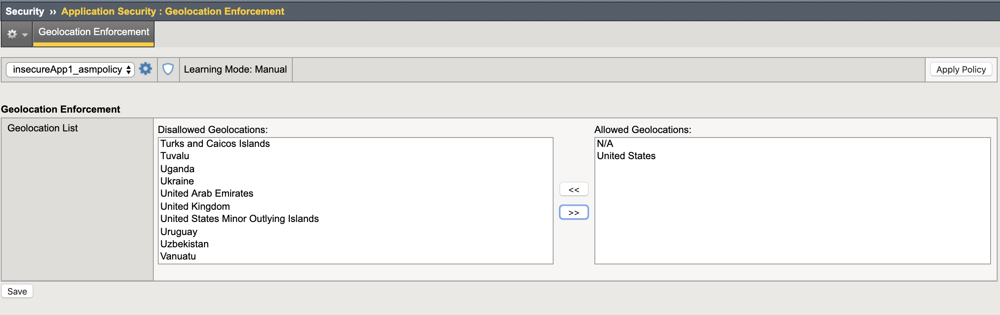
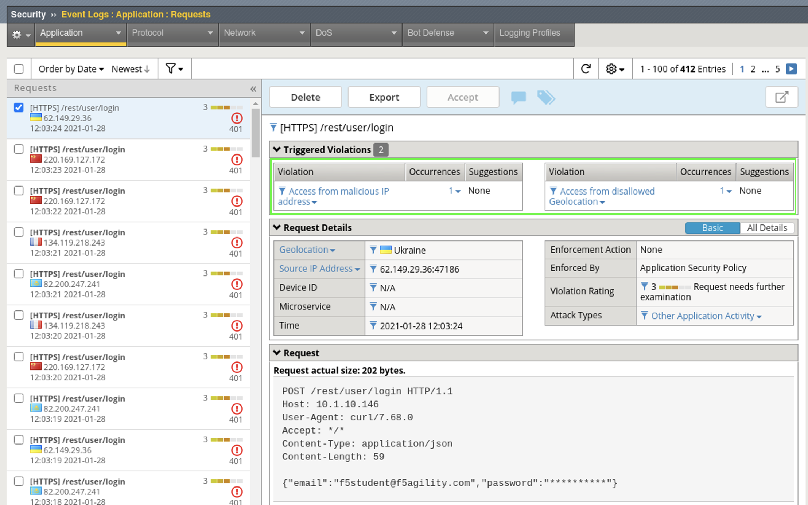

Exercise 1.2: Add a Geolocation Policy
-------------------------------------------------
Geolocation
~~~~~~~~~~~~~

#. Open **Security > Application Security > Geolocation Enforcement**

#. Select all geolocations **except the United States and N/A** and move them to Disallowed Geolocations. **Save** and then **Apply Policy**.

.. NOTE:: N/A covers all RFC1918 addresses. If you aren’t dropping them at your border router (layer 3), you may decide to geo-enforce at ASM (Layer 7) if no private IP’s will be accessing the site.

#. You should now see entries in the event log that contain both IPI and Geolocation violations.

**This completes Lab 1.2**