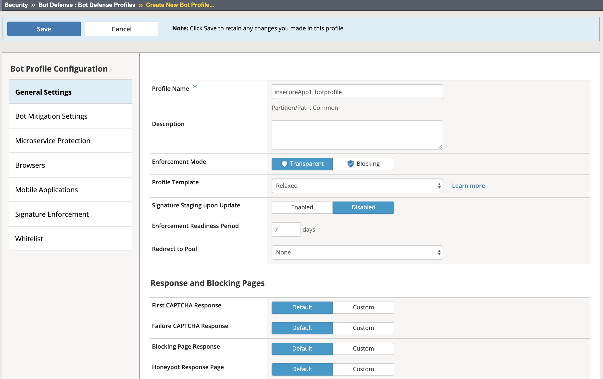
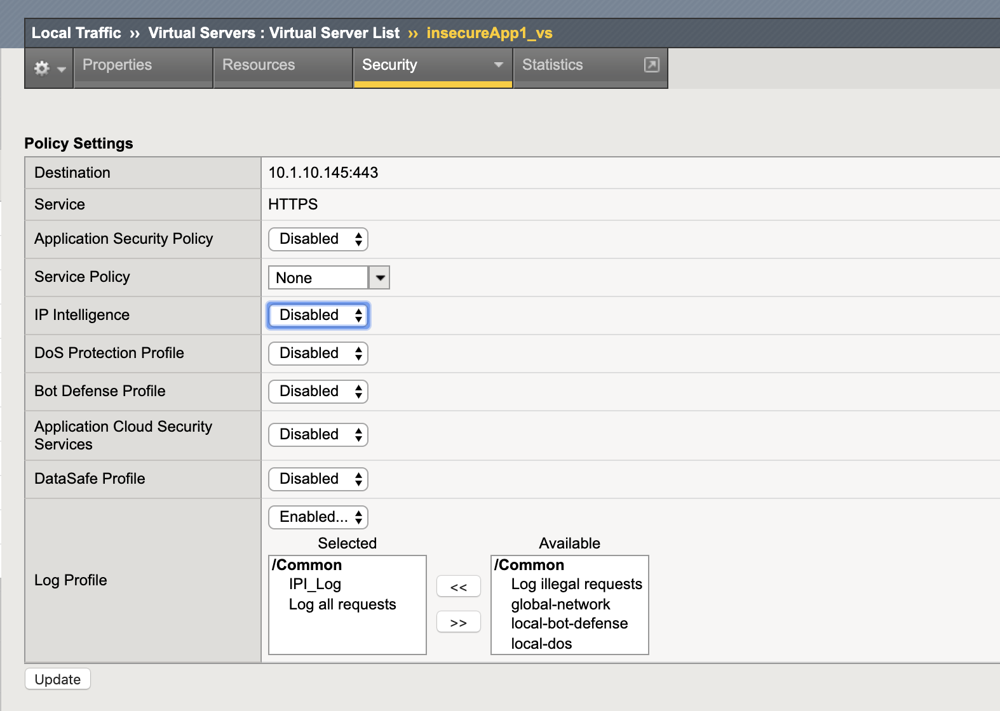
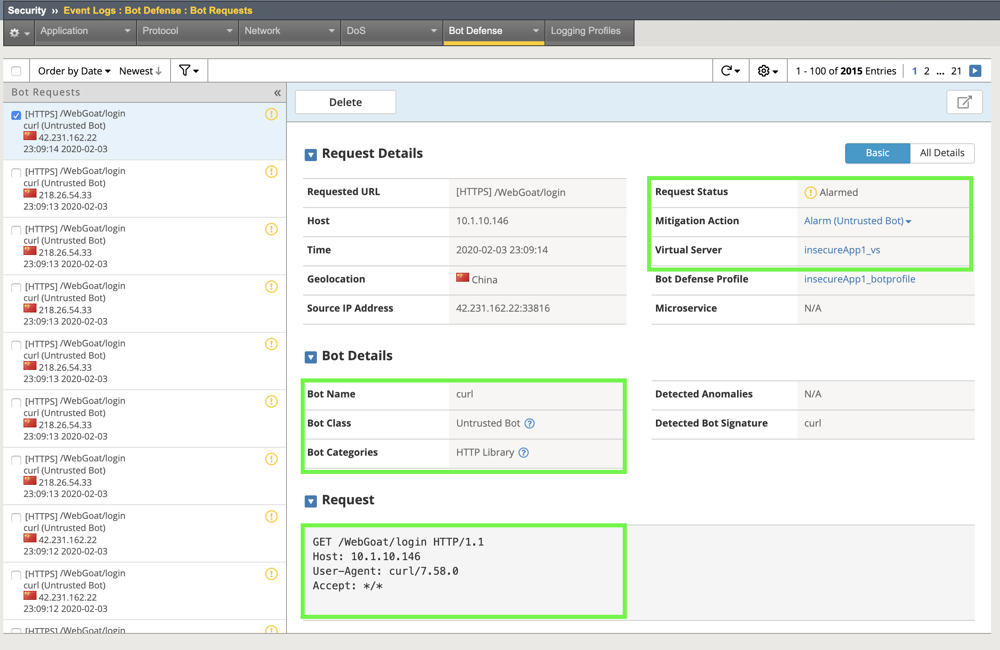
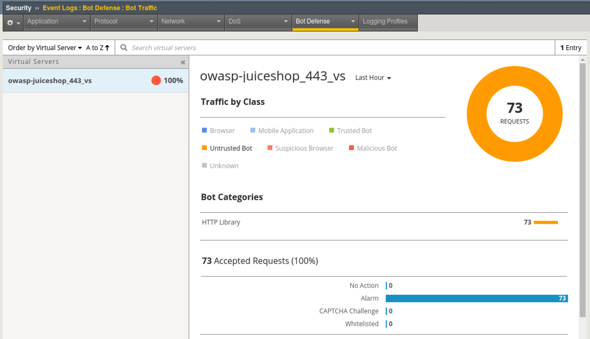
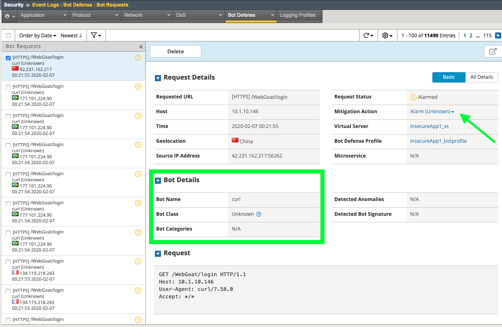

Exercise 2.1: Bot Defense with Signatures
-------------------------------------------
The next logical step in our configuration is to deal with automated traffic. While Advanced WAF has some deep Bot Defense capabilities, we will start with Bot Signatures. 
A good goal during your initial deployment would be to get transparent BOT profiles deployed across your various application Virtual Servers so you can start to analyze your "normal" loads of automated traffic. This can be very surprising to an organization or a developer that thought they had a lot more "real users". 

Objective
~~~~~~~~~

- Create a Bot Defense logging profile
- Create and apply a transparent Bot Defense Profile with Signatures
- Test and verify logs 
- Add a signature to the whitelist

-  Estimated time for completion: **20 minutes**

Create Logging Profile 
~~~~~~~~~~~~~~~~~~~~~~

#. Navigate to **Security > Event Logs > Logging Profiles** and create a new Logging Profile with the settings shown in the screenshot below and click **Create**. 

.. image:: images/log_profile.png
  :width: 600 px

2. Navigate to **Security > Bot Defense > Bot Defense Profiles** and click **Create**.
#. Name: **juiceshop_bot**
#. Profile Template: **Relaxed**
#. Click the **Learn more** link to see an explanation of the options. These will be explored further in the 241 lab but for now we are going with **Relaxed** aka **Challenge-Free Verification**. 

6. Click on the **Bot Mitigation Settings** tab and review the default configuration.
#. Click on the **Signature Enforcement** tab and review the default configuration.
#. Click **Save**.

Apply the Policy and Logging Profile
~~~~~~~~~~~~~~~~~~~~~~~~~~~~~~~~~~~~~~~~~

#. Navigate to **Local Traffic > Virtual Servers** click on **owasp-juiceshop_443_vs** then go to the **Security Tab > Policies** (top middle of screen).

.. IMPORTANT:: To clearly demonstrate just the Bot Defense profile, please disable all security policy on the virtual server. The ipi_tester script should still be running!

2. Navigate to **Local Traffic > Virtual Servers > owasp-juiceshop_443_vs > Security > Policies** and **disable the Application Security Policy** and **enable the Bot Defense Profile and Bot_Log Profile.**
#. Click **Update**

4. Navigate to **Security > Event Logs > Bot Defense > Bot Requests** and review the event logs. Notice curl is an untrusted bot in the HTTP Library category of Bots. 

5. On the top middle of the screen under the **Bot Defense** Tab, click on **Bot Traffic** for a global view of all Bot Traffic. In this lab we only have one site configured. 

6. Click on the **owasp-juiceshop_443_vs** Virtual Server and explore the analytics available under **View Detected Bots**.

.. image:: images/curl.png
  :width: 600 px

Whitelisting a Bot & Demonstrating Rate-Limiting
~~~~~~~~~~~~~~~~~~~~~~~~~~~~~~~~~~~~~~~~~~~~~~~~~~

#. Navigate to **Security > Bot Defense > Bot Defense Profiles > juiceshop_bot > Bot Mitigation Settings**
#. Under **Mitigation Settings** change Unknown Bots to **Rate Limit** with a setting of **1** TPS. **1** is a very aggressive rate-limit and used for demo purposes in this lab. 

.. NOTE:: In the "real world" you will need to set this to a value that makes sense for your application or environment to ensure the logs do not become overwhelming. If you don't know, it's usually pretty safe to start with the default of 30. 

3. Under **Mitigation Settings Exceptions** click **Add Exceptions** and search for **curl** and click **Add**.
#. Change the Mitigation Setting to **None** and then **Save** the profile. 

.. image:: images/rate-limit.png
  :width: 600 px

5. Navigate to **Security > Event Logs > Bot Defense > Bot Requests** and review the event logs. 
#. Notice the whitelisted bot's class was changed to **unknown** and we set curl to not alarm but the requests are still being alarmed. What gives?

7. Click the down arrow under **Mitigation Action** and note the reason for the alarm. 

.. NOTE:: Even though we have whitelisted this bot we can still ensure that it is rate-limited to prevent stress on the application and any violations to that rate-limit will be Alarmed. This bot is currently violating the rate-limit of 1 TPS. 

.. image:: images/bot-rate-limit.png
  :width: 600 px

Testing Additional User-Agents
~~~~~~~~~~~~~~~~~~~~~~~~~~~~~~~~~~~~~~~~~~~~
#. Navigate to **Local Traffic  > Virtual Servers > Virtual Server List > juiceshop-test.f5agility.com > Resources** tab and under iRules click **Manage** and add the **ua_tester** iRule and click **Finished**. 

.. image:: images/ua-irule.png
  :width: 600 px

.. NOTE:: What you just added is an iRule that inserts poorly spoofed User-Agents. Our ipi_tester script has been sending traffic through this Virtual Server all along and spoofing source IP's to the main site via the ipi_tester iRule. 

2. Navigate to **Security > Event Logs > Bot Defense > Bot Requests** and review the event logs. 
#. All the **Unknown** bots are getting rate-limited and the known browsers that do not match the appropriate signatures, such as the spoofed Safari request in this example, are being marked as **Suspicious or Malicious**.

.. image:: images/ua-spoof-log.png
  :width: 600 px

**This completes Lab 2**

**Congratulations! You have just completed Lab 2 by implementing a signature based bot profile. Implementing bot signatures is the bare minimum for bot mitigation and not a comprehensive security strategy. This is a excellent step in getting started with WAF and will provide actionable information on automated traffic. You can use this information to take next steps such as implementing challenges and blocking mode. At a very minimum, share this information with your Application teams. Automated traffic can negatively affect the bottom line especially in cloud environments where it's pay to play. See our 241 class on Elevated WAF Security for more info on advanced bot mitigation techniques.**
