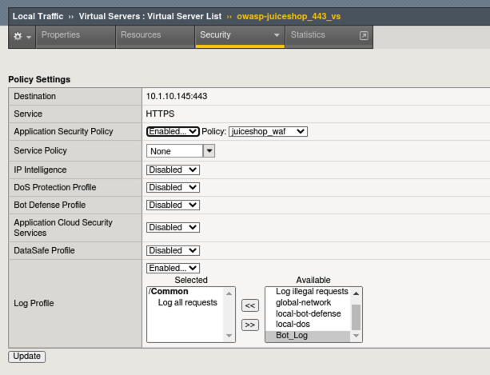
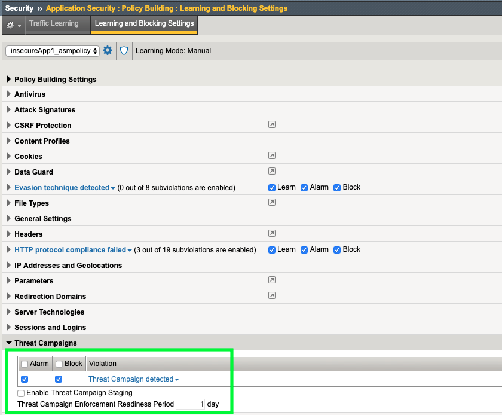
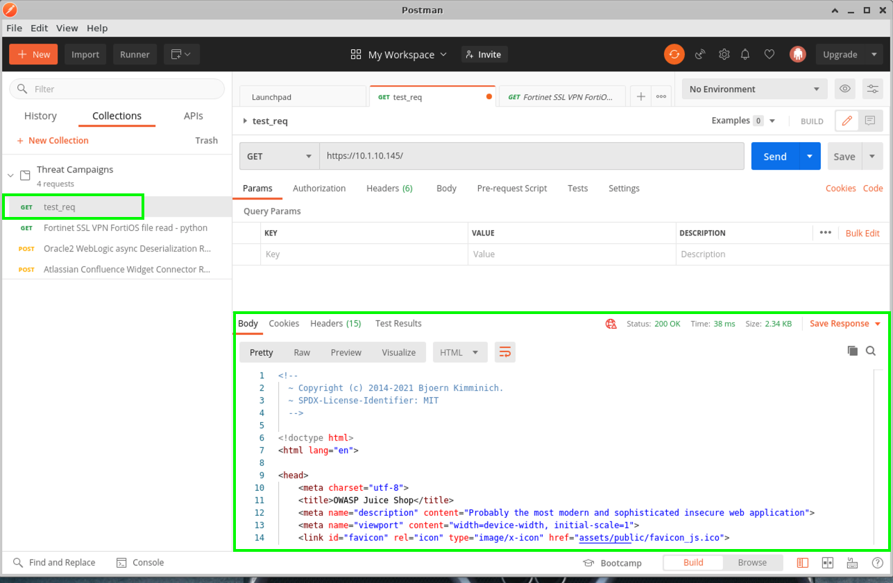
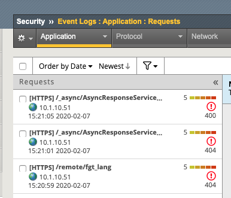
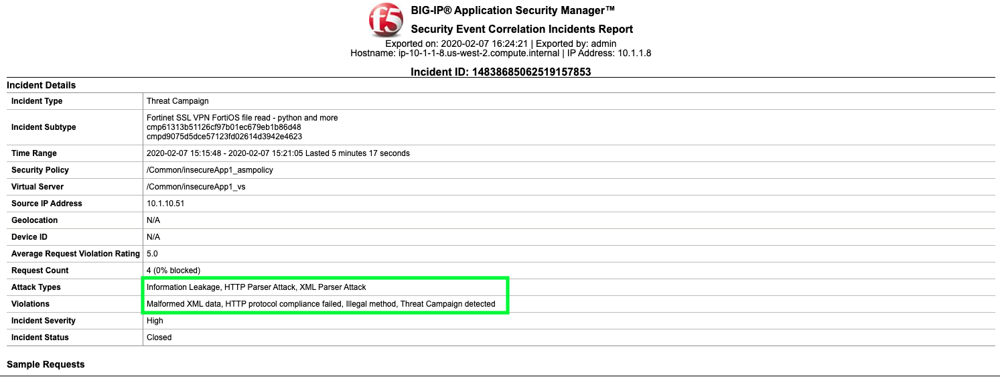

Exercise 3.1: Threat Campaigns
----------------------------------------

Threat Campaign signatures are subscription based and sourced from a variety of threat intel sources based on real world campaigns to attack and/or take over resources. 
Attackers are constantly looking for ways to exploit the latest vulnerabilities and/or new ways to exploit old vulnerabilities. F5’s Threat Research team is constantly monitoring malicious activity around the globe and creating signatures specific to these exploits. These Threat Campaign signatures are based on current “in-the-wild” attacks. Threat Campaign signatures contain contextual information about the nature and purpose of the attack.

As an example, a normal WAF signature might tell you that SQL injection was attempted. A Threat Campaign signature will tell you that a known threat actor used a specific exploit of the latest Apache Struts vulnerability (CVE -****) in an attempt to deploy ransomware for cryptomining software.

Objective
~~~~~~~~~~~

- Review signatures 
- Review Learning & Blocking and Staging Concept
- Test and verify logs 
- Disable a signature Security  > Application Security > Security Policies > Policies List  

-  Estimated time for completion: **20** **minutes**

Configure the Virtual Server
~~~~~~~~~~~~~~~~~~~~~~~~~~~~~~~

#. Navigate to **Local Traffic > Virtual Servers > Virtual Server List > insecureApp1_vs > Security > Policies**. 
#. **Remove the Bot Defense Profile** and **enable the Application Security Policy: insecureApp1_asmpolicy**. We are removing the bot profile since we will be using a Bot to test the Threat Campaign signatures. 
#. **Remove the Bot_Log and IPI_Log logging profiles**. Your virtual should look like this. 

Review TC Signatures
~~~~~~~~~~~~~~~~~~~~~~~~~~~~~~~

#. Navigate to **System > Software Management > Live Update > Threat Campaigns**. DO NOT update the system but note the Installation History. You can also view the Bot Signatures and other signature packages that are currently installed or pending. 

.. NOTE:: Without an Advanced WAF license and Threat Campaign Subscription you will NOT get Live Updates for Bot Signatures. 

#. Navigate to **Security > Options > Application Security > Threat Campaigns** and review some of the signatures and information about them. 
#. Click on the **Apache Struts2 devmode RCE - HatBoy** signature and note the attack type as well as the CVE reference: **CVE-2012-0394**. You can click the CVE reference link for more information. 
#. Click on the filter button and under the Reference field, type: **2019** and **Apply Filter** to search for all CVE's related to 2019. 

.. image:: images/tc_sig.png
  :width: 600 px

.. image:: images/cve2019.png
  :width: 600 px

Review TC Learning and Blocking Settings
~~~~~~~~~~~~~~~~~~~~~~~~~~~~~~~~~~~~~~~~~

#. Navigate to **Security > Application Security > Policy Building > Learning and Blocking Settings** and expand the **Threat Campaigns** section. 
#. Note that the system is set to **Alarm** and **Block** on signature matches. Remember, our policy is in transparent mode so the blocking setting will not have any effect. 
#. Staging and the Enforcement Readiness period means that when new signatures are downloaded, if staging is enabled, the system will wait until the enforement readiness period is over before it starts blocking. You will still see alarms during this period. Due to the high accuracy nature of Threat Campaign signatures, the default system configuration is to have Staging turned off so new signatures go into effect immediately. 

Test TC Signatures and Review Logs
~~~~~~~~~~~~~~~~~~~~~~~~~~~~~~~~~~~~~~~~~

.. Important:: Please ensure the ipi_tester script is not running in the terminal on the client01 jumphost. 

#. From the client01 jumphost, launch **Postman** from the dock. 

.. image:: images/postman.png

#. You will see a collection called **Threat Campaigns** and under there you will see an item called **test_req**. This simply tests that the site is responding. 
#. Click on **test_req** and then click the blue **Send** button on the top right. If your output does not look like this, please let a lab instructor know. 

#. Click on the **Fortinet SSL VPN** attack and then click the blue **Send** button. Repeat this process for the **Oracle2** attack. Explore the Headers and Payloads that are being sent. If your policy was in blocking mode you would receive a block page but since the policy is transparent, these attacks are making it through. 
#. Navigate to **Security > Event Logs > Application > Requests** and review the Sev5 events.

#. Click on the event for **/remotefgt_lang** and note the triggered violations. Click on **All Details** to the right of the screen to get more information. You can also click the **Open to new Window** icon in the top right to get an isolated view of this violation. 
#. To see exactly which Attack Signature or Threat Campaign was triggered under the **Violations** section click the **1** under **Occurrences** for **Attack Signature Detected**. 
#. Notice that the Attack Signature was a parameter level Directory Traversal Attempt. Also notice that this signature is currently in staging. Attack signatures have or can have a different enforcement readiness period than Threat Campaign Signatures. 

If this policy was in blocking mode would this signature have blocked the attack?

.. image:: images/attack_sig.png
  :width: 600 px

If you guessed no, you are correct. This signature is still in staging and therefor would not be blocked.  

#. Under the **Violations** section click the **1** under **Occurrences** for **Threat Campaign detected** and review the signature that was triggered and the Applied Blocking Settings. 
#. Review the other alert that we generated and note any additional Attack Signatures that were fired.

.. image:: images/violations.png
  :width: 600 px

#. Navigate to **Security > Event Logs > Application > Event Correlation** and explore the Dashboard. 
#. Click on the **Threat Campaign** incident and then click on **Export Incident** and review the generated report.

**This completes Lab 3**

