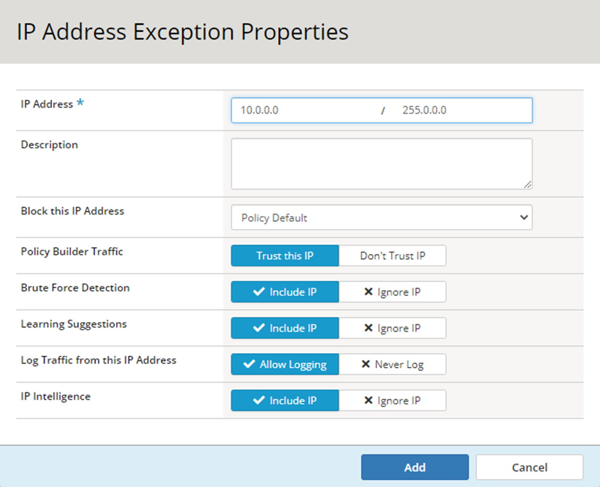
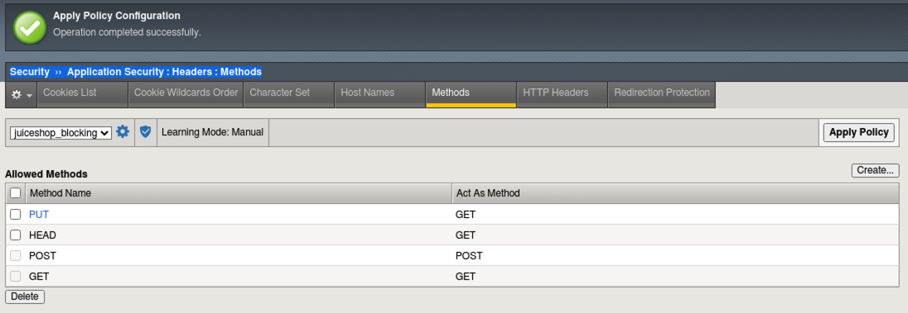
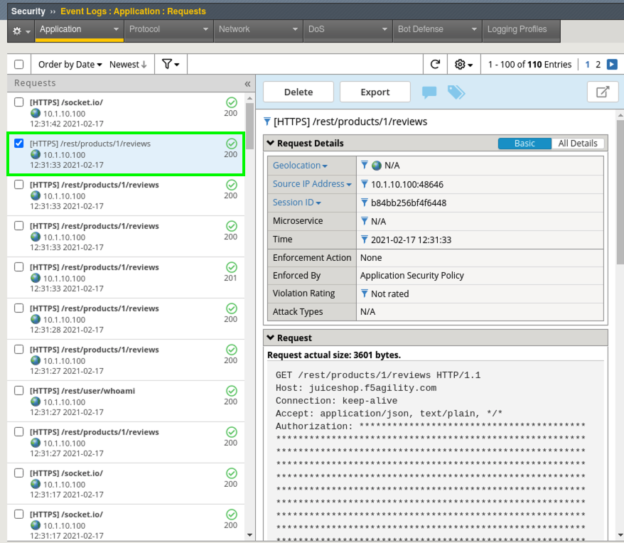
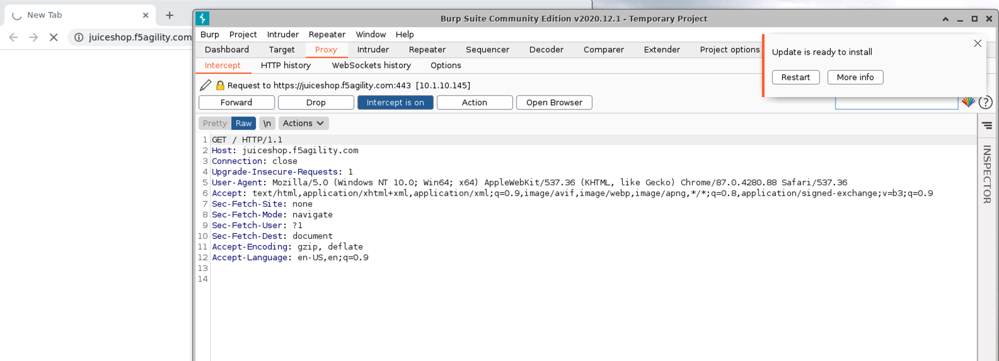
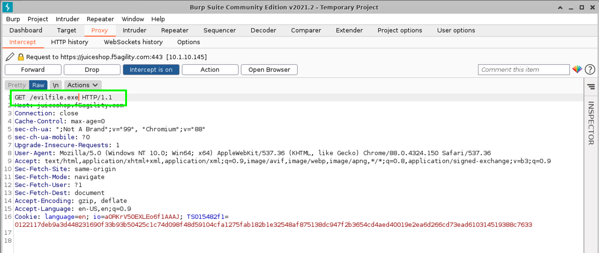
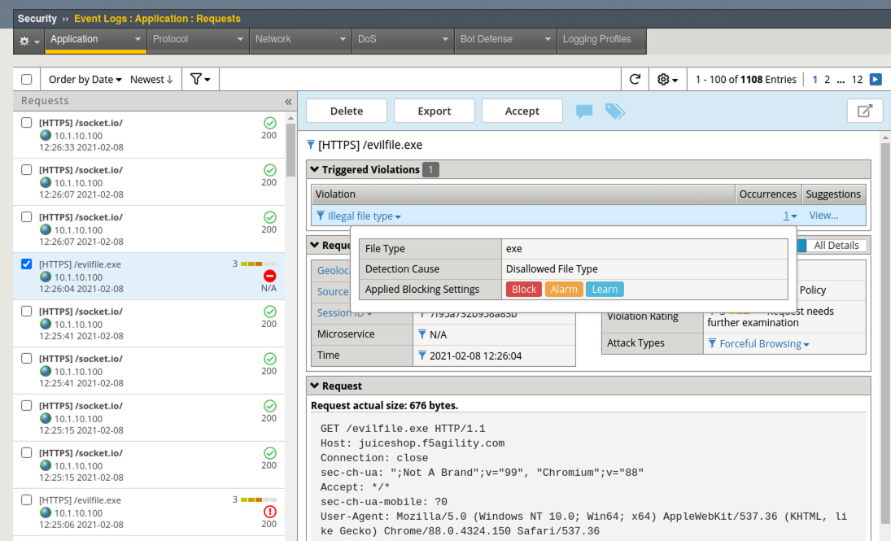
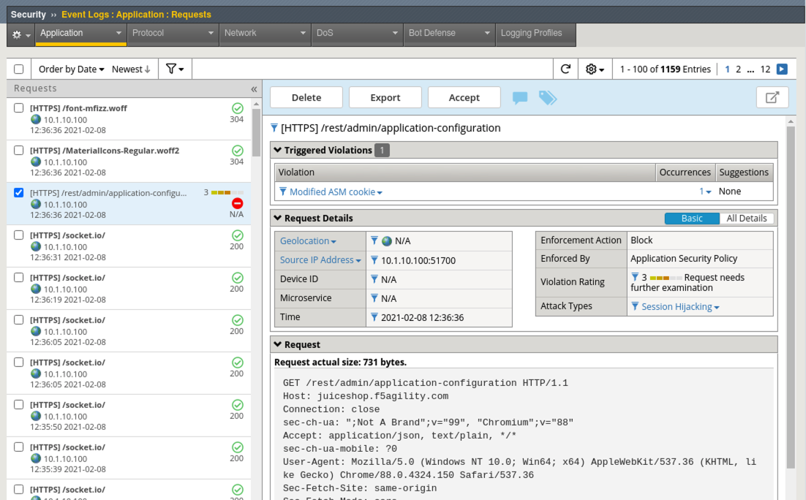
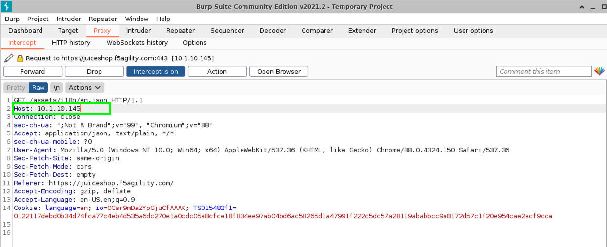

Lab 2: Intro to Positive Security 
------------------------------------

In WAF 102, we created and tested some of the negative security aspects of the Application Security Policy including IP Intelligence Enforcement, Geolocation, Signature Based Bot Detection and a Transparent Policy focused on Attack Signatures. 
If you were following along in successive fashion and building your own environment, the configurations below logically pick up in the policy right where 102 left off. We will be creating a new policy for this lab that starts with "2nd day" best-practice configurations for **elevating** your WAF policy up a level, but in reality, you should always start your approach as recommended in WAF 102 and build from there. 

#. Navigate to **Security > Application Security > Security Policies > Policies List > Create** and configure a policy named **juiceshop_blocking**.
#. Choose Policy Template: **Rapid Deployment Policy**, Enforcement Mode: **Blocking** and click **Save**. 

.. image:: images/juice_block.png
  :width: 600 px

3. Navigate to **Security > Application Security > Policy Building > Learning and Blocking Settings**. 
#. Under **Cookies** note the default settings. Uncheck **Learn** from **Modified ASM Cookie**. Generally, we do not want to allow modification of the WAF cookie and therefor will disable learning suggestions for this. 
#. Under **File Types** note the default Learning Mode is set to **Never (wildcard only)** Change that to be **Selective** and enable **Learn and Alarm** for **Illegal file type**. 

.. image:: images/cookies.png
  :width: 600 px
  
6. Under **Headers**, check the box for both Alarm and Block for **Illegal host name** and then it's **very important** to check the bottom box for **Learn Host Names**.
7. Under **URLS**, enable **Compact Mode** for "Learn New HTTP URLS" instead of **Never (wildcard only)**. Note the description of this mode: 

Choose this option if you would like to create a list of top-level URL directories ``(e.g. /abc/*) and /``, while enforcing all other URLs with a wildcard rule.

.. image:: images/heads.png
  :width: 600 px

8. Enable Learn and Alarm for **Illegal URL**, click **Save** and **Apply Policy** which is back at the top right of the UI. Accept the popup and check the box for no more confirmations and then **Ok**. 

.. image:: images/pop1.png
  :width: 600 px

Allow List
~~~~~~~~~~
Since we will be training the WAF for positive security, let's create an allow list. This will help to create high-fidelity learning suggestions as events occur. 

#. Navigate to **Security > Application Security > Security Policies > Security Policies List, then click on the "juiceshop_blocking" policy and navigate to the IP Address Exceptions menu.** and click **Create**. Configure the allow list for a 10/8 to allow our internal "trusted" network as shown below and check the box for **Policy Builder trusted IP**. 
#. Note in the upper left that this allow list is only associated with the **juiceshop_blocking policy**. Allow lists are unique per policy but could be defined at part of a parent policy and delegated down to child policies. 
#. Click **Create** and configure your Exception properties according to the screenshot below, then click **Add**. Be sure to enable the **Trust this IP** under **Policy Builder Traffic**. Be sure to then click **Apply Policy** in the upper-right hand corner of the UI.

.. image:: images/ipe2in1.png
  :width: 600 px

  
Configure the Virtual Server 
~~~~~~~~~~~~~~~~~~~~~~~~~~~~~~

#. Navigate to  **Local Traffic > Virtual Servers > owasp-juiceshop_443_vs > Security > Policies**.

.. NOTE:: For Demo purposes, we will be removing the Bot Defense Profile to exclusively test the blocking Application Security Policy. In the "real world" these profiles complement each other by providing a layered defense for your application. 

2. **Enable** the Application Security Policy **juiceshop-blocking**. 
#. **Disable** the Bot Defense profile. 
#. **Move** the Balanced_Bot_Log from **Selected** to **Available** and move the **Log all requests** profile over to **Selected** and click **Update**. 

.. image:: images/virt.png
  :width: 600 px

Exercise the App Part 1
~~~~~~~~~~~~~~~~~~~~~~~~~~~

#. Close any existing Juice Shop tabs in the browser and open a new one to the **OWASP Juice Shop** bookmark. 
#. **Request Rejected!!!** What Happened?

Investigating an Incident
~~~~~~~~~~~~~~~~~~~~~~~~~~~~
#. Click back on the **Advanced WAF** tab and navigate to **Security > Event Logs > Application > Requests** and review the blocked events. In both cases it was an illegal hostname due to the checks that we enabled under **Headers** in **Learning and Blocking Settings** just moments ago. 
#. The problem is that we enabled checking for a hostname but haven't defined what that hostname is yet. This exercise is to draw your attention to the importance of understanding what you are enabling in Learning and Blocking Settings and how to quickly resolve an issue. We can easily add the hostname. 
#. Navigate to **Security > Application Security > Policy Building > Traffic Learning** and note the learning suggestions and score. You will see suggestions to add the top-level URL and a Valid Hostname.  All of the others involve enabling various checks for evasion techniques and http protocol compliancy, which are generally a good idea to enable. 
#. Click the box to **Select All** suggestions and click **Accept > Accept suggestions** and **Apply Policy**.

.. image:: images/learn.png
  :width: 600 px

5. Navigate to **Security > Application Security > Headers > Host Names** to review the hostname that was configured when you accepted the learning suggestion. 

.. image:: images/host.png
  :width: 600 px

Exercise the App Part 2
~~~~~~~~~~~~~~~~~~~~~~~~~~~

#. Go back to the Juice Shop tab and do a [Shft + Refresh].
#. If you are continuing with the same deployment from the 102 class, skip to Step 4, else click **Account > Login** in the top right and then click **Not yet a customer** on the login form.

.. image:: images/account.png
  :width: 600 px

3. Use **f5student@f5agility.com** for email address and the same password you've been using for the labs. Select and complete any of the Security Questions and click **Register**.
#. Login with the new account, click on the **Apple Juice** and leave a short review and click **Submit**.

.. image:: images/feedback.png
  :width: 600 px

5. In the Advanced WAF tab navigate to **Security > Event Logs > Application > Requests** and you will see a blocked event for the review you just left.
#. Click on the blocked event and review the Violation. This is an **Illegal method** violation due to "PUT" being used as the command to leave feedback. "PUT" is not a default allowed HTTP command per the Rapid Deployment Policy Template.

.. image:: images/badreview.png
  :width: 600 px

7. Click the **Accept** button which will add "PUT" to the **Allowed Methods** in **Security > Application Security > Headers > Methods**.
#. Navigate to **Security > Application Security > Headers > Methods** to review the addition and click **Apply Policy**.

9. Go back to Juice Shop and test leaving a review again. From the left hamburger menu start a support chat and test leaving a complaint. 
10. Navigate to **Security > Event Logs > Application > Requests** and you should see all **Allowed Requests** at this point. If you, by rare chance, see a blocked request, take steps similar to the previous to resolve the issue by **Accepting** the blocked request. 

**This is how to train a WAF - by ferreting out any false positives early on. It's also an important example of you why it's critical to get your policies developed from trusted sources during the testing phases of application development.**

Enforcing File Types
~~~~~~~~~~~~~~~~~~~~~~

File types are low-hanging fruit from a positive security perspective and a great starting point for enhancing your security policy by allowing or disallowing access to known file types or extensions. We will enable Compact mode learning to create a learned list of common file types and enforce against a pre-populated list of disallowed file types. 

#. Navigate to **Security > Application Security > Policy Building > Learning and Blocking Settings > File Types** and change the default learning mode from **Selective** to **Compact** and read the description.  
#. Click **Save** and **Apply Policy**.
#. Go back to the Juice Shop tab and browse to the **Photo Wall** via the "Hamburger Menu" at the top left.

.. image:: images/ham.png
  :width: 600 px

4. In Advanced WAF go to **Security > Application Security > Policy Building > Traffic Learning** and notice the new file type learning suggestions. 
#. Review and then select all of the new suggestions and click **Accept > Accept Suggestions** and **Apply Policy**. There may be additional suggestions that you can safely accept. 

.. image:: images/fileaccept.png
  :width: 600 px

6. Navigate to **Security > Application Security > Policy Building > Security Policies > Security Policies List**, click on **juiceshop_blocking** policy, then navigate to **HTTP Message Protection > File Types** within the policy to review what was added. You can also observe other availabe file types available for enforcement.

.. image:: images/filetypes.png
  :width: 600 px

Testing WAF Policy
~~~~~~~~~~~~~~~~~~~~~

#. On the Linux Client desktop launch Burp Suite Community Edition. **DO NOT click multiple times. It takes a few moments to load on first launch**. 

.. image:: images/burp.png
  :width: 60 px

2. Take the default setting of **Temporary project** by clicking **Next** and then click **Start Burp** with the default settings. **Do not accept any offers to update/restart the software**. 
#. Click on the **Proxy** tab and click on the "blue" **Intercept is on** button to turn it off.  
#. Click the **Open Browser** button and **wait for several moments** for the built-in Burp Browser to open. Your setup should look like this:

.. image:: images/browser.png
  :width: 600 px

5. In the Burp browser paste in: ``https://juiceshop.f5agility.com/`` but do **NOT** hit the Return key yet. 
#. Back in Burp Console click on **Intercept is off** button to turn it back on.
#. In Burp browser click in the whitespace of the URL bar twice so the URL is NOT highlighted and hit the **Return** key on your keyboard to send the request for ``https://juiceshop.f5agility.com/``.
#. You will notice Burp Console will popover the browser with the intercepted request. You can now decide which actions to take real-time before sending the requests. 

.. Important:: You may see some requests mixed in that are Google related (www.gstatic.com, googleapis.com, etc). These are produced automatically by the browser and you can safely forward them until you get to the request for https://juiceshop.f5agility.com. 

9. Go ahead and choose to **Forward** that request. 
#. As you can see Burp is a very powerful proxy that allows you to view each request as it is being made and potentially insert or modify that request before sending. 
#. Click on **Intercept is on** to turn it off so the rest of the requests load and then click it again to turn it back on so that it reads **Intercept is on**.
#. Back in the Burp Browser the page should have loaded from the previous requests so just click the **Refresh** button in the browser and **Dismiss** the popup. 
#. You can use any of the **GET** requests for **Host: juiceshop.f5agility.com**. Simply forward any of the aforementioned Google related requests should they pop up. 

.. image:: images/defaultpage.png
  :width: 600 px

14. Modify the request to fetch an evilfile.exe file from the server and click **Forward**. 

15. In Advanced WAF, navigate to **Security > Event Logs > Application > Requests** and review the alert. Was it blocked? 

.. image:: images/evilalert.png
  :width: 600 px

.. NOTE:: Even though policy is in blocking mode, individual elements can be very granularly configured to Alarm or Block. In practice you could have a Blocking policy with everything in set in Learning and Blocking settings to only "Alarm". You can then methodically enable blocking for each individual element and validate the application. This gives you the utmost flexibility when moving from a Transparent to Blocking policy.

16. Navigate to **Security > Application Security > Policy Building > Learning and Blocking Settings > File Types** and enable **Block** for **Illegal file type**.
#. Click **Save** and **Apply Policy**. 

17. Back in Burp Console modify another request for **evilfile.exe** again and click **Forward**. Just delete whatever URI is currently being called and replace it with ``evilfile.exe`` **Make sure the Host is set to juiceshop.f5agility.com and not a google site. If it is related to google just click forward until you get to the next juiceshop.f5agility.com "Host" request**.

#. Navigate to **Security > Event Logs > Application > Requests** and review the alert. Was it blocked this time? 

Monkeying with the ASM Cookie
~~~~~~~~~~~~~~~~~~~~~~~~~~~~~~~~

1. Back in Burp Console make sure you are looking at a request for Host **juiceshop.f5agility.com**. If not, click  forward until you find one. 
#. Under **Cookie** notice at least 3 cookies. 

  * language (used to set language pref in the browser).
  * io (Juice Shop session cookie).
  * TS (Set by Advanced WAF and will always be a unique identifier).

3. Add an extra character (7) to the end of the TS cookie value and click **Forward**. 

.. image:: images/modified.png
  :width: 600 px

4. Navigate to **Security > Event Logs > Application > Requests** and review the alert. 

5. Back in Burp Console make sure you are looking at a request for Host **juiceshop.f5agility.com**. If not, click  forward until you find one. 
6. Change the host to the IP address of the Virtual Server: **10.1.10.145** and click **Forward**. 

7. Close Burp.
8. Back in Advanced WAF, refresh **Security > Event Logs > Application > Requests** and review the alert. What was the violation? How could you add it to the allowed hostnames if required?

**This lab was designed to give you the tools and strategies for building and managing a more complex or "Day 2" WAF policy. You now know how to turn on and test some positive security features that can be used to enhance and "elevate" your application security posture.**

**This concludes Lab 2.**
