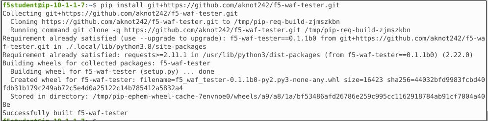

Lab 2 – Use the F5 WAF Tester Tool
----------------------------------

Objective
~~~~~~~~~

- Install the F5 WAF Tester Tool
- Initialize the F5 WAF Tester Tool
- Use the F5 WAF Tester Tool 

Task - Install the F5 WAF Tester Tool
~~~~~~~~~~~~~~~~~~~~~~~~~~~~~~~~~~~~~~~~

RDP into the Client Jumpbox. 

Open a terminal and browse to the f5Student home directory  **/home/f5student**

Perform an **apt** update to ensure we have the right libraries unstalled  

``sudo apt update``

Install pip for python3

``sudo apt install python3-pip``

Confirm the pip version

``pip3 --version``

Now install the **f5-waf-tester**

``pip install git+https://github.com/aknot242/f5-waf-tester.git``

Task - Initialize the F5 WAF Tester Tool
~~~~~~~~~~~~~~~~~~~~~~~~~~~~~~~~~~~~~~~~

While still on the terminal where you installed the F5-WAF-Tester, enter the code below to begin the configuration: 

``f5-waf-tester --init``

You will be asked a series of questions for the configuration. Enter the following below into the appropiate fields. Any other fields that are propmted, just hit enter to leave blank. 

.. code-block:: bash

  ``[BIG-IP] Host []: 10.1.1.4``
  ``[BIG-IP] Username []: admin``
  ``[BIG-IP] Password []: f5demos4u!``
  ``ASM Policy Name []: juice_shop_waf``
  ``Virtual Server URL []: https://juiceshop.f5agility.com``

Your Confoguration prompts will look like this: 

.. image:: ../images/f5-waf-tester-config.png

The output from running the command above will look like the following:

::

   [BIG-IP] Host []: 10.1.1.4
   [BIG-IP] Username []: admin
   [BIG-IP] Password []:
   ASM Policy Name []: juice_shop_waf
   Virtual Server URL []: http://10.1.10.102
   Blocking Regular Expression Pattern [ Your support ID is: (?P<id>\d+) ]:
   Number OF Threads [25]:
   [Filters] Test IDs to include (Separated by ',') []:
   [Filters] Test Systems to include (Separated by ',') []:
   [Filters] Test Attack Types to include (Separated by ',') []:
   [Filters] Test IDs to exclude (Separated by ',') []:
   [Filters] Test Systems to exclude (Separated by ',') []:
   [Filters] Test Attack Types to exclude (Separated by ',') []:

If you need to edit the configuration, re-initialize the tool by running ``f5-waf-tester --init`` again. Then enter your changes. 

Task - Use the F5 WAF Tester Tool
~~~~~~~~~~~~~~~~~~~~~~~~~~~~~~~~~~

Run the tool as follows: 

::

    f5-waf-tester -r f5_waf_tester_report_1.json

.. note:: When using this tool at home and many of the tests fail, the signatures may be out of date. Ensure the latest signatures have been installed. The following article provides instructions on how to do that: https://support.f5.com/csp/article/K82512024. This lab does have an up to date signature set installed. 

.. note:: Also check the configration attributte **URL** of the **f5-waf-tester** tool if most of the tests have failed. It is possible the testing tool is not sending traffic to the right location. 

Quickly check how many tests passed and failed:

::

    grep true f5_waf_tester_report_1.json | wc -l
    grep false f5_waf_tester_report_1.json | wc -l

View the results of the test:

::

    less f5_waf_tester_report_1.json

Continue to tune your WAF policy and check the OWASP Dashboard and then re-run the F5 WAF Tester.