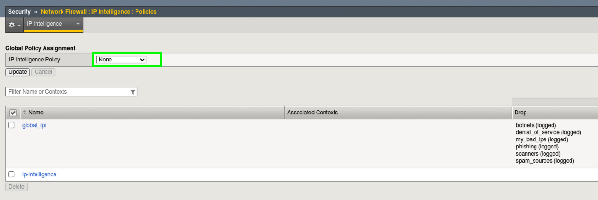
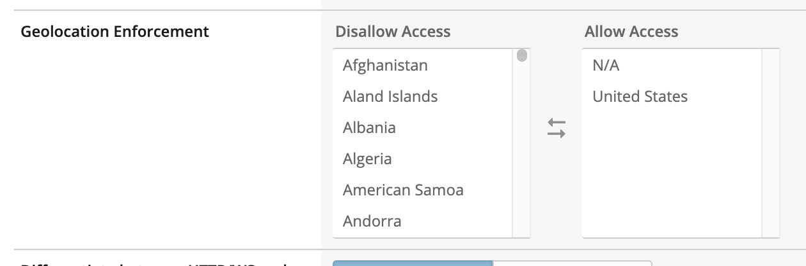
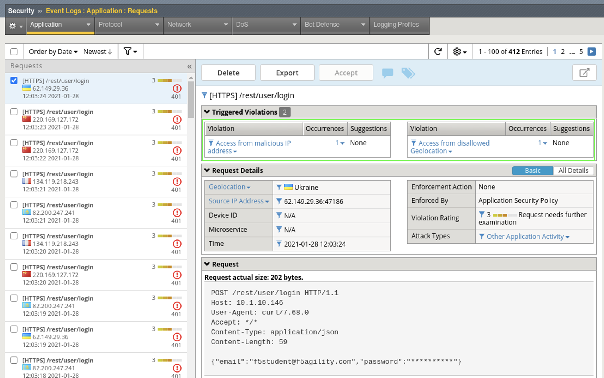
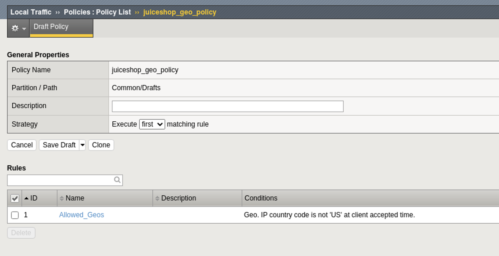

Lab 2 - Add a Geolocation Policy
-------------------------------------------------
Another practical control to implement early on in your WAF deployment is Geolocation blocking or fencing. If we know that our application is only supposed to be accessed from certain countries or not accessed from others, now is the time to get that configured and enforced. 

.. NOTE:: Much like our Layer 7 IPI Policy, with Advanced WAF the Geolocation logic happens at the policy level. You may have many policies each with their own unique configuration per application or you may use a parent policy that has baseline settings. 

Geolocation
~~~~~~~~~~~~~

**For demonstration purposes you will now disable the Layer 3 Global IPI policy to ensure Layer 7 Geolocation & IPI events occur.**

#. Browse to **Security > Network Firewall > IP Intelligence > Policies** and set the Global Policy Assignment to **None** and click **Update**. 

2. Open **Security > Application Security > Security Policies**. Select the **juiceshop_waf** policy created previously. Click **General Settings >** scroll down the right pane to **Geolocation Enforcement**.   

#. Select all Geolocations **except the United States and N/A** and move them to Disallowed Geolocations. **Save** and then **Apply Policy**.

.. NOTE:: N/A covers all RFC1918 private addresses. If you aren’t dropping them at your border router (layer 3), you may decide to geo-enforce at ASM (Layer 7) if no private IP’s will be accessing the site.

4. Navigate to **Security > Event Logs > Application > Requests** and review the entries in the event log that contain both IPI and Geolocation violations.

.. NOTE:: You can also perform Geolocation Enforcement with LTM policies attached to Virtual Servers even if you are only licensed for Advanced WAF. Blocking decisions made here would not be reflected in the Application Requests WAF Log but can be still be logged. 

Here is an example for future reference:

**Congratulations! You have just completed Module 4 by implementing an IPI policy globally at Layer 3 and at Layer 7 via WAF policy for a specific application. Next you added Geolocation Enforcement to the policy and learned that this can be done via WAF policy or LTM policy. This follows our best-practice guidance for getting started with Application Security.**  
