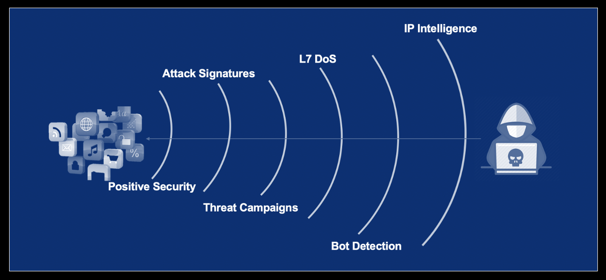

WAF 101 - BIG-IP Security:  Mitigating App Vulnerabilities with AWAF
=================================================================================

BIG-IP Advanced Web Applications Firewall, AWAF, is an incredibly powerful security tool to protect applications. Protecting your apps against critical risks such as the threats listed in the OWASP Top 10, requires comprehensive and consistent security. F5 AWAF technology provides a strategic stop gap against common vulnerabilities like injection and cross-site scripting. In this lab we will demonstrate how basic injection and cross site scripting attacks work, how to quickly configure the BIG-IP AWAF policies for mitigation and deploy other useful features such as IP Intelligence and Bot Defense in your AWAF policies. 

Here is a complete listing of all F5 Advanced WAF classes offered at this year's Agility event.

* BIG-IP Security: Mitigating App Vulnerabilities with AWAF

* BIG-IP Security: Enabling API Protection with AWAF and APM

Following the Agility conference you can visit `clouddocs.f5.com <https://clouddocs.f5.com/training/community/>`_ to continue your education and create your own test lab environment.

.. toctree::
   :maxdepth: 1
   :caption: Contents:
   :glob:

   labinfo/labinfo
   module*/module*