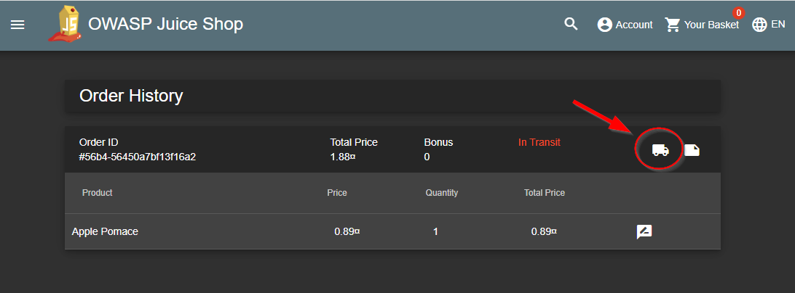
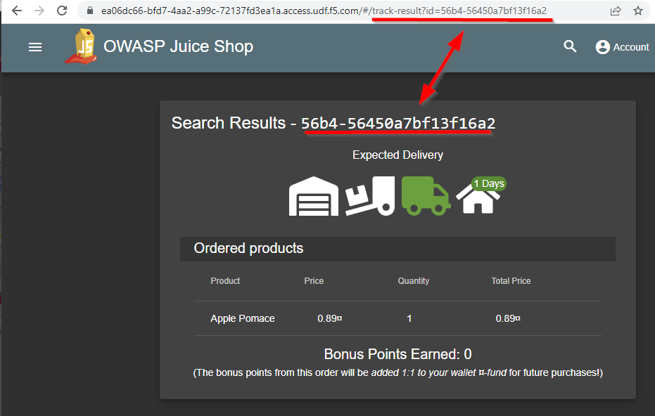
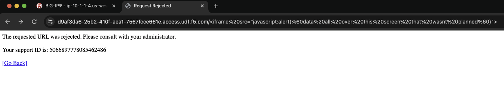
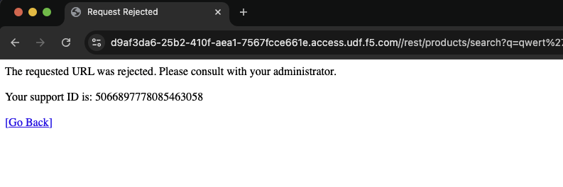
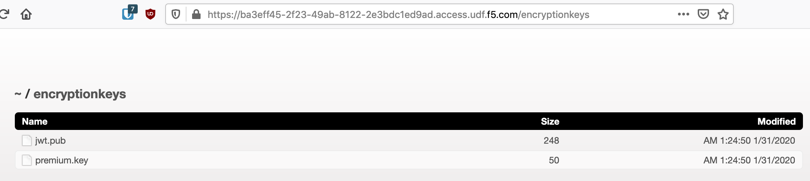
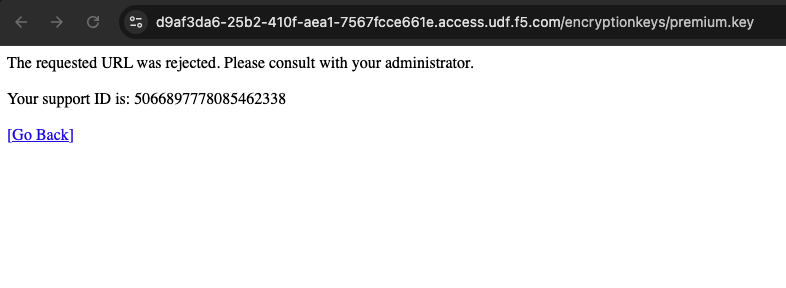

Lab 3 – Test your Policy against the Juice Shop
-----------------------------------------------
Objective
~~~~~~~~~~~~~~~~
Revist the Juice Shop to test what the OWASP Compliance Dashboard has done so far.

Cross Site Scripting (XSS)
~~~~~~~~~~~~~~~~~~~~~~~~~~

This hack we will cause a simple reflected XSS attack on the Juice Shop application by compromising a parameter value in the URL. First go to **Account** in the upper right corner, then to **Orders and Payment**, select **Order History**.

Click on the truck. This will take you to an expected delivery page with search results. Carefully look at the URI and notice that it is not encoded or using a trusted html link for the parameter value. 

Paste the following code after **yourhost.access.udf.f5.com/#/track-result?id=** in the URI. 

.. code-block:: none
    
    <iframe src="javascript:alert(`data all over this screen that wasnt planned`)">

The full URL will look like this after encoding is done by the browser. Dont paste this code below into the browser. This is meant for reference since you will have a different host. 

.. code-block:: none
    
    https://ea06dc66-bfd7-4aa2-a99c-72137fd3ea1a.access.udf.f5.com/#/track-result?id=%3Ciframe%20src%3D%22javascript:alert(%60data%20all%20over%20this%20screen%20that%20wasnt%20planned%60)%22%3E

The result should now be a response page from the BIG-IP

SQL Injection
~~~~~~~~~~~~~

Paste the following path in your browser's location bar after the FQDN of the Juice Shop:

.. code-block:: none
   
    /rest/products/search?q=qwert%27%29%29%20UNION%20SELECT%20id%2C%20email%2C%20password%2C%20%274%27%2C%20%275%27%2C%20%276%27%2C%20%277%27%2C%20%278%27%2C%20%279%27%20FROM%20Users--

The location bar should look something like (don't copy this since your FQDN will be different):

.. code-block:: none

    https://ba3eff45-2f23-49ab-8122-2e3bdc1ed9ad.access.udf.f5.com/rest/products/search?q=qwert%27%29%29%20UNION%20SELECT%20id%2C%20email%2C%20password%2C%20%274%27%2C%20%275%27%2C%20%276%27%2C%20%277%27%2C%20%278%27%2C%20%279%27%20FROM%20Users--

The result should now be a response page from the BIG-IP.

Unauthorized File Access
~~~~~~~~~~~~~~~~~~~~~~~~

Navigate to /encryptionkeys to expose an unwanted directory listing

Click on the file ``premium.key`` and attempt to download it.

Notice that while you can get to **/encryptionkeys**, an attempt to download the file is now blocked by BIG-IP Advanced WAF.