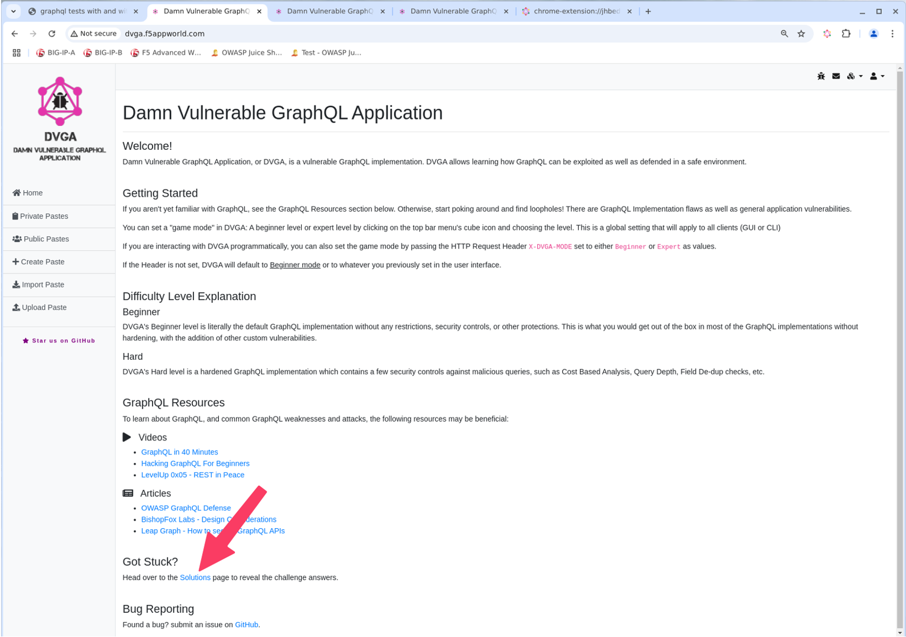
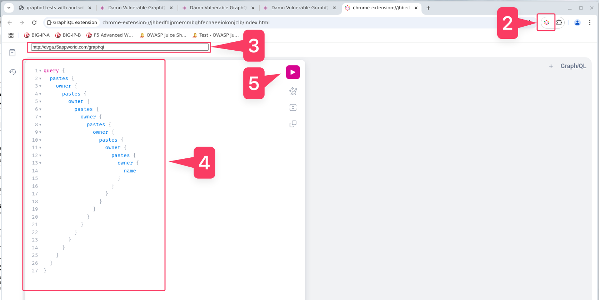
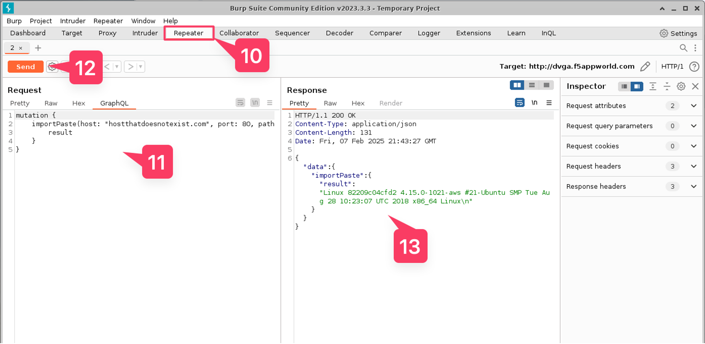
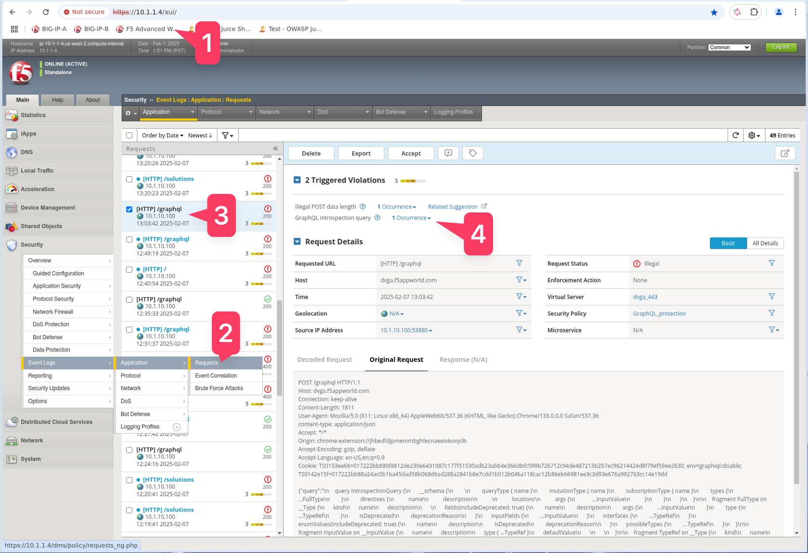

Lab 1 - Explore DVGA Attack Types and Execute Some Attacks
----------------------------------------------------------
Objective
~~~~~~~~~

Familiarize yourself with DVGA and Challenge Solutions

Connect to the Linux Client
~~~~~~~~~~~~~~~~~~~~~~~~~~~

.. NOTE:: All steps in this lab exercise will be performed from the Linux jump host.

#. On your UDF page, go to your Client component, click the Access drop down menu and choose RDP 

#. RDP to the Linux Client by choosing the RDP access method from your UDF environment page. 

**user: f5student**
**password: f5DEMOs4u!**

.. NOTE:: you should only need to enter the password, the username should be auto-populated.

Explore DVGA
~~~~~~~~~~~~

#. Once logged in, launch Chrome Browser and go to http://dvga.f5appworld.com.

#. Scroll down to “Got Stuck?” section and click “Solutions” link.

3. Select an attack type...in this case select **"Batch Query Attack"**

.. image:: ../images/challenge_s.png

4. Click the green "Show" button.

.. image:: ../images/batch_query.png

.. NOTE:: Each solution may show a script or just a graphQL payload to use to execute the attack. If it shows a script, you will find a script file matching that attack type in the /graphql directory in the user’s home directory. If the solution shows a GraphQL payload you may choose either the GraphiQL Chrome extension or Burp Suite to execute the attack. After each attack you should review the WAF logs to see the results and which violations triggered. See the “Review Waf Logs” section at the end of Lab 2 for instructions.

Execute an attack via a python script
~~~~~~~~~~~~~~~~~~~~~~~~~~~~~~~~~~~~~

#. Open Terminal on the Linux jump host

#. cd graphql

#. python3 <script name>

.. image:: ../images/py_term.png

Execute an attack using the GraphiQL Chrome extension
~~~~~~~~~~~~~~~~~~~~~~~~~~~~~~~~~~~~~~~~~~~~~~~~~~~~~

#. Copy the graphQL payload from the Solution

.. image:: ../images/deep_recur.png   

2. Open GraphiQL Chrome extension

#. Enter http://dvga.f5appworld.com/graphql into the target field

#. 4.	Paste the graphql payload from solution

#. Send the request

Execute an attack using the Burp Suite
~~~~~~~~~~~~~~~~~~~~~~~~~~~~~~~~~~~~~~

#. Open Burp Suite from the desktop icon

.. image:: ../images/burp.png

2. Click “Next” and “Start Burp”.

#. Go to the “InQL” Burp extension tab.

#. Enter http://dvga.f5appworld.com/graphql in the GraphQL Endpoint field.

#. Click "Analyze"

.. NOTE:: This will run introspection on DVGA and return the entire schema.  You should see violations in the WAF logs for this.

6. You should now see a directory for DVGA in the schema folders below.

#. Expand the DVGA folder and the date-specific folder.

#. Select the request type that best matches the attack payload youa re trying to use.

#. In the GraphQL paylod area to the right, right-click and select "Send to Repeater"

10. Select the "Repeater" tab

#. Paste the attack paylod from the SOlution into the Request area.

#. Click "Send"

#. Review the response.

Review WAF Logs
~~~~~~~~~~~~~~~

#. In Chrome on the Linux jump host, go to the F5 Advanced WAF shortcut and Login

**user: admin**

**password: f5demos4u!**

2. Navigate to the WAF Request Logs screen

#. Select the request with your most recent attack

#. Review the request and any GRAPHQL violations that may have triggered.

**Congratulations! You have just completed Module 3**

