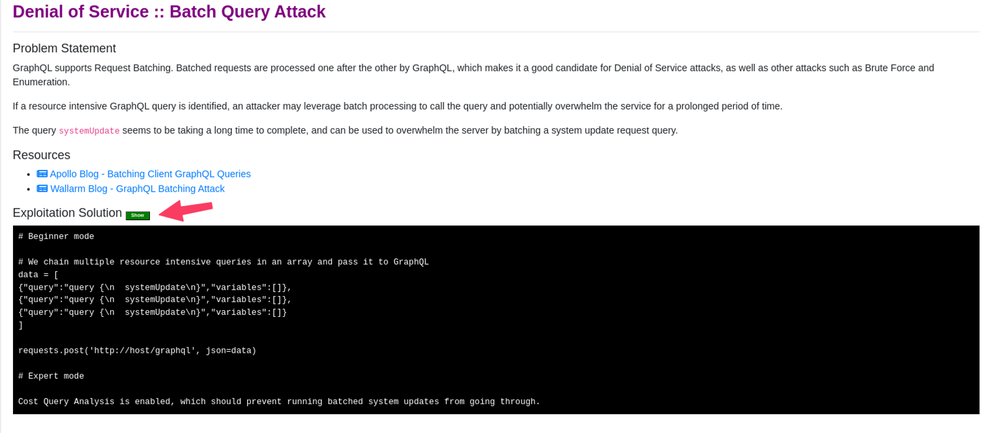

Lab 1 - Find DVGA Attack Types
---------------------------------------
Objective
~~~~~~~~~

Familiarize yourself with DVGA and Challenge Solutions

Connect to the Linux Client
~~~~~~~~~~~~~~~~~~~~~~~~~~~

.. NOTE:: All steps in this lab exercise will be performed from the Linux jump host.

#. On your UDF page, go to your Client component, click the Access drop down menu and choose RDP 

#. RDP to the Linux Client by choosing the RDP access method from your UDF environment page. 

**user: f5student**
**password: f5DEMOs4u!**

.. image:: ../images/rdp.png

Explore DVGA
~~~~~~~~~~~~

#. Once logged in, launch Chrome Browser and go to http://dvga.f5appworld.com.

#. Scroll down to “Got Stuck?” section and click “Solutions” link.

.. image:: ../images/dvga_stuck.png

3. Select an attack type...in this case select **"Batch Query Attack"**

4. Click the green "Show" button.

.. NOTE:: Each solution may show a script or just a graphQL payload to use to execute the attack. If it shows a script, you will find a script file matching that attack type in the /graphql directory in the user’s home directory. If the solution shows a GraphQL payload you may choose either the GraphiQL Chrome extension or Burp Suite to execute the attack. After each attack you should review the WAF logs to see the results and which violations triggered. See the “Review Waf Logs” section at the end of Lab 2 for instructions.

