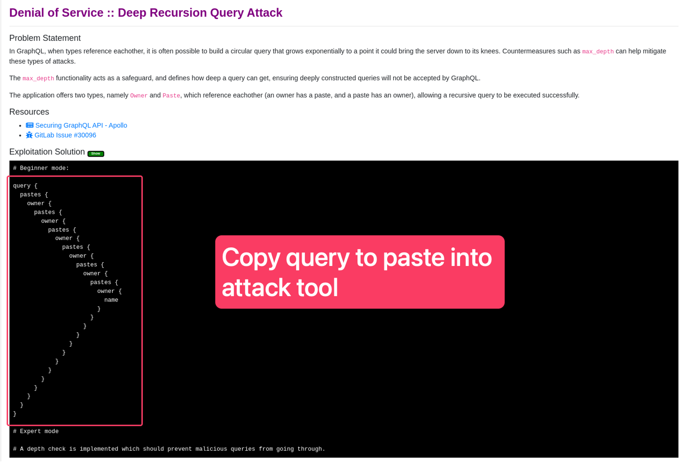

Lab 2 - Execute Attacks and Review Logs
---------------------------------------

Execute an attack via a python script
~~~~~~~~~~~~~~~~~~~~~~~~~~~~~~~~~~~~~

#. Open Terminal on the LInux jump host

#. cd /graphql

#. python3 <script name>

.. image:: ../images/py_term.png

Execute an attack using the GraphiQL Chrome extension
~~~~~~~~~~~~~~~~~~~~~~~~~~~~~~~~~~~~~~~~~~~~~~~~~~~~~

#. Copy the graphQL payload from the Solution

2. Open GraphiQL Chrome extension

#. Enter http://dvga.f5appworld.com/graphql into the target field

#. 4.	Paste the graphql payload from solution

#. Send the request

.. image:: ../images/graphiql.png

Execute an attack using the Burp Suite
~~~~~~~~~~~~~~~~~~~~~~~~~~~~~~~~~~~~~~

#. Open Burp Suite from the desktop icon

2. Click “Next” and “Start Burp”.

#. Go to the “InQL” Burp extension tab.

#. Enter http://dvga.f5appworld.com/graphql in the GraphQL Endpoint field.

#. Click "Analyze"

.. NOTE:: This will run introspection on DVGA and return the entire schema.  You should see violations in the WAF logs for this.

6. You should now see a directory for DVGA in the schema folders below.

#. Expand the DVGA folder and the date-specific folder.

#. Select the request type that best matches the attack payload youa re trying to use.

#. In the GraphQL paylod area to the right, right-click and select "Send to Repeater"

.. image:: /images/inql.png

10. Select the "Repeater" tab

#. Paste the attack paylod from the SOlution into the Request area.

#. Click "Send"

#. Review the response.

.. image:: /images/repeater.png

Review WAF Logs
~~~~~~~~~~~~~~~

#. In Chrome on the LInux jump host, go to the F5 Advanced WAF shortcut and Login

**user: admin**

**password: f5demos4u!**

2. Navigate to the WAF Request Logs screen

#. Select the request with your most recent attack

#. Review the request and any GRAPHQL violations that may have triggered.

.. image:: ../images/waf_log.png

**Congratulations! You have just completed Module 4**
