Lab 1: Elevated Bot Defense
-------------------------------------------

We began WAF 102 with a Relaxed or "Signature Only" Bot Defense Profile that did not include any active challenges. Now to build on that knowledge, and **elevate** our security posture, we will create a Balanced Bot Mitigation Profile that includes active JavaScript challenges. 

**Balanced Mode Bot Profile Template Benefits**

* Defines a moderate security policy that performs advanced verification of Browsers
* Blocks Malicious Bots that bypass signature checks
* Initiates a CAPTCHA challenge for Suspicious Browsers
* Strong verification of Mobile Apps using Anti-Bot Mobile Security SDK (Add-on required)
* Limits the total request rate produced by Unknown bots and allows Trusted and Untrusted Bots. 
* Malicious Bots and Suspicious Browsers are identified by using both anomaly detection algorithms and bot signatures. 
* This mode provides an advanced protection level with reduced latency impact because Browser verification is performed by injecting challenge in HTTP response. 

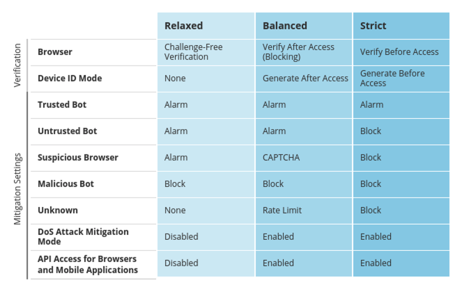

-  Estimated time for completion: **25** **minutes**

.. IMPORTANT:: If you are continuing your lab session from WAF 101 or 102 with the same deployment, please disable any previously configured security profiles on the Virtual Server and skip down to "Configuring Bot Defense”. New students start at step 1. 

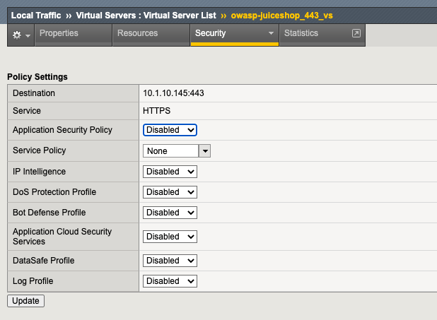

#. RDP to the Linux Client by choosing the RDP access method from your UDF environment page. You will be presented with the following prompt where you will enter the password only. The **f5student** account is hard coded into XRDP for your convenience. 

  .. image:: images/xrdp.png
    :width: 600 px

2. Once logged in, launch Chrome Browser. You can double-click the icon or right click and choose "execute", but **do not click multiple times**. It does take a few moments for the browser to launch the first time. 

#. Click the **F5 Advanced WAF bookmark** and login to TMUI. admin/[password]. 

#. On the Main tab, click **Local Traffic > Virtual Servers** and you will see the Virtual Servers that have been pre-configured for your lab. Essentially, these are the listening IP's that receive requests for your application and proxy the requests to the backend "real" servers.

| You will see 3 Virtual Servers: 

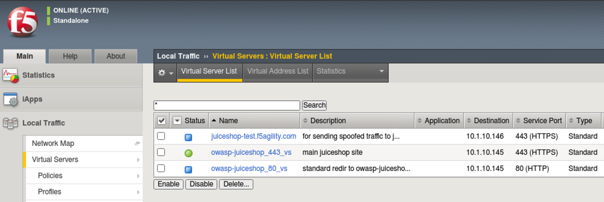

|

| * **juiceshop-test.f5agility.com** - Will be used later to send spoofed traffic to the main site
| * **owasp-juiceshop_443_vs** - Main Site - Status of green indicates a healthy backend pool of real servers 
| * **owasp-juiceshop_80_vs** - Standard port 80 redirect to main site

Configuring Bot Defense 
~~~~~~~~~~~~~~~~~~~~~~~~

The first step in enabling Bot Defense is to set up the log profile so we can capture all of the events we need to see. We will then create and apply the Bot Defense profile to our Juice Shop Virtual Server. 

#. Navigate to **Security > Event Logs > Logging Profiles** and click **Create** to setup a new Logging Profile named: **Balanced_Bot_Log**. 
#. Configure the profile per the screenshot below and when finished click **Create**. You may need to resize the browser for the "Create" button to be visible. 

.. NOTE:: Initially, we are logging everything so we get can a feel for traffic patterns where normally in the "real world" you would scale this back to log only essential requirements and not necessarily valid human or mobile devices. 

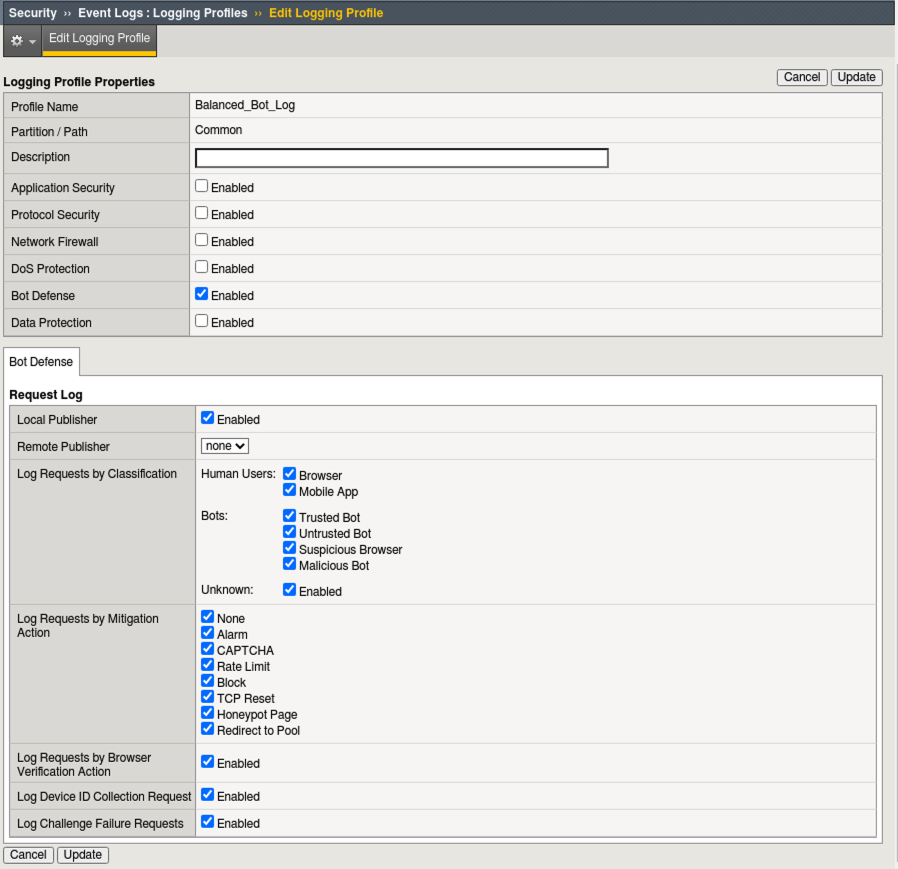

3. Navigate to **Security > Bot Defense > Bot Defense Profiles** and click **Create**.
#. Name: **Balanced_Bot_Profile**
#. Enforcement Mode: **Blocking** (If the enforcement mode is set to Transparent, browser verification challenges are not performed.)
#. Profile Template: **Balanced**
#. Click the **Learn more** link to see an explanation of the options. 

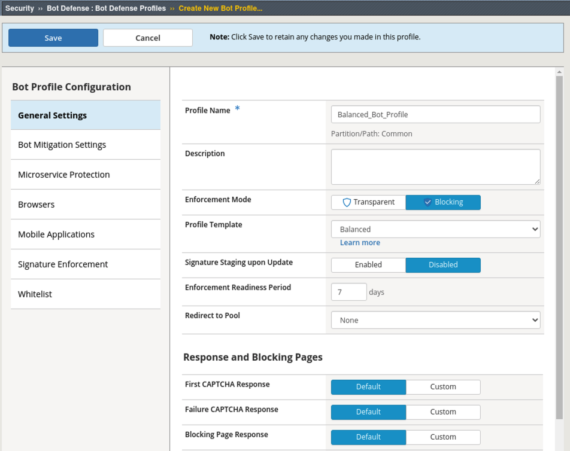

8. Click on the **Bot Mitigation Settings** tab and review the default Mitigation Settings for various classifications of bots and browsers. We will see these settings in action shortly.
#. Click on the **Browsers** tab and under **Browser Verification** and note the settings as well as the setting for **Device ID Mode**.

* The grace period allows clients the time to be identified as non-bots while web pages, including complex pages such as those which include images, JS, and CSS, load.
* The grace period begins after the client is validated, a configuration change occurs, or when proactive bot defense starts as a result of a detected DoS attack or high latency.

10. Click on the **Help** tab at the top left of the screen and scroll down to the **Browsers > Browser Verification** section for a more detailed explanation of each of the settings for **Browser Verification**. 

.. NOTE:: It is important to understand what these settings are capable of and how they operate. Inline help is always a great option for more information!

**Verify after Access (Blocking)**: JavaScript is injected in the response. The JavaScript performs browser verification tests. If the tests fail, browser verification anomalies are reported, and the mitigation is performed according to the selected mitigation settings. If the tests pass, the request is passed to the server.

11. Click **Save**.

Verify Normal HTTP Response
~~~~~~~~~~~~~~~~~~~~~~~~~~~~~

#. Open a new Tab in Google Chrome and **Right Click** anywhere on the page and choose **Inspect** from the menu. Click on the **Network Tab** and click **Disable cache** as shown in the screenshot below step 4.
#. Click the **OWASP Juice Shop Bookmark** in the Bookmark menu and click through the certificate warning if you receive one. **DO NOT Dismiss the popup or click on anything else yet.** You will see a lot of output under the Network Tab Log as the page loads. Scroll to the top of this log until you find the entry named **juiceshop.f5agility.com** and click on it. 
#. Click on the **Response** tab and note the default HTML response when no Bot Profile is applied to the Virtual Server. This is the normal Juice Shop web page HTML. 
#. Do not close this tab. 

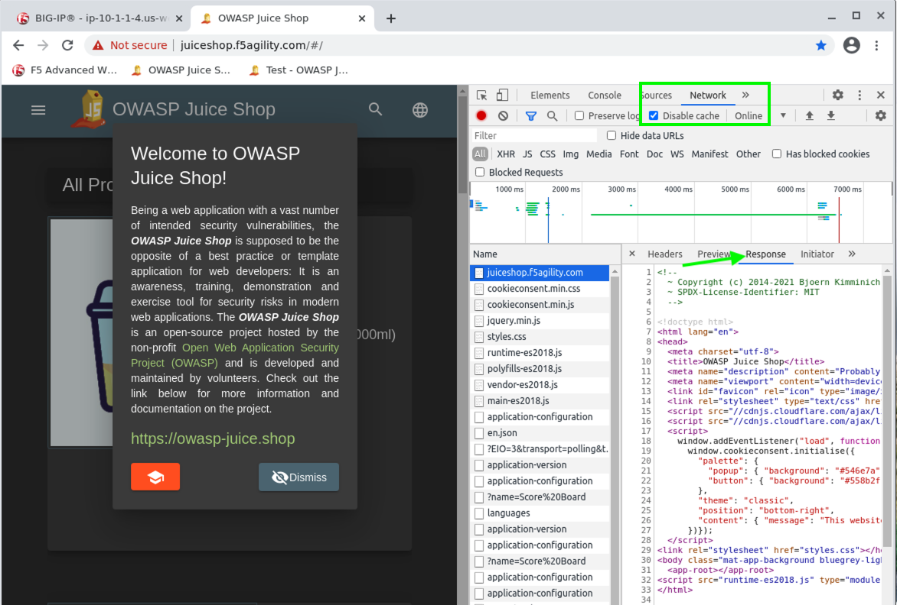

Applying Bot Defense 
~~~~~~~~~~~~~~~~~~~~~~~~

#. In Advanced WAF tab, click the **Main** tab and navigate to **Local Traffic > Virtual Servers > owasp-juiceshop_443_vs > Security > Policies**
#. Enable the Bot Defense Profile and select the **Balanced_Bot_Profile**.
#. Enable the Log Profile and select the **Balanced_Bot_Log** profile.
#. Click **Update**

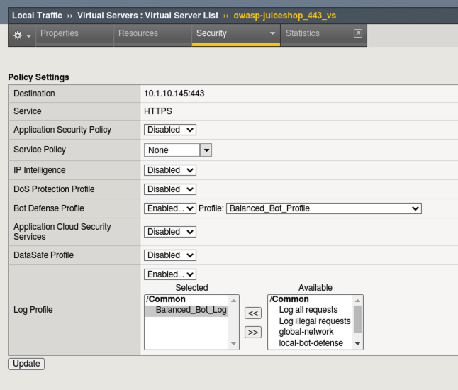

Verify Browser Challenges 
~~~~~~~~~~~~~~~~~~~~~~~~~~~
#. Back in the JuiceShop tab, click the Browsers **Refresh** button. **Do not dismiss the popup or interact with the site in any way**. (Inspection tools should still be open and focused on the Network tab)
#. Find the 1st entry named **juiceshop.f5agility.com** at the top and click on it. There will be two. The top one is empty (Failed to load response data) because there was none, but if you look at the headers you can see this is actually a 307 temp redirect back to "/" with 2 **TS** cookies set by the WAF. The **TSPD_101** cookie is the one set as part of the challenge. This was the first phase of the Active challenge and similar in a way to how our TCP SYN cookies work at Layer 4. 

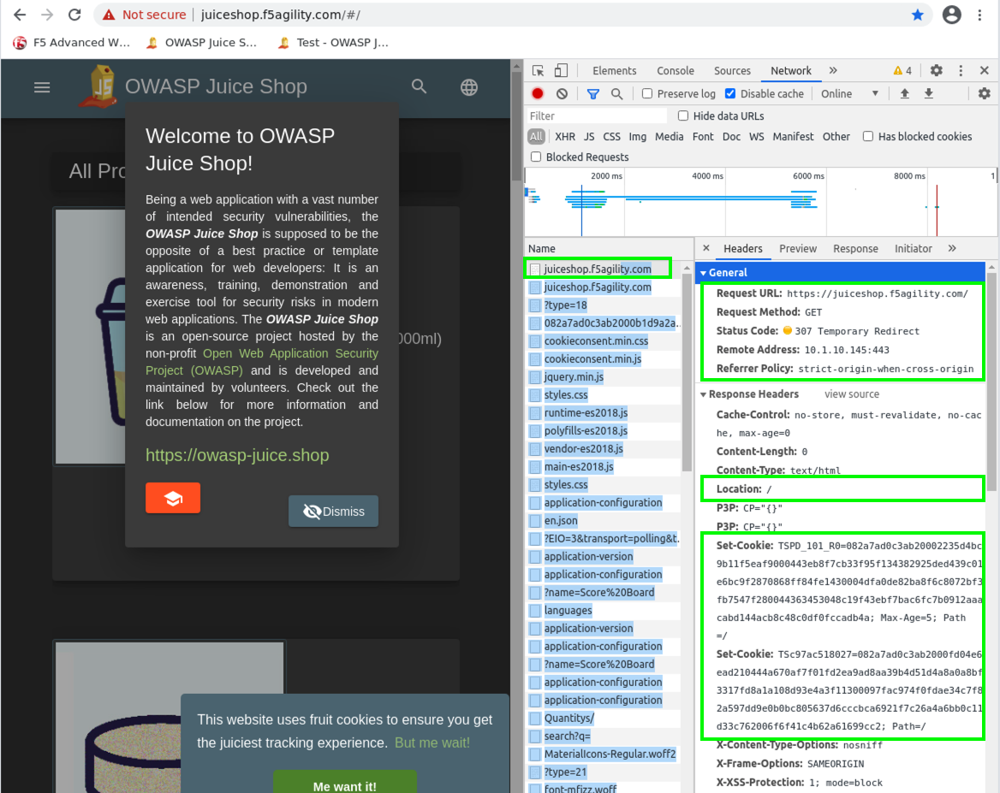

3. Under the second request for **juiceshop.f5agility.com** you will see quite a different HTML response this time as the Advanced WAF has inserted obfuscated JS to challenge and verify the browser. 
#. You may need to resize the Inspect > Response pane to get a better look at the JS. This code is not easy to reverse engineer and is updated often via the Advanced WAF **Live Update** feature.

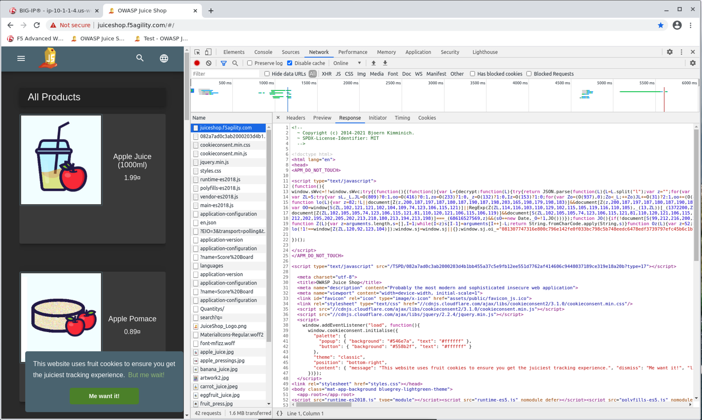

5. Now that we have verified the Bot Profile is actively inserting the challenge, you can **Close** the **Inspection tools** in the browser and **Refresh** the Juice Shop site. **Dismiss** the popup and click on one of the first items for sale such as the Apple or Banana Juice. 
#. Back in the Advanced WAF tab navigate to **Security > Event Logs > Bot Defense > Bot Requests** and review the event logs. You will see all valid and/or challenged requests from **"Chrome (Browser)"**. 
#. Click on some of the requests and then click the **All Details** tab on the right and review the **Verification Action and Challenge Status**. You will also see a unique DeviceID was assigned per the Balanced_Bot_Profile default settings. Also note the Bot Details and the full text visibility of the request below. 

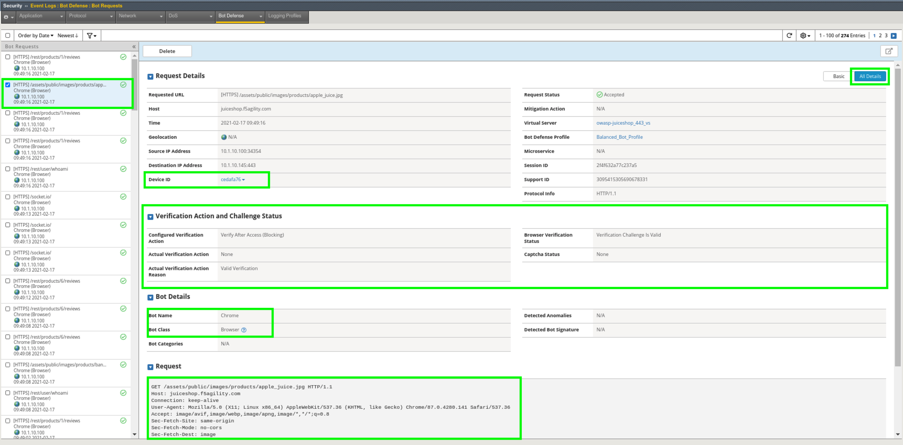

Testing with a Bot
~~~~~~~~~~~~~~~~~~~~~~~

#.  Open a Terminal on the Linux Client and run the following command:

        ``curl -k https://juiceshop.f5agility.com``

2. Refresh **Security > Event Logs > Bot Defense > Bot Requests** and review the event logs. Was the Request blocked?

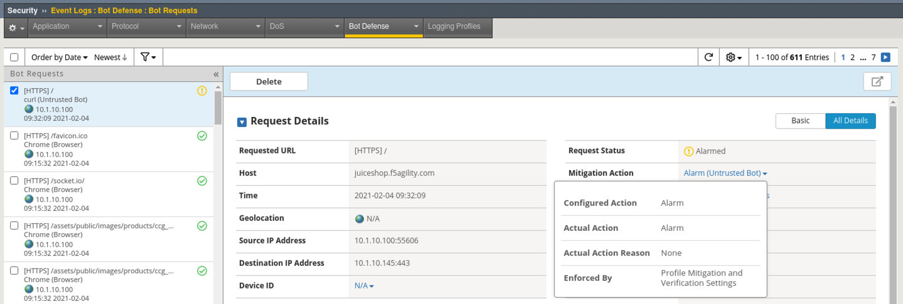

3. This request was not blocked but did produce an alarm. **Click** on the **Mitigation Action** in Request Details for more information around the enforcement. 

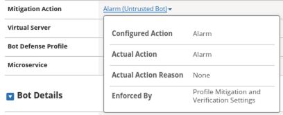

.. NOTE:: Curl is an untrusted bot, but not necessarily malicious. By default, the Balanced policy is set to only alarm on untrusted bot access. This can be tuned per your environment.  

4.  Now we will test with a request that is formatted to appear as if it is coming from a malicious user-agent (Nikto). In the terminal run the following curl command:

        ``curl https://juiceshop.f5agility.com/ -k -H "User-Agent: Mozilla/5.00 (Nikto/2.1.6) (Evasions:None) (Test:Port Check)"``

You should get a **Request Rejected** response in the Terminal window. 

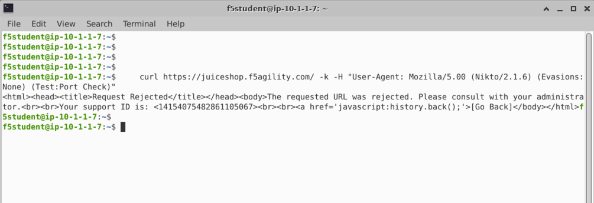

5. Refresh **Security > Event Logs > Bot Defense > Bot Requests** and review the event logs. You will see that the Bot was categorized as malicious and blocked. Also notice that there is no DeviceID because the bot was blocked immediately due to its categorization. No challenge necessary. DeviceID is provided via the JS Challenge. 
6. Examine **All Details** and review the **Verification Action and Challenge Status**. Notice there is none. Why?

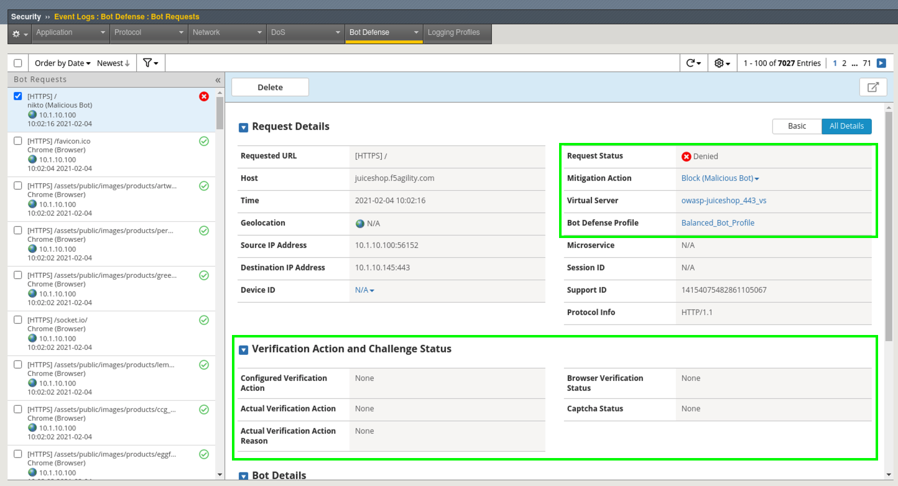

.. NOTE:: The reason there are no challenges for this request is because these requests have user-agents associated with them that are well-known by our Bot Signatures so there is no reason to challenge them. They match the signature at the time of the request, so an action is immediately taken based on the categorization of the bot. 

So, what if an attacker spoofs user-agents to look legitimate? Let's try to trick the WAF by using curl and spoofing a legitimate user-agent. 

Spoofing a legitimate UA
~~~~~~~~~~~~~~~~~~~~~~~~~~~

1. Select one of the **Accepted Requests** in Bot Requests Log and scroll down to examine the request. We will "borrow" the user-agent from that request since we know it is a valid browser UA. 

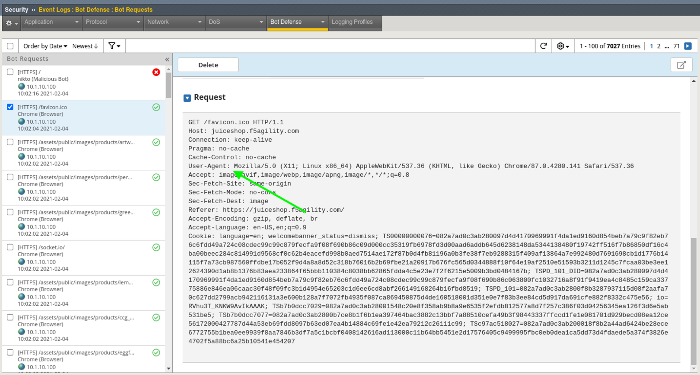

2. In the terminal run the following command: 

        ``curl https://juiceshop.f5agility.com/ -k -H "User-Agent: Mozilla/5.0 (X11; Linux x86_64) AppleWebKit/537.36 (KHTML, like Gecko) Chrome/87.0.4280.141 Safari/537.36" | more``

Here we see a response, but it isn't the default HTML of the Juiceshop page we saw earlier or a **Request Rejected** page as seen in the previous example. Continue to hit the space bar to see the remainder of the response/challenge. 

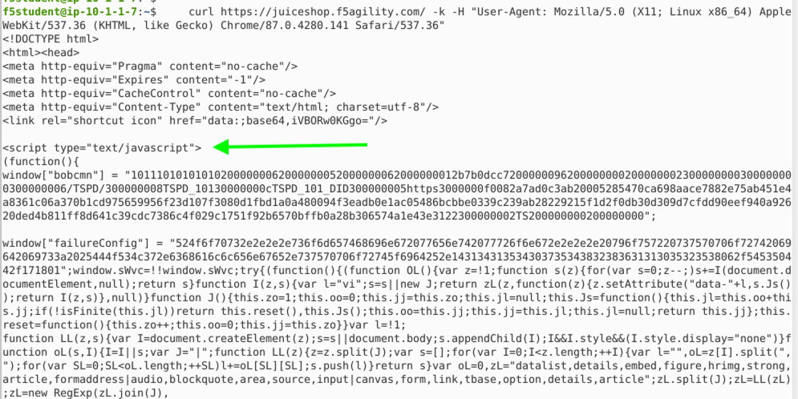

3.  Refresh **Security > Event Logs > Bot Defense > Bot Requests**. You should now see a **Challenged Event**. 

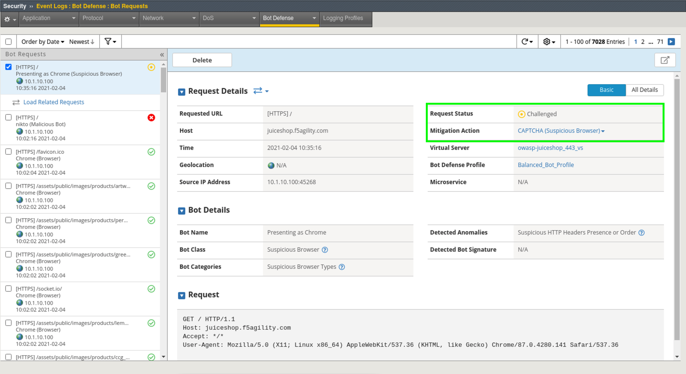

4. Look under **Bot Details > Detected Anomalies** and note the anomaly of Suspicious HTTP Headers Presence or Order. 

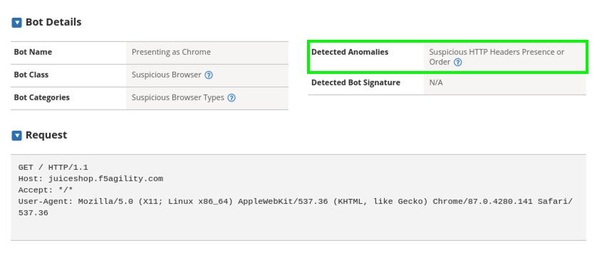

.. NOTE:: The Bot Profile identified the requesting party as a suspicious browser and issued a Captcha Response due to Suspicious HTTP Headers Presence or Order. That was the JavaScript we saw returned in the terminal window. 

Return to your Bot Defense Profile (**Security > Bot Defense Profiles, then click on "Balanced Bot Profile**) and review the Bot Mitigation options in the drop downs menus. **At this point it should be getting clearer to you as to how a bot profile operates from a mitigation settings perspective and how to validate your configurations. We "could" start blocking or redirecting Untrusted Bots to another pool of servers for forensics. We "could" also send Suspicious browsers or Malicious Bots to a honeypot page.**

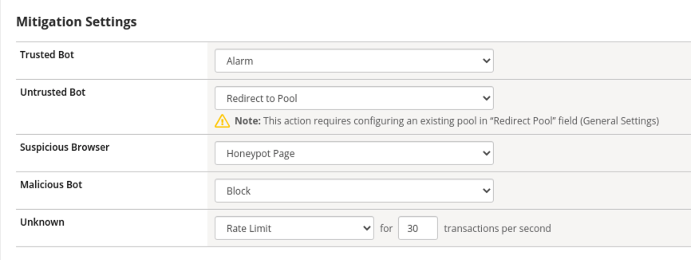

**This concludes Lab 1**
