Lab 2: Intro to Positive Security 
------------------------------------

In WAF141 we created and tested some of the negative security aspects of the Application Security Policy including Ip Intelligence Enforcement, Geolocation, Signature Based Bot Detection and a Transparent Policy focused on Attack Signatures. 
If you were following along in successive fashion and building your own environment, the configurations below logically pick up in the policy right where 141 left off. We will be creating a new policy for this lab that starts with "2nd day" best-practice configurations for **elevating** your WAF policy up a level but in reality you should always start your approach as recommended in the 141 class and build from there. 

#. Navigate to **Security > Application Security > Security Policies > Policies List > Create** and configure a policy named **juiceshop_blocking**
#. Choose Policy Template: **Rapid Deployment Policy**, Enforcement Mode: **Blocking** and click **Save**. 

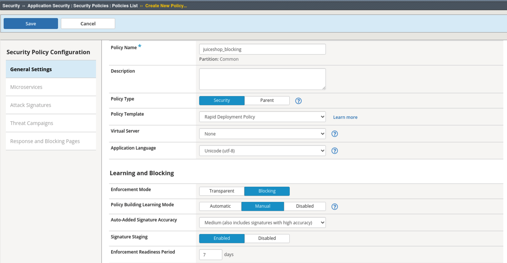

3. Navigate to **Security > Application Security > Policy Building > Learning and Blocking Settings**. 
#. Under **Cookies** note the default settings. Uncheck **Learn** from **Modified ASM Cookie**. Generally we do not want to allow modification of the WAF cookie and therefor will disable learning suggestions for this. 
#. Under **File Types** note the default Learning Mode is set to **Never (wildcard only)** Change that to be **Selective** and enable **Learn and Alarm** for **Illegal file type**. 

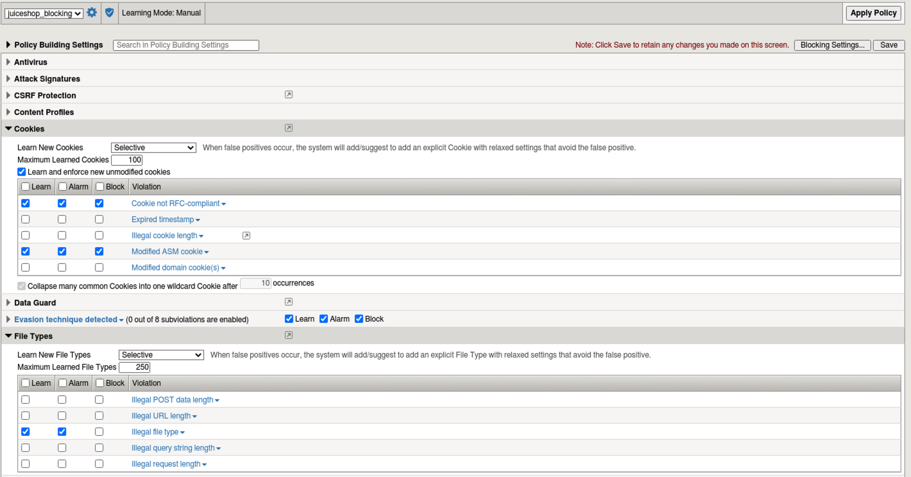

6. Under **Headers** check the box for both Alarm and Block for **Illegal host name** and then it's very important to check the bottom box for **Learn New Hostnames**.
7. Under **URLS** enable **Compact Mode** for Learning Mode instead of **Never (wildcard only)**. Note the description of this mode: 

Choose this option if you would like to create a list of top-level URL directories ``(e.g. /abc/*) and /``, while enforcing all other URLs with a wildcard rule.

8. Enable Learn and Alarm for **Illegal URL**, click **Save** and **Apply Policy**. 

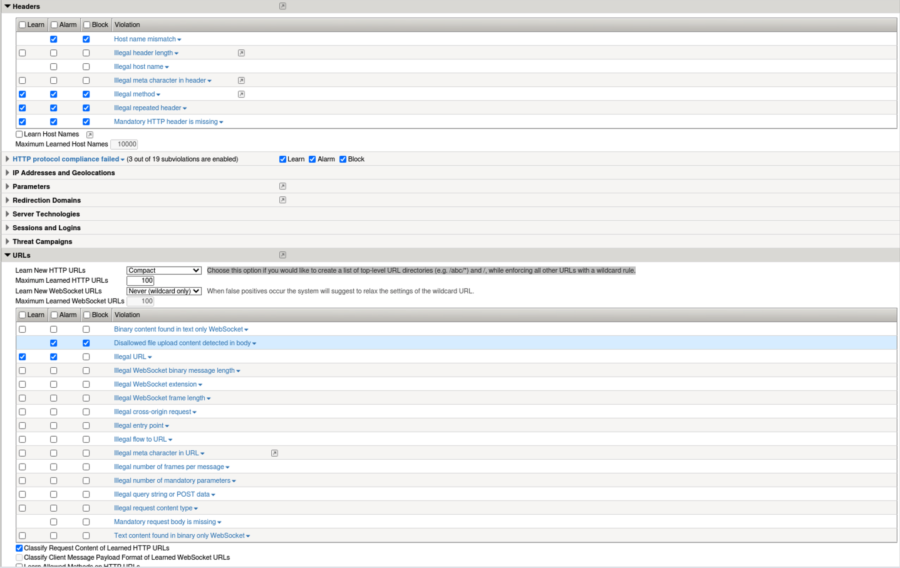

Whitelist
~~~~~~~~~~
Since we will be training the waf for positive security, let's create a whitelist. This will help to create high fidelity learning suggestions as events occur. 

#. Navigate to **Security > Application Security > IP Addresses > IP Address Exceptions** and click **Create**. Configure the whitelist for a 10/8 to allow our internal "trusted" *cough *cough networks as shown below and check the box for **Policy Builder trusted IP**. 
#. Note in the upper left that this Whitelist is only associated with the juiceshop_blocking policy. Whitelists are unique per policy but could be defined at the parent level. 
#. Click **Create** and **Apply Policy**. 

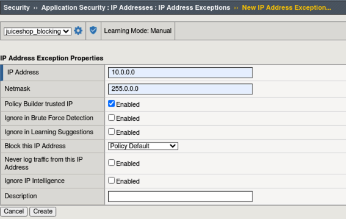

Configure the Virtual Server 
~~~~~~~~~~~~~~~~~~~~~~~~~~~~~~

#. Navigate to  **Local Traffic > Virtual Servers > owasp-juiceshop_443_vs > Security > Policies** 

.. NOTE:: For Demo purposes, we will be removing the Bot Defense Profile to exclusively test the blocking Application Security Policy. In the "real world" these profiles compliment each other by providing a layered defense for your application. 

2. **Enable** the Application Security Policy **juiceshop-blocking**. 
#. **Disable** the Bot Defense profile. 
#. **Move** the Balanced_Bot_Log from **Selected** to **Available** and add move the **Log all requests** profile over to **Selected** and click **Update**. 

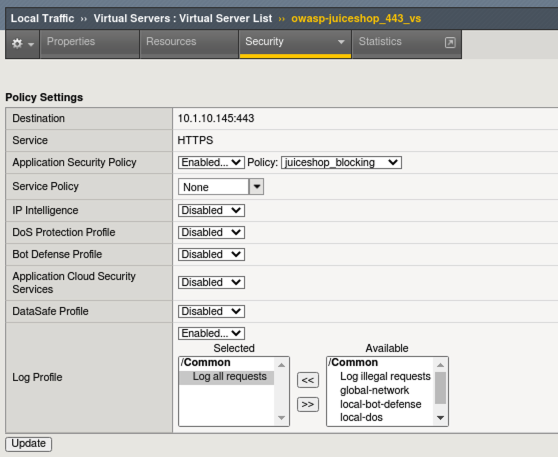

Exercise the App Part 1
~~~~~~~~~~~~~~~~~~~~~~~~~~~

#. Close any existing Juice Shop tabs in the browser and open a new one to the **OWASP Juice Shop** bookmark. 
#. Request Rejected!!! What Happened?

Investigating an Incident
~~~~~~~~~~~~~~~~~~~~~~~~~~~~
#. Navigate to **Security > Event Logs > Application > Requests** and review the blocked events. In both cases it was an illegal hostname due to the checks that we enabled under **Headers** in **Learning and Blocking Settings** just moments ago. 
#. The problem is that we enabled checking for a hostname but haven't defined what that hostname is yet. This exercise is to draw your attention to the importance of understanding what you are enabling in Learning and Blocking Settings and how to quickly resolve an issue. We can easily add the hostname. 

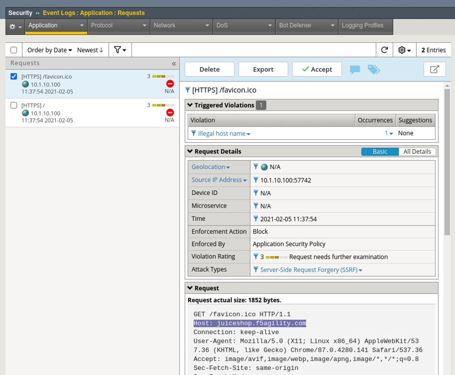

#. Select one of the alerts and click **Accept**. By clicking **Accept** we will be instructing the system to create a learning suggestion to add a new hostname for this policy if it did not have one already. 
#. Notice a screen briefly pops up and informs you that the system is checking the learning mode. Our policy is set to manually learn so we will need to manually accept this suggestion. 
#. Navigate to **Security > Application Security > Policy Building > Traffic Learning** and note the learning suggestions and score. You will see suggestions to add the top level URL and a Valid Hostname.  All of the others involve enabling various checks for evasion techniques and http protocol compliancy which is generally a good idea. 
#. Click the box to **Select All** suggestions and click **Accept > Accept suggestions** and **Apply Policy**.
#. Navigate to **Security > Application Security > Headers > Host Names** to review the hostname that was configured when you accepted the learning suggestion. 

.. image:: images/host.png
  :width: 600 px

Exercise the App Part 2
~~~~~~~~~~~~~~~~~~~~~~~~~~~

#. Go back to the Juice Shop tab and do a [Shft + Refresh] 
#. Click **Account > Login** in the top right and then click **Not yet a customer** on the login form. 
#. Use **f5student@f5agility.com** for email address and the same password you've been using for the labs. Select and complete any of the Security Questions and click **Register**. 
#. Login with the new account, click on the **Apple Juice** and leave a short review and click **Submit**.

.. image:: images/feedback.png
  :width: 600 px

5. In the Advanced WAF tab navigate to **Security > Event Logs > Application > Requests** and you will see a blocked event for the review you just left. 
#. Click on the blocked event and review the Violation. This is an **Illegal method** violation due to "Put" being used as the command to leave feedback. "Put" is not a default allowed HTTP command per the Rapid Deployment Policy Template.  
#. Click the **Accept** which will add "Put" to the **Allowed Methods** in **Security > Application Security > Headers > Methods**
#. Click **Apply Policy**.

.. image:: images/put1.png
  :width: 600 px

9. Go back to Juice Shop and test leaving a review again. From the left menu start a support chat, then browse to the photo wall and finally test leaving a complaint. 
10. Navigate to **Security > Event Logs > Application > Requests** and you should see all **Allowed Requests** at this point. If you, by rare chance, see a blocked request, take steps similar to the previous to resolve the issue by **Accepting** the blocked request. 

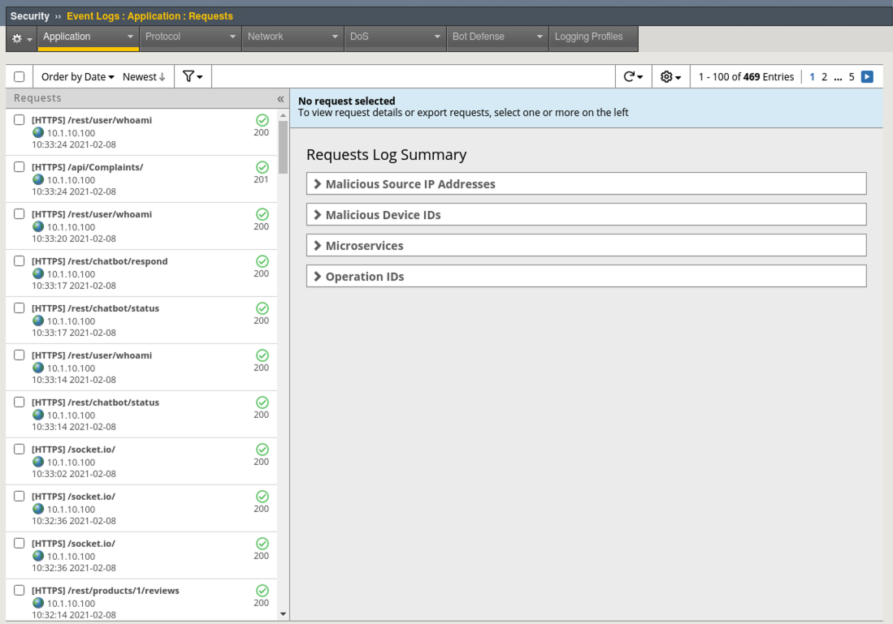

**This is is how to train a waf and why it is critical to get your policies developed during the testing phase of application devlopment.**

File Types
~~~~~~~~~~~~

File types are low-hanging fruit from a positive security perspective and a great starting point for enhancing your security policy by allowing or disallowing access to known file types or extensions. We will enable Compact mode learning to create a learned list of common file types and enforce against a pre-populated list of disallowed file types. 

#. Navigate to **Security > Application Security > Policy Building > Learning and Blocking Settings > File Types** and change the default learning mode from **Selective** to **Compact** and read the description.  
#. Click **Save** and **Apply Policy**.
#. Go back to the Juice Shop tab and browse to the **Photo Wall**. 
#. In Advanced WAF go to **Security > Application Security > Policy Building > Traffic Learning** and notice the new file type learning suggestions. 
#. Select all of the new suggestions and click **Accept > Accept Suggestions** and **Apply Policy**. 
#. Navigate to **Security > Application Security > File Types > Allowed File Types** and review what was added. Click on the **Disallowed File Types** tab at the top of the GUI and review the default disallowed files for this policy. 

.. image:: images/files.png
  :width: 600 px

Testing WAF Policy
~~~~~~~~~~~~~~~~~~~~~

#. On the Linux Client desktop launch Burp Suite Community Edition. **Do not click mulitple times. It takes a few moments to load on first launch**. 

.. image:: images/burp.png
  :width: 60 px

2. Click **Next** on Temporary project and then click **Start Burp**. **Do not accept any offers to update the software**. 
#. Click on the **Proxy** tab and click on **Intercept is on** to turn it off.  
#. Click the **Open Browser** button and wait for several moments for the built-in Burp Browser to open. Your setup should look like this:

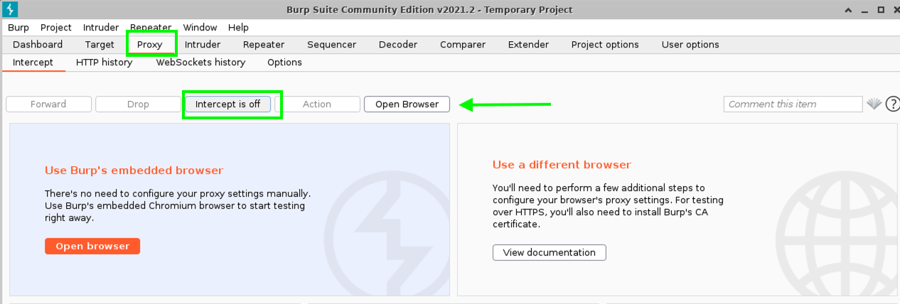

4. In the Burp browser paste in: ``https://juiceshop.f5agility.com/`` but do **NOT** hit the Return key yet. 
#. Back in Burp Console click on **Intercept is off** to turn it back on.
#. In Burp browser click in the URL bar and hit the **Return** key on your keyboard to send the request for ``https://juiceshop.f5agility.com/`` 
#. You will notice Burp Console will popover the browser with the intercepted request. You can now decide which actions to take real-time before sending the requests. 

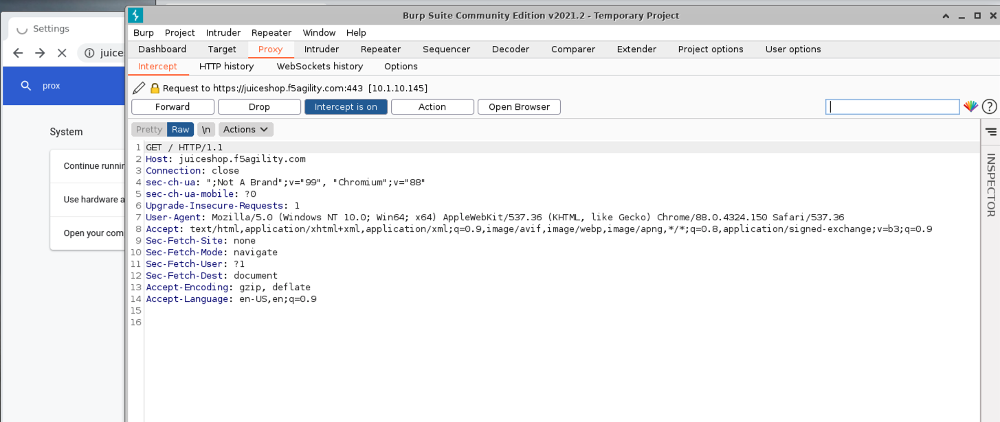

8. Go ahead and choose to **Forward** that request. You may see some requests mixed in that are Google related. These are produced automatically by the browser. You can safely forward them. 
#. As you can see Burp is a very powerful proxy that allows you to view each request as it is being made and potentially insert or modify that request before sending. 
#. Click on **Intercept is on** to turn it off so the rest of the requests load and then click it again to turn it back on so that it reads **Intercept is on**.
#. Back in the Burp Browser the page should have loaded from the previous requests so just click the **Refresh** button in the browser. 
#. You may see a request or two for **socket.io** which is used for session persistence in the app. You can just forward them until you get to the following request for the default page:

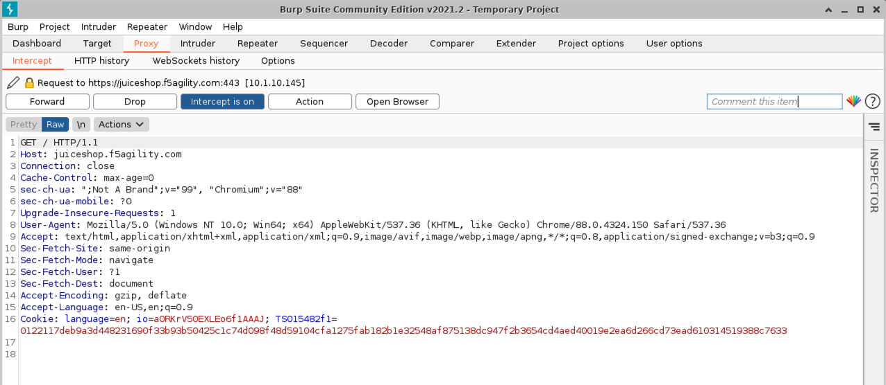

13. Modify the request to fetch an evilfile.exe file from the server and click **Forward**. 

.. image:: images/evilfile.png
  :width: 600 px

14. Navigate to **Security > Event Logs > Application > Requests** and review the alert. Was it blocked? 

.. NOTE:: Even though policy is in blocking mode individual elements can be very granularly configured to Alarm or Block. In practice you could have a Blocking policy with everything in Learning and Blocking settings only set to "Alarm". You can then methodically enable blocking for each individual element and validate the application. This gives you the utmost flexibility when moving from a Transparent to Blocking policy. 

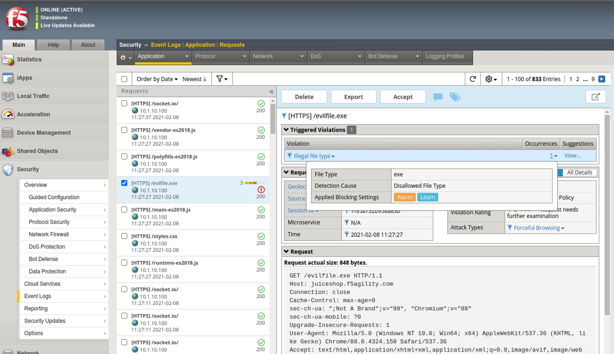

15. Navigate to **Security > Application Security > Policy Building > Learning and Blocking Settings > File Types** and enable **Block** for **Illegal file type**.
#. Click **Save** and **Apply Policy**. 

16. Back in Burp Console modify another request for **evilfile.exe** again and click **Forward**. Just delete whatever URI is currently being called and replace it with ``evilfile.exe`` **Make sure the Host is set to juiceshop.f5agility.com and not a google site. If it is related to google just click forward until you get to the next juiceshop.f5agility.com "Host" request**. 

#. Navigate to **Security > Event Logs > Application > Requests** and review the alert. Was it blocked this time? 

.. image:: images/evilblock.png
  :width: 600 px

Monkeying with the ASM Cookie
~~~~~~~~~~~~~~~~~~~~~~~~~~~~~~~~

1. Back in Burp Console make sure you are looking at a request for Host **juiceshop.f5agility.com**. If not, click  forward until you find one. 
#. Under **Cookie** notice the 3 cookies. there is one for language, 1 for persistence (io) and one set by the WAF (TS Cookie). 
#. Add an extra character (7) to the end of the TS cookie value and click **Forward**. 

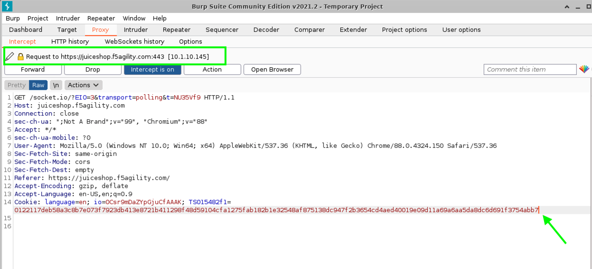

4. Navigate to **Security > Event Logs > Application > Requests** and review the alert. By disabling the learning suggestion earlier, we rightfully blocked this modified cookie instead of creating a learning suggestion for it. 

.. image:: images/modified1.png
  :width: 600 px

5. Back in Burp Console make sure you are looking at a request for Host **juiceshop.f5agility.com**. If not, click  forward until you find one. 
6. Change the host to the ip address of the Virtual Server: **10.1.10.145** and click **Forward**. 

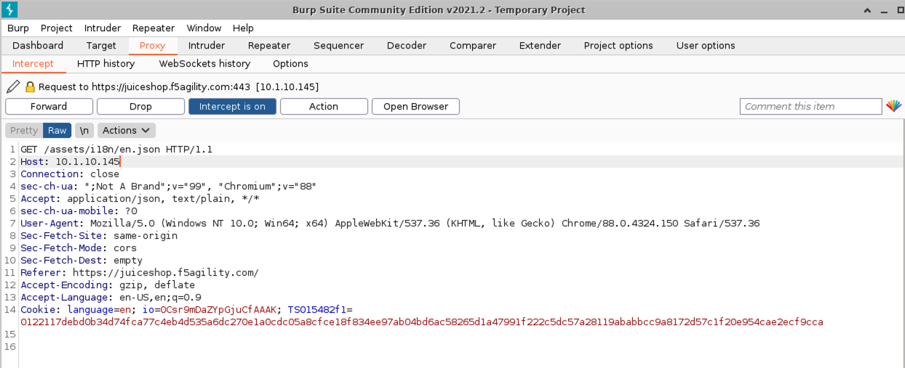

7. Refresh **Security > Event Logs > Application > Requests** and review the alert. What was the violation? How could you add it to the allowed hostnames if required?

**This concludes Lab 2**

**This lab was designed to give you the building blocks necessary to be comfortable managing a WAF policy. You now know how to turn on and test some easy and operationally low-cost features that will greatly elevate your security policy.**
