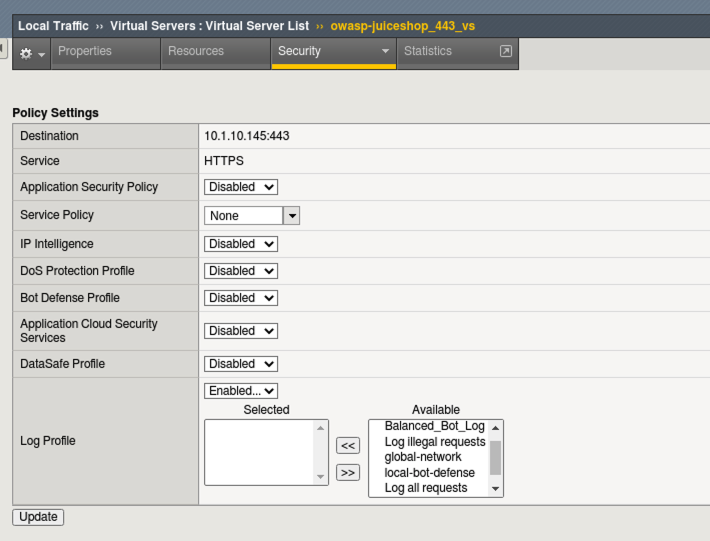
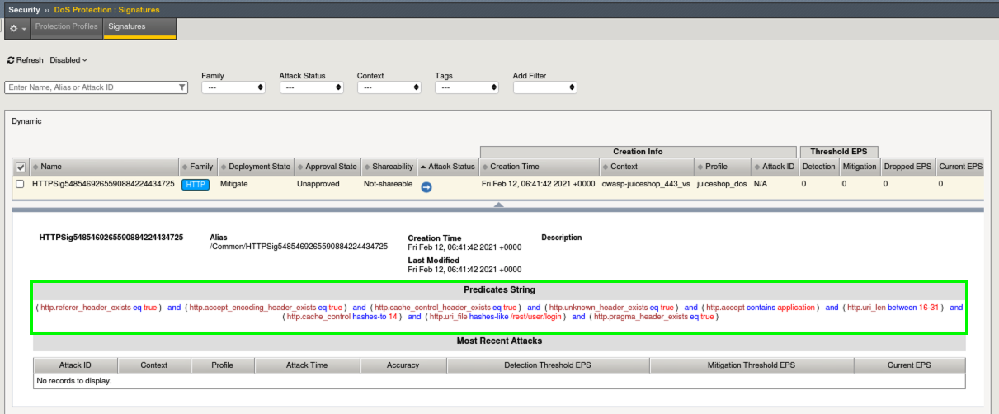

Lab 3: Behavioral DOS Protection
----------------------------------

In this lab you will use a baseline traffic generation script and an Apache Bench based attack script against a Virtual Server in both unprotected and protected mode in order to trigger Behavioral DoS Protection. **Unlimited Behavioral Dos protection profiles are a feature of Advanced WAF**. 

Test Default Site Behavior
~~~~~~~~~~~~~~~~~~~~~~~~~~~
#. Navigate to **Local Traffic > Virtual Servers > owasp-juiceshop_443_vs > Security > Policies**. 
#. **Disable** all Policies and Logging Profiles so that we can effectively demonstrate just the DoS mitigation.  
#. Click **Update**.

Your Virtual Server should look like this:

4. Open a new **Terminal** window and run the **baseline_menu.sh** script in the **Agility2021wafTools** directory.

    .. code-block:: bash

        cd ~/Agility2021wafTools/
        ./baseline_menu.sh
    ..

5. Choose **Option 1** and hit the **Return Key or Enter key**. 
6. You will see the script start sending traffic to site and you should see all responses with an http code of **status: 200**.

.. image:: images/status.png
  :width: 600 px

7. While the script is still running, open a new browser tab and click on the **OWASP Juice Shop** bookmark. 
8. Browse around the site and refresh the page a few times. You should not feel any lag in response time and everything should be loading quickly in the browser even with the baseline script running in the background.

Start the Attack
~~~~~~~~~~~~~~~~~~~~

#. Open a new **Terminal** tab and ensure you are in the **~/Agility2021wafTools/** directory and run the AB_SSL_DOS.sh script.

    .. code-block:: bash

        cd ~/Agility2021wafTools/
        ./AB_SSL_DOS.sh
    ..

2. Choose **Option 1** and hit the **Return Key or Enter key**. 
3. Back in Chrome browser, attempt to refresh the site. **There are no smoke and mirrors here.** The Apache Bench script almost instantly knocked this single container site offline. If it isn't offline, then it horribly slow and un-usable. **There was no special configuration on the server side.**
4. Stop the Apache Bench script by hitting (Ctrl + C) and then type the # **4** and hit the **Return Key or Enter key**.
5. **Leave the baseline_menu script running**. 

**Questions**: What do you do when you are shopping online and a site is behaving like this? Do you think attackers and/or competing entities ever use this to their advantage?

Advanced WAF to the Rescue
~~~~~~~~~~~~~~~~~~~~~~~~~~~~~

#. Navigate to **Security > DoS Protection > Protection Profiles** and click **Create**.
#. Name the profile **juiceshop_dos** and click **Behavioral & Stress-based Detection** to the left. 
#. Configure the **Behavioral & Stress-based Detection** settings like below:
  
  * Operation Mode: Transparent (It is always best-practice to add new features to a policy in transparent mode until you fully understand the impacts.) 

  * Thresholds Mode: **Manual**
  
  * Stress-based Detection and Mitigation: 
  
    * By Source IP: **Edit > Check all 3 boxes**
  
    * By Device ID: **Not Applicable for this lab**
    
    * By Geolocation: **Not Applicable for this lab**
    
    * By URL: **Not Applicable for this lab**
    
    * Site Wide: **Edit > Check all 3 boxes**

  * Behavioral Detection and Mitigation: > click **Edit** 
  
    * **Check** the box for **Use TLS patterns as part of host identification**
    
    * **Check** the box for **TLS fingerprinting signatures**

    * Under **Mitigation** read the description of **Standard Protection**.
  
  * Prevention Duration: > click **Edit**
    
    * Escalation Period: **10** seconds
  
.. image:: images/bdos.png
  :width: 600 px

4. Click **Finished**

.. IMPORTANT:: What you essentially just configured was a series of DoS traffic categorizers and step-up remediations. Remediations will fire in the order that they are shown in the GUI and progress every 10 seconds. First a client side integrity check is performed (JS injection), next a CAPTCHA and finally Rate-Limiting kicks in. 

#. Navigate to **Local Traffic > Virtual Servers > owasp-juiceshop_443_vs > Security > Policies**. 
#. **Enable** the Dos Protection Profile and choose our new **juiceshop_dos** profile and also **Enable** the **local-dos** Logging Profile. 
#. Click **Update**.

Your virtual server should look like this: 

.. image:: images/dos.png
  :width: 600 px

8. Open a new **Terminal** tab and start the attack script again and choose option **1**:

    .. code-block:: bash

        cd ~/Agility2021wafTools/
        ./AB_SSL_DOS.sh
    ..

9. Navigate to **Security > Event Logs > DoS > Application Events** and review the entry. 
#. Click on the Attack ID #. 

.. image:: images/bdoslog.png
  :width: 600 px

11. Once the Dashboard loads, turn on **Real Time** by checking the box at the top under **Dos Attack IDs** in the right hand pane make sure the attack ID is selected. 
  
There is alot of information on DoS Visibility Dashboard including the type of attack, the severity, duration and much more. You can use the **Real Time** filters on the right to further dissect the traffic and drill down for analysis. 

.. image:: images/dash.png
  :width: 600 px

12. Navigate to **Security > Dos Protection > Signatures** and click on **Dynamic**. 
#. You will see a **Dynamic Signature** was created based off of the behaviors associated with this attack. Click on the signature name and it will expand to show the details of the signature. 

14. Open a new tab in Chrome and open Juice Shop again. The page should be functioning with minimum latency even though the attack is still ongoing in the background. 

.. NOTE:: What you are witnessing first hand is F5's proprietary machine learning in action. We are able to create very granular dynamic signatures to effectively mitigate only the bad traffic.  

15. Navigate to **Security > Reporting > DoS > Analysis** and review the system health overview of the BIG-IP device itself. 

.. image:: images/sys.png
  :width: 600 px

Stop the Baseline and Attack Scripts
~~~~~~~~~~~~~~~~~~~~~~~~~~~~~~~~~~~~~~~

#. In each of your terminal windows type **Ctrl+C** to terminate the scripts. The **AB_SSL_DOS.sh** script will require you to enter **4** to completely stop the attacks. 

**This concludes Lab 3**
