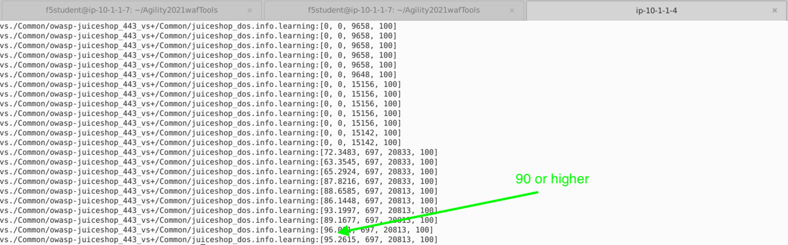

Lab 3: Behavioral DOS Protection
----------------------------------

In this lab you will use a baseline traffic generation script and an Apache Bench based attack script against a Virtual Server in both unprotected and protected mode in order to trigger Behavioral DoS Protection. **Unlimited Behavioral Dos protection profiles are a feature of Advanced WAF**.

Test Default Site Behavior
~~~~~~~~~~~~~~~~~~~~~~~~~~~
#. Navigate to **Local Traffic > Virtual Servers > owasp-juiceshop_443_vs > Security > Policies**. 
#. **Disable** all Policies and Logging Profiles so that we can effectively demonstrate just the DoS mitigation.  
#. Click **Update**.

Your Virtual Server should look like this:

.. image:: images/dos_vs.png
  :width: 600 px

4. Open a new **Terminal** window and run the **baseline_menu.sh** script in the **Agility2021wafTools** directory.

    .. code-block:: bash

        cd ~/Agility2021wafTools/
        ./baseline_menu.sh
    ..

5. Choose **Option 1** and hit the **Return Key or Enter key**. 
6. You will see the script start sending traffic to site and you should see all responses with an http code of **status: 200**.

.. image:: images/status.png
  :width: 600 px

7. While the script is still running, open a new browser tab and click on the **OWASP Juice Shop** bookmark. 
8. Browse around the site and you should not feel any lag in response time. Everything should be loading quickly in the browser even with the baseline script running in the background.

Start the Attack
~~~~~~~~~~~~~~~~~~~~

#. Open a new **Terminal** tab and ensure you are in the **~/Agility2021wafTools/** directory and run the AB_SSL_DOS.sh script.

    .. code-block:: bash

        cd ~/Agility2021wafTools/
        ./AB_SSL_DOS.sh
    ..

2. Choose **Option 1** and hit the **Return Key or Enter key**. 
3. Back in Chrome browser, attempt to refresh the site. **There are no smoke and mirrors here.** The Apache Bench script almost instantly knocked this single container site offline. If it isn't offline, then it horribly slow and un-usable. **There was no special configuration on the server side.**
4. Stop the Apache Bench script by hitting (Ctrl + C) and then type the # **4** and hit the **Return Key or Enter key**.
5. **Leave the baseline_menu script running**. 

**Questions**: What do you do when you are shopping online and a site is behaving like this? Do you think attackers and/or competing entities ever use this to their advantage?

Advanced WAF to the Rescue
~~~~~~~~~~~~~~~~~~~~~~~~~~~~~

#. Navigate to **Security > DoS Protection > Protection Profiles** and click **Create**.
#. Name the profile **juiceshop_dos** and click **Behavioral & Stress-based Detection** to the left. 
#. Configure the **Behavioral & Stress-based Detection** settings like below and click **Finished**.
 
  * Thresholds Mode: **Automatic**
  
  * Stress-based Detection and Mitigation: 
  
    * By Source IP: **Check all 3 boxes**
  
    * By Device ID: **Not Applicable for this lab**
    
    * By Geolocation: **Check all 3 boxes**
    
    * By URL: **Check all 3 boxes**
    
    * Site Wide: **Check all 3 boxes**

  * Behavioral Detection and Mitigation:
  
    * **Check** the box for **Use TLS patterns as part of host identification**
    
    * **Check** the box for **TLS fingerprinting signatures**

    * Under **Mitigation** read the desciption of **Standard Protection**.

.. image:: images/bdos.png
  :width: 600 px

.. image:: images/bdetect.png
  :width: 600 px

4. Click **Finished**

.. IMPORTANT:: What you essentially just configured was a a series of traffic categorizers and step-up remediations. Remediations will fire in the order that they are shown in the GUI. First a client side integrity check is performed (JS injection), next a CAPTCHA and finally Rate-Limiting kicks in. 

#. Navigate to **Local Traffic > Virtual Servers > owasp-juiceshop_443_vs > Security > Policies**. 
#. **Enable** the Dos Protection Profile and choose our new **juiceshop_dos** profile and also **Enable** the **local-dos** Logging Profile. 
#. Click **Update**.

Your virtual server should look like this: 

.. image:: images/dos.png
  :width: 600 px

8. In Chrome, browse the site and ensure everything is still loading ok. The site should be unaffected by the DoS profile unless there are signs of stress on the server at which time mitigations will kick in.  

9. Open a new **Terminal** tab and start the attack script again:

    .. code-block:: bash

        cd ~/Agility2021wafTools/
        ./AB_SSL_DOS.sh
    ..

10. In Chrome, browse the site. Initially, it will appear to be broken again even though we have a Dos Profile applied.
11. Navigate to **Security > Event Logs > DoS > Application Events** and review the entry. 

screenshot

12. Click on the Attack ID #. 

review event Logs and dashboard
browse site and test response
3 minutes later the mitigation automatically changes form source ip to url based. 
review big-ip resources used security > analytics

Train the DoS Profile
~~~~~~~~~~~~~~~~~~~~~

#.  Open a new Terminal and SSH into the BIG-IP as the **admin** ``ssh admin@10.1.1.4`` then type **bash** and hit **enter**.
#.  Paste the following command: ``admd -s vs./Common/owasp-juiceshop_443_vs+/Common/juiceshop_dos.info.learning``

It should look like this:

.. image:: images/doslearn.png
  :width: 600 px
  
3.  With the **admd** command still running, 
run baseline

#. Open one more terminal tab and run the script again, but this time select the **other** option.

 
    .. NOTE:: Due to the use of machine learning, the order in which you execute these traffic generation patterns does not particularly matter.  The BIG-IP will learn regardless. The purpose is really to train the BIG-IP on "normal traffic patterns" for the app.  Obviously, this is a sterile environment designed to demonstrate the capabilities quickly.  Traffic learning in a production environment will likely take significantly longer.

#. Go back to your BIG-IP terminal window and take a look at the output of your prior **admd** command. The admd command returns data on the progress of the traffic learning process and **it can take several minutes to start learning behaviors**.  
#. **Wait** for what seems like forever and you wonder if your lab your broken, until the first number in the brackets has a value of 90 or above.  This represents the percentage confidence the system has in the accuracy of the baseline traffic.

Finally! 

#. Once you have reached 90% confidence, you may move on to the next task.  This may take upto **10 minutes or longer** depending on various factors.

Launch an Attack
~~~~~~~~~~~~~~~~

#.  Open yet another Terminal window on the client and in the **Agility2021wafTools** directory you will find another script named **AB_SSL_DOS.sh**.  Run this script.

    .. code-block:: bash

            cd agility2020wafTools/
            ./AB_SSL_DOS.sh
    ..
    
 

#.  Select **1** for "Attack start - similarity" and hit **enter**.  Notice that entering 4 ends the script.  You will use this later to end the attack.  As the attack starts, the output should look similar to this:

    .. NOTE:: At some point, the script may start to generate SSL errors.  This is expected as the BIG-IP adds the offending IP addresses to its shun list while it computes a solution to the attack.

Examine the Mitigation
~~~~~~~~~~~~~~~~~~~~~~

#.  In the TMUI, go to **Security > DoS Protection > Signatures** and click on the bar for **Dynamic**. You should see an entry similar to the on below (this may not show up right away, refresh the page until an entry appears).

    Notice that the **Deployment State** is **Mitigate**. Since **approve signatures** was not enabled in the DoS Protection profile, this signature was automatically deployed once computed.  If desired, enabling the **aprove signatures** option would require user interaction before any mitigations were deployed.

#.  Click on the **signature name** (in blue) to examine the contents of the signature.

  

    The signature generated here is a product of machine learning.  The BIG-IP is actually able to determine which aspects of the traffic are problematic and create a signature to match them....Thus protecting you from the attack.

#.  Machine generated signatures can also be promoted to persistent.  Select the **checkbox** next to the signature and click **Make Persistent**.

#.  Once persistent, the signature will remain a part of the BIG-IP system and may actually be modified manually if so desired.  To modify the signature open the **flyout** on the right.

 

Visibility & Reporting
~~~~~~~~~~~~~~~~~~~~~~

#.  Navigate to **Security -> Event Logs -> DoS -> Application Events** 

   

#.  This gives us a quick view of what has happened from an Application DoS perspective. Notice that the attack Detection and Mitigation were Behavioral.

#.  Now, navigate to **Security -> Overview -> Dashboard**.  Ensure that you've selected a virtual server on the right and that the Behavioral DoS dashboard is selected in the upper left.  Spend some time exploring here.  Notice you can get details from each attack and export the data to CSV for later analysis.

#.  Next, navigate to **Security -> Reporting -> DoS -> URL Latencies**.  The BIG-IP also keeps track of the performance of each URI in order to assess the impact of an attack (stress) on specific parts of an application.  Since this is a lab instance you will probably want to adjust the time period to **Last Hour** in order to get some more meaningful statistics.

#. In each of your terminal windows type **Ctrl+C** to terminate the scripts. The **AB_SSL_DOS.sh** script will require you to enter **3** stop the attacks, then **4** to quit after pressing **Ctrl+C**.

|

**This concludes module 2.**
