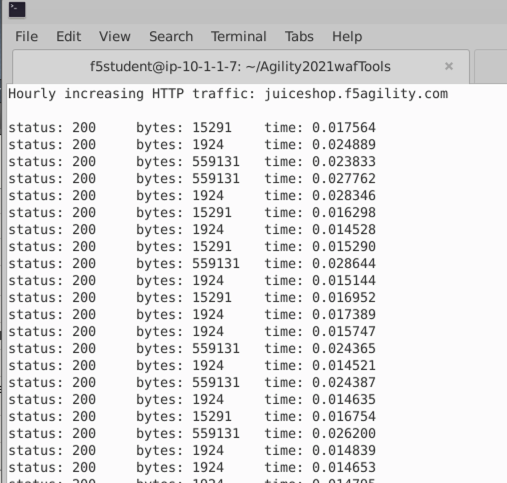
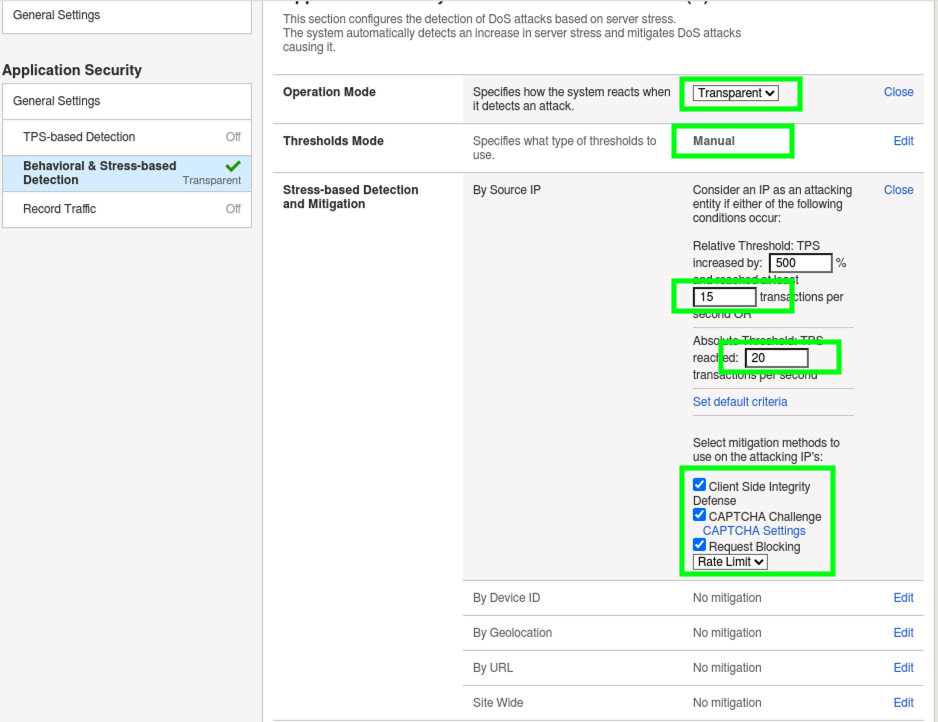
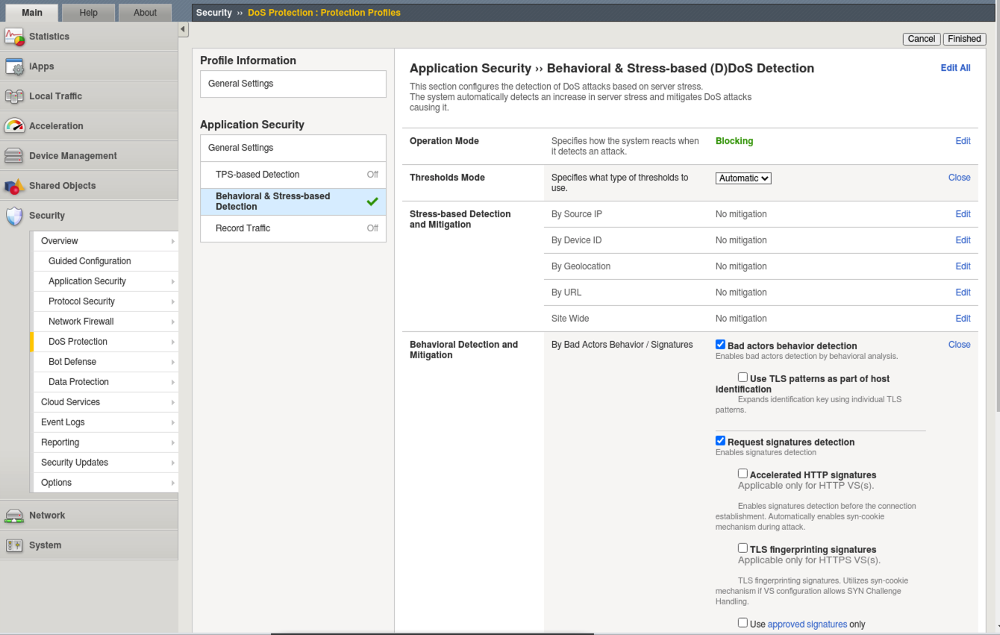
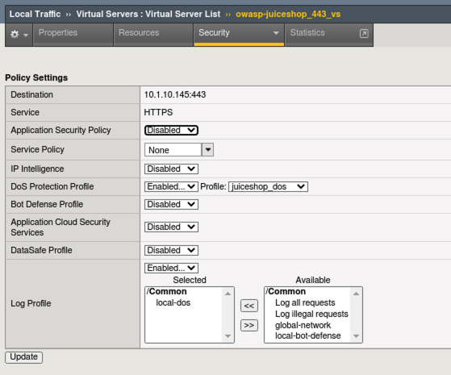
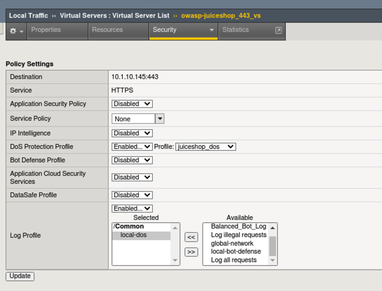
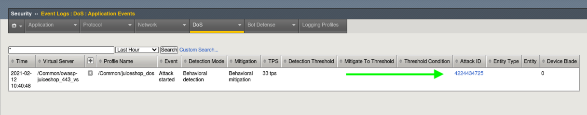
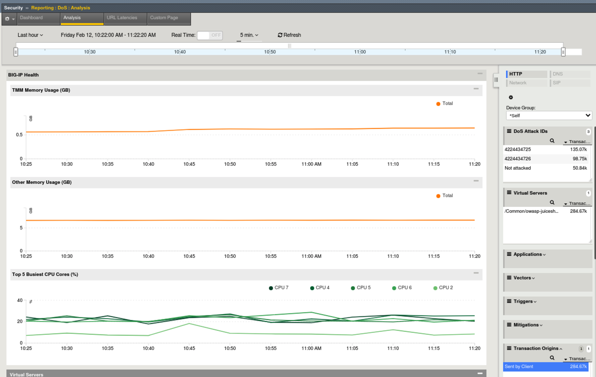
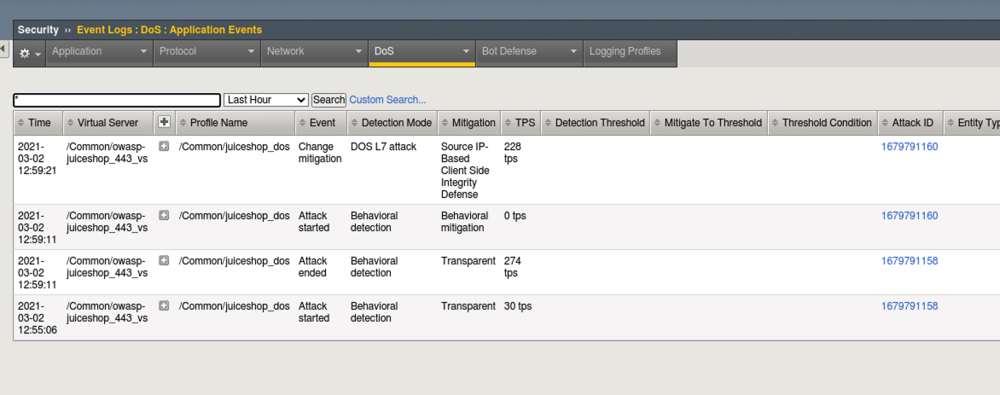

Lab 3: Behavioral DOS Protection
----------------------------------

In this lab you will use a baseline traffic generation script and an Apache Bench based attack script against a Virtual Server in both unprotected and protected mode in order to trigger Behavioral DoS Protection. **Unlimited Behavioral Dos protection profiles are a feature of Advanced WAF**. 

Test Default Site Behavior
~~~~~~~~~~~~~~~~~~~~~~~~~~~
#. Navigate to **Local Traffic > Virtual Servers > owasp-juiceshop_443_vs > Security > Policies**. 
#. **Disable** all Policies and Logging Profiles so that we can effectively demonstrate just the DoS mitigation.  
#. Click **Update**.

   Your Virtual Server should look like this:

   .. image:: images/dos_vs.png
    :width: 600 px

#. Open a new **Terminal** window and run the **baseline_menu.sh** script in the **Agility2021wafTools** directory.

   .. code-block:: bash

    cd ~/Agility2021wafTools/
    ./baseline_menu.sh

5. Choose **Option 2** and hit the **Return Key or Enter key**. 
#. You will see the script start sending traffic to the site and you should see all responses with an http code of **status: 200**.

7. While the script is still running, open a new browser tab and click on the **OWASP Juice Shop** bookmark. 
8. Browse around the site and refresh the page a few times. You should not feel any lag in response time and everything should be loading quickly in the browser even with the baseline script running in the background.

Start the Attack
~~~~~~~~~~~~~~~~~~~~

#. Open a new **Terminal** tab and ensure you are in the **~/Agility2021wafTools/** directory and run the AB_SSL_DOS.sh script.

    .. code-block:: bash

        cd ~/Agility2021wafTools/
        ./AB_SSL_DOS.sh
    ..

2. Choose **Option 1** and hit the **Return Key or Enter key**. 
3. Back in Chrome browser, attempt to refresh the site. **There are no smoke and mirrors here.** The Apache Bench script almost instantly knocked this single container site offline. If it isn't offline, then it horribly slow and un-usable. **There was no special configuration on the server side.**
4. Stop the Apache Bench script by hitting (Ctrl + C) and then type the # **4** and hit the **Return Key or Enter key**.
5. **Leave the baseline_menu script running**. 

**Questions**: What do you do when you are shopping online and a site is behaving like this? Do you think attackers and/or competing entities ever use this to their advantage?

Advanced WAF to the Rescue
~~~~~~~~~~~~~~~~~~~~~~~~~~~~~

For demonstration purposes in this lab we will simply configure Source IP based DoS Protection, although there are several selectors available including DoS mitigation based on Device ID, Geolocation, URL and Site Wide. 

#. In the Advanced WAF tab of Chrome, navigate to **Security > DoS Protection > Protection Profiles** and click **Create**.
#. Name the profile **juiceshop_dos** and click **Behavioral & Stress-based Detection** to the left. 
#. Configure the **Behavioral & Stress-based Detection** settings like below:
  
  * Operation Mode: **Transparent** (It is always best-practice to add new features to a policy in transparent mode until you fully understand the impacts.) 

  * Thresholds Mode: **Manual**
  
  * Stress-based Detection and Mitigation: 
  
    * By Source IP: **Edit** Check the box at the bottom for **Client Side Integrity Defense** at the bottom which tells the WAF to send an Active JS challenge when under attack to verify the browser vs an attacking bot.

.. NOTE:: You can also enable CAPTCHA and Rate-limiting but you will not get a chance to see that in action in this lab as Client Side Integrity Defense is enough to mitigate the mighty Apache Bench "bot".   

* Set the Relative Threshold to 500% and **15** transactions per second. 
* Set the Absolute Threshold TPS to **20**. 

  
* Behavioral Detection and Mitigation: > click **Edit** 
  
    * **Check** the box for **Use TLS patterns as part of host identification**
    
    * **Check** the box for **TLS fingerprinting signatures**

    * Under **Mitigation** read the description of **Standard Protection**.

* Prevention Duration: > click **Edit**
    
    * Escalation Period: **90** seconds
    * De-escalation Period: **360** seconds
  

4. Click **Finished**

.. IMPORTANT:: What you essentially just configured was a DoS "Client Source IP" traffic categorizer and step-up mitigations. In this case mitigations will fire in the order that they are shown in the GUI and progress every 90 seconds. First, a client side integrity check is performed (JS injection) and if necessary the WAF will escalate to issuing a CAPTCHA to offending clients. Finally, Rate-Limiting kicks in as a last resort. You could use any combination of these three mitigation tactics with any of the DoS categorizer types in the profile.  

Apply the Dos Profile and Test
~~~~~~~~~~~~~~~~~~~~~~~~~~~~~~~

#. Navigate to **Local Traffic > Virtual Servers > owasp-juiceshop_443_vs > Security > Policies**. 
#. **Enable** the Dos Protection Profile and choose our new **juiceshop_dos** profile and also **Enable** the **local-dos** Logging Profile. 
#. Click **Update**.

Your virtual server should look like this: 

7. Open a new tab to Juice Shop and browse the site. There should not be any perceivable effect of having applied the DoS profile. 
8. Browse the photo wall from the hamburger menu (top left) and file a customer complaint. Spend about a minute browsing the site.
9. Open a new **Terminal** tab and start the attack script again and choose option **1**:

    .. code-block:: bash

        cd ~/Agility2021wafTools/
        ./AB_SSL_DOS.sh

10. Navigate to **Security > Event Logs > DoS > Application Events** and review the entry. the system immediately picked up the attack due to the behavior. 
11. Click on the Attack ID #. 

  
11. Once the Dashboard loads, turn on **Real Time** by checking the box at the top under **Dos Attack IDs**. It will take a few moments for the things to populate.

12. Click on the attack graphic and then select the virtual server to the right. You may have to wait a few moments for the Virtual Server to appear. As you click items, you are applying real time filters. 
13. From the right hand filters menu expand **Client IP Addresses**, **Pool Members** and **URLS** and review the data. 

.. image:: images/need_new.png
  :width: 600 px

There is alot of information on DoS Visibility Dashboard including the type of attack, the severity, duration and much more. You can use the **Real Time** filters on the right to further dissect the traffic and drill down for analysis. **It may take some time for various data fields to load**.

15. In the top middle of the GUI click the **Analysis** tab and review the system health overview of the BIG-IP device itself. Scroll down and check out the CPU, Connection and Throughput stats. 
16. At the bottom you will get to the HTTP stats which should be of most interest. 

Stop the Baseline and Attack Scripts
~~~~~~~~~~~~~~~~~~~~~~~~~~~~~~~~~~~~~~~
#. In each of your terminal windows or tabs type **Ctrl+C** to terminate the scripts. The **AB_SSL_DOS.sh** script will require you to enter **4** to completely stop the attacks. 

Enable Blocking in the DoS Profile
~~~~~~~~~~~~~~~~~~~~~~~~~~~~~~~~~~~~~~~

#. In the Advanced WAF tab, navigate to **Security > DoS Protection > Protection Profiles > juiceshop_dos** and click on **Behavioral & Stress-based Detection**.
#. Under **Operation Mode** click **Edit** and from the dropdown choose **Blocking** and click **Update**. 
#. Open a new tab to Juice Shop and ensure the site is operating normally. 
#. Open a new Terminal Tab and run the AB_SSL_DOS script again. Choose **Option 1**. 

    .. code-block:: bash

        cd ~/Agility2021wafTools/
        ./AB_SSL_DOS.sh

#. Attempt to refresh Juice Shop..initailly it is down but after a few short seconds the WAF has figured out the attack and taken mitigation action. 
#. Navigate to Security  ››  Event Logs : DoS : Application Events and review the new entries. We can see that the attack was picked up by behavioral mitigation first.
#. Next we can see that the mitigation was changed to ** DOS L7 Attack** with **Source IP-Based Client Side Integrity Defense**. This means that the WAF is actiley challenging these IP addresses. 

#. Expand the + 

.. image:: images/needtoadd.png
  :width: 600 px

#. Notice the browser loads fine now
#. Open a new terminal tab and run the following command: curl -k https://juiceshop.f5agility.com
noteice normal html response
stop attack script
now run this command to send it from an interface that is being mitigated by DOs profile
curl -k --interface 10.1.10.52 https://juiceshop.f5agility.com
notice the javascript challenge. This ip will continue to be challenged for the duration of the de-escaltion period that we set earlier. 

**This concludes Lab 3**
