Lab 4: Login Page Protection
------------------------------

In this final lab, we will explore some of the login protection and session tracking capabilities present in F5 Advanced WAF and end with a fully configured Virtual Server.  F5 Advanced WAF not only has the capability to gather user identity details from login pages and APM, but can also generate a unique DeviceID for each connected client. 

Virtual Server Configuration
~~~~~~~~~~~~~~~~~~~~~~~~~~~~~~

#. Navigate to **Local Traffic > Virtual Servers > owasp-juiceshop_443_vs > Security > Policies** and enable the Application Security Policy: **juiceshop_blocking**. 
#. **Enable** the **Balanced_Bot_Profile** and add both the **Log all requests** and **Balanced_Bot_Log** logging profiles and click **Update**. You can leave the DoS profiles in place. Your fully configured Virtual Server config should look like this: 

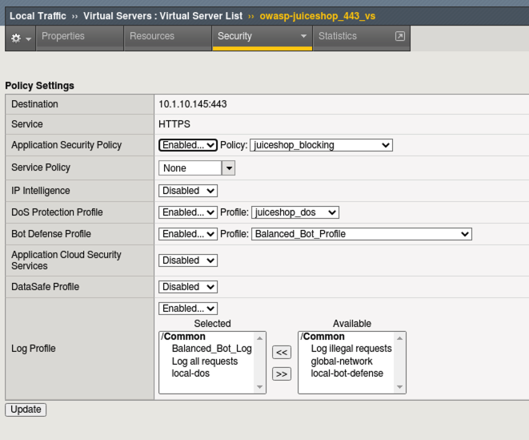

Define Login & Logout Pages
~~~~~~~~~~~~~~~~~~~~~~~~~~~~~~~~~~~

#.  To configure a login page, go to **Security > Application Security > Security Policies > Policy List** and click on the **juiceshop_blocking** policy.  From the Policy Configuration menu, select **Sessions and Logins** and then click the **+ Add Page** next to **Login Pages.**
#.  We'll now populate the form with data gathered from the browser inspection tools during a login attempt as shown below. 

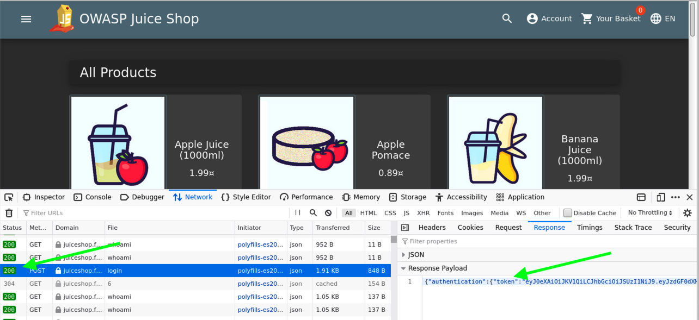

3.  Fill out the **Login Page Properties** and **Access Validation** fields as shown and then click **Add**.

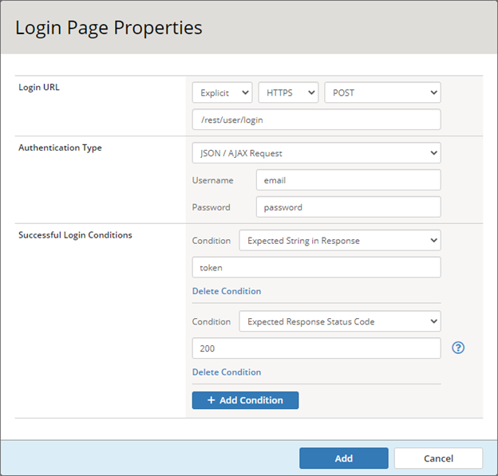

4.  From the tab bar at the top middle of the GUI, select **Login Enforcement** and populate the form as shown below. The **/profile** URI should never have attempted access without authentication. 
5.  Click **Save** and make note of the **Note** in red txt. We will configure **Learning and Blocking Settings** momentarily.

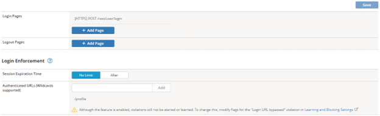

Enable Session Tracking
~~~~~~~~~~~~~~~~~~~~~~~~~~~~~~

#. Click the **Session Tracking** tab at the top middle of the screen and under **Session Hijacking** click the **Enabled** button. Read through the notes paying close attention to the ones in **red**.

   - For the first red note, regarding the bot profile, we are covered since DeviceID is enabled in our **Balanced_Bot_Profile** by default and it is applied to the VS.  
   - The second is more informational and let's us know that non-browser entities will be blocked if they can not run the JS and produce a DeviceID. 
   - The third is regarding **Learning and Blocking Settings** which we will configure in a moment. 
  
#. Under **Session Tracking Configuration** Check the box for **Session Awareness** and click **Save** and **Apply Policy**. 

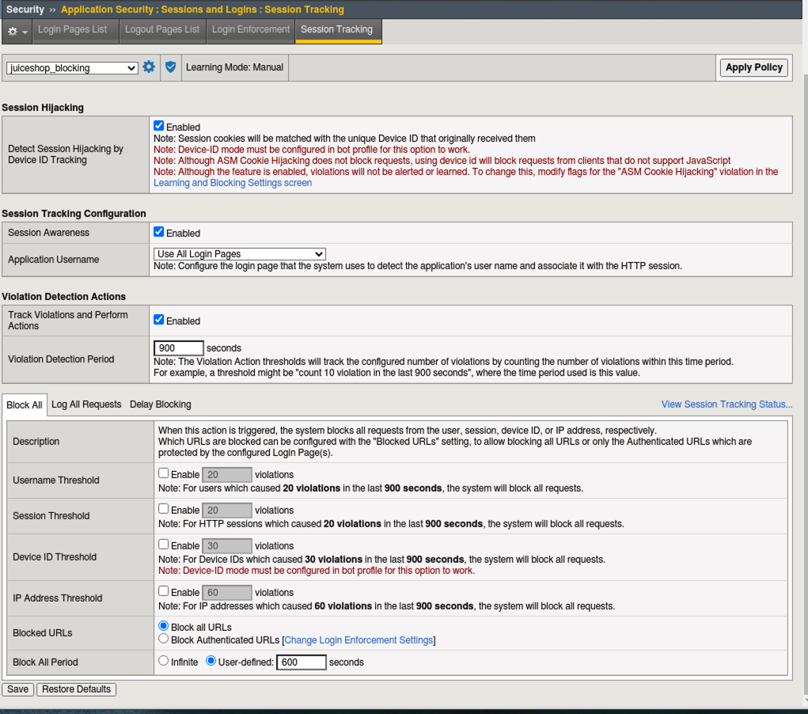

3. Navigate to **Security > Application Security > Policy Building > Learning and Blocking Settings > Sessions and Logins**
#. Check the box for **Learn, Alarm and Block** for both **ASM Cookie Hijacking** and **Login URL bypassed** and click **Save** and **Apply Policy**. 

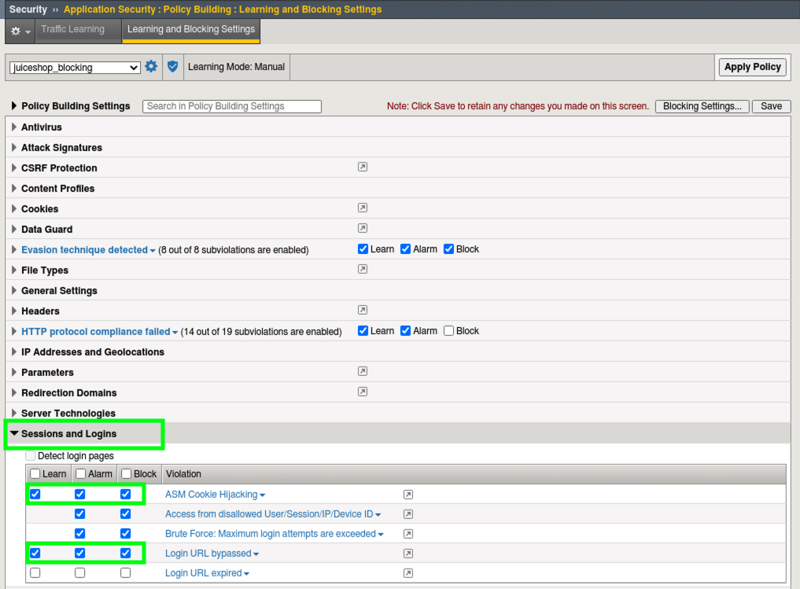

Test Login Enforcement
~~~~~~~~~~~~~~~~~~~~~~~~~~~~~~

#. Open a new tab in Chrome Browser and paste in the following "login enforced" URL:  ``https://juiceshop.f5agility.com/profile``

#. Your attempt should be blocked:

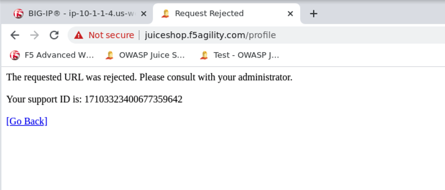

3. Back in Advanced WAF tab, navigate to **Security > Event Logs > Application > Requests** and locate the blocked request for **/profile**. Note the reason for the block then click on **View** under Suggestions to open a new tab to the learning suggestions screen. 

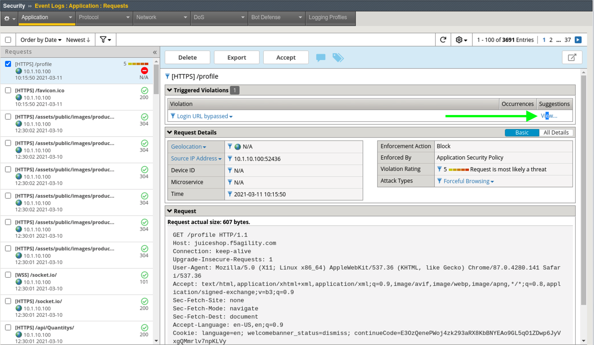

4. You will notice a learning suggestion for this since we enabled learning for this violation in **Learning and Blocking Settings**. 
#. Look at this suggestion very carefully. It has a score of 100% and comes from a trusted IP. The suggested action is to **Remove /profile from Authenticated URLS** which is something we definitely DO NOT want to do. 
#. Learning suggestions can be tricky especially if they are coming from a trusted source and have a high confidence learning score. Always take a close look at the suggested action. For this suggestion click **Ignore** so no further suggestions are created.

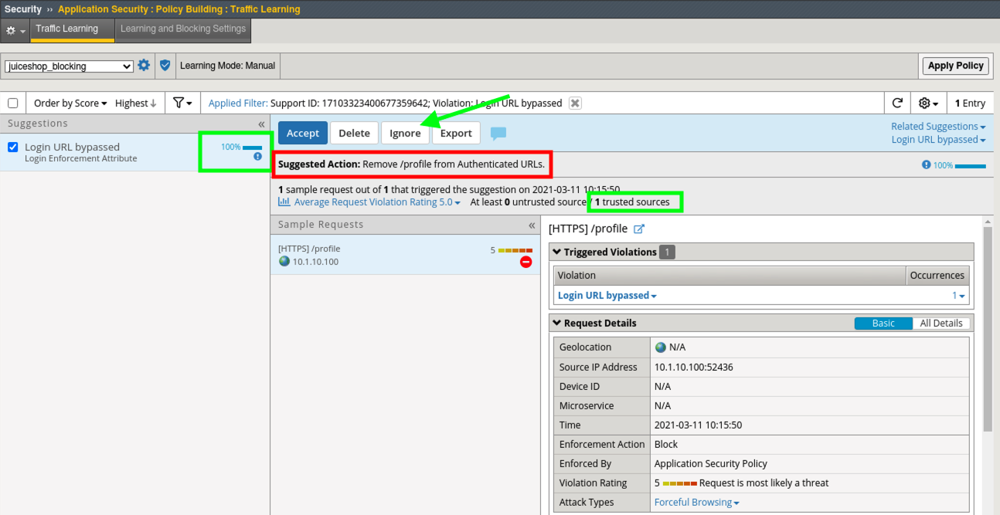

Test Session Tracking
~~~~~~~~~~~~~~~~~~~~~~~~~~~~~

#. Open a new Chrome Incognito tab by typing (CTRL+SHFT+N) then open Juice Shop and login with the account you created earlier for f5student@f5agility.com. 
#. Return to the Advanced WAF and navigate to **Security > Event Logs > Application > Requests** and click on any of them except for "/socket.io". Click **All Details** to the right. 

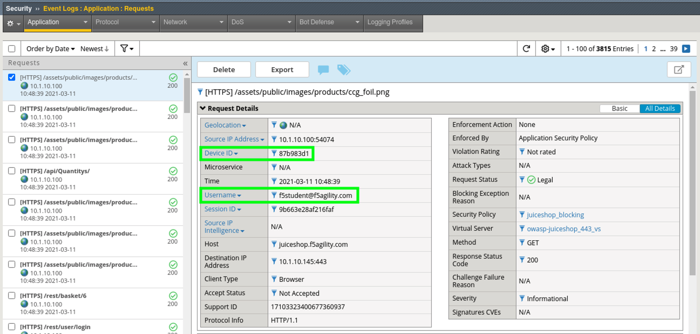

3. Click the down arrow next to **Device ID** to open the Session Tracking details. Check the box to enable **Log All Requests** and click **Change**. You are now tracking all sessions from this Device ID. 

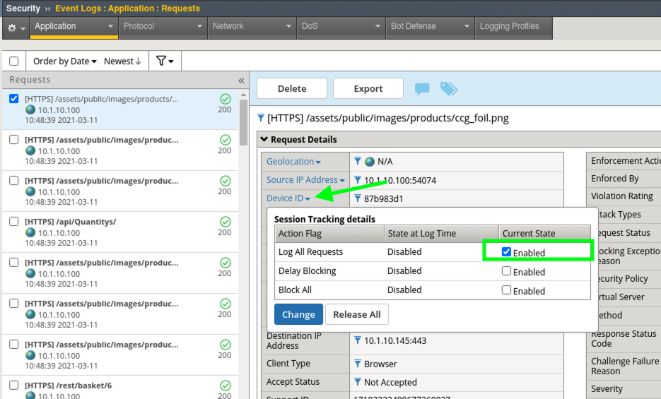

4. Repeat this process for the username field as well to track all sessions from **f5student**

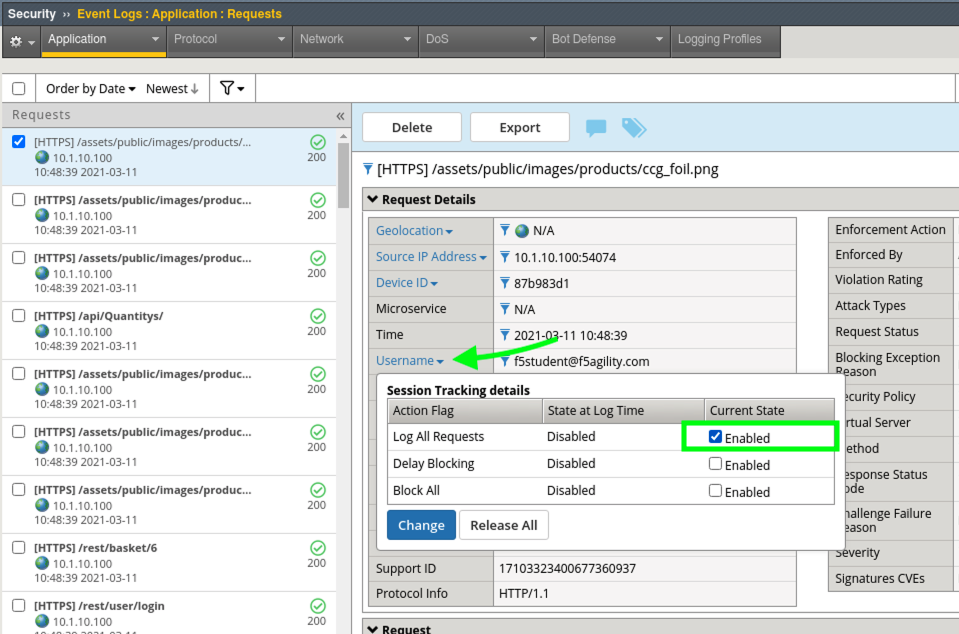

5. Navigate to **Reporting > Application > Session Tracking Status** and review the entries that were just created from the application request event log. 
#. Click "View Requests" for either of them to see all requests filtered by either the Device ID or Username. You may also use this page to release the Username or Device ID from Session Tracking.  
#. These features are useful for forensic purposes as well as blocking access to applications by Device-ID, Username, etc.
#. Finally, navigate to **Security > Application Security > Sessions and Logins > Session Tracking** and review the other more detailed actions you can take based off of Devie ID, Username etc. 

**This concludes Lab 4**

