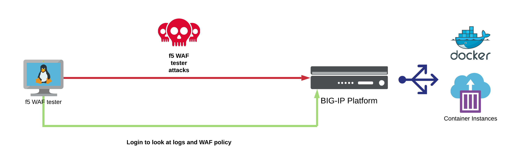

Module 2: Policy testing - Intro to f5 WAF Tester (secops engineer)
===================================================================

Expected time to complete: **10 minutes**

**Intro**
~~~~~~~~~

In this lab, we will cover the following:

- Install the f5 WAF tester tool
- Configure the tool and run it against the Juiceshop web site
- Remediate the WAF policy so SSRF attacks are blocked

**f5 WAF Tester**
~~~~~~~~~~~~~~~~~

f5 Network's Threat Research Team has created a tool that provides an easy and fast way to integrate security testing as part of the SDLC process for basic application protection health check before moving to production.
The tool is intended to test the WAF configuration state and its provided security posture against common web attack types. The tool will send HTTP requests containing attacks and will expect to receive a WAF blocking page in the response. In case the attack vector was not blocked, the tool will read the WAF logs and its configuration to try determine possible reasons for the attack not being blocked, and suggest corresponding actions.

**Disclaimer**: This tool is not meant for testing whether the application itself is vulnerable and does not replace a DAST or a SAST.  

If you would like to see the GitHub repository for the tester, it can be found here:

https://github.com/f5devcentral/f5-waf-tester

.. toctree::
   :maxdepth: 1
   :glob:

   lab*/lab*
   review
