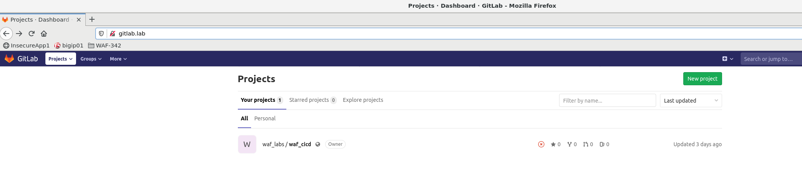
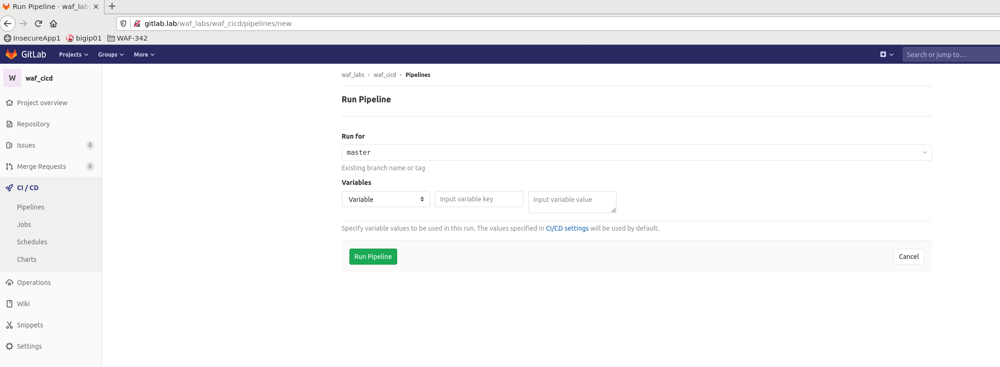

Lab 3.1: Build, Test and Deploy Juice-shop Web App Staging ENV via Gitlab CI/CD
===============================================================================

Staging Pipeline
----------------

We are starting with a staging pipeline that will build the app and deploy it to the staging environment. 
the pipeline is built from the **master** branch. 
Here are the highlevel stages we are going to execute:

.. image:: images/pipeline_overview.png

3.1.1 Open GitLab
~~~~~~~~~~~~~~~~~

In the linux client RDP session open Firefox and click gitlab from the waf-342 favorites folder 

:guilabel:`client RDP` -> :guilabel:`firefox` -> :guilabel:`waf-342` -> :guilabel:`GitLab`

Click on :guilabel:`waflabs / waf_cicd` Project

3.1.2 Run Staging Pipeline
~~~~~~~~~~~~~~~~~~~~~~~~~~

Navigate to :guilabel:`CI / CD` -> :guilabel:`Pipelines` and click on :guilabel:`Run Pipeline`

.. image:: images/run_pipeline.png

Then click on :guilabel:`Run pipeline`

3.1.3 Pipeline progress and fail (about 2-3 minutes)
~~~~~~~~~~~~~~~~~~~~~~~~~~~~~~~~~~~~~~~~~~~~~~~~~~~~

Watch the pipeline as it progresses through its stages. You can see the output of individual stages by clicking on the corresponding Job in the pipeline.

It is **expected** that the pipeline will fail for the first time. This is due to the WAF Policy being too strict and not allowing `Trusted Traffic` through.
Click on :guilabel:`Trusted traffic` Job to see more details about the failure

.. note:: The Functionality tests job sends 3 requests to validate that WAF Policy allows for retrieval of YAML, JSON and .bak extension files, as those are used by users of the app. 
          Original policy uses 'POLICY_TEMPLATE_RAPID_DEPLOYMENT' template which blocks such requests if they are not included in modifications section of the policy.

.. image:: images/pipeline_fail.png

3.1.4 OPTIONAL: Manually test WAF Policy for trusted traffic
~~~~~~~~~~~~~~~~~~~~~~~~~~~~~~~~~~~~~~~~~~~~~~~~~~~~~~~~~~~~

With automated WAF Policy testing built into the pipeline there is no need to run any manual testing, 
for learning purposes you can send the 'trusted traffic', check the response and check the AWAF logs. 
in the client linux terminal: 

    .. code-block:: console

        curl http://10.1.10.150/ftp/packages.json -v
        curl http://10.1.10.150/ftp/errors.yml -v
        curl http://10.1.10.150/ftp/security_report.json.bak -v

The expected result should look something like the following: (AWAF default blocking page) 
.. code-block:: console

    <html><head><title>Request Rejected</title></head><body>The requested URL was rejected. Please consult with your administrator.  Your support ID is: 15023059139070787972  <a href='javascript:history.back();'>[Go Back]</a></body></html>

3.1.5 Review policy suggestions
~~~~~~~~~~~~~~~~~~~~~~~~~~~~~~~

At this point it's necessary to update WAF Policy to allow for trusted traffic to pass through.

AWAF generates suggestions based on the 'policy builder'.when working with AWAF in a pipeline policy builder will mainly be used to 'relax' the policy and disable restrictions. 

3.1.6 Examine AWAF suggestions through the GUI 
~~~~~~~~~~~~~~~~~~~~~~~~~~~~~~~~~~~~~~~~~~~~~~

1. Open the bigip GUI :guilabel:`firefox` -> :guilabel:`bigip01`
2. Verify that you are looking at :guilabel:`juiceshop_waf_policy_staging` policy under the :guilabel:`staging` partition
3. Navigate to 'traffic learning' :guilabel:`security` -> :guilabel:`application security` -> :guilabel:`policy building` -> :guilabel:`traffic learning`
4. Review the suggestions

Question - Why did the request to http://10.1.10.150/ftp/packages.json get blocked? What is the required policy change? 

.. image:: images/policy_learning.png

What's Next?

:doc:`Apply WAF Policy Suggestions <lab2>`
