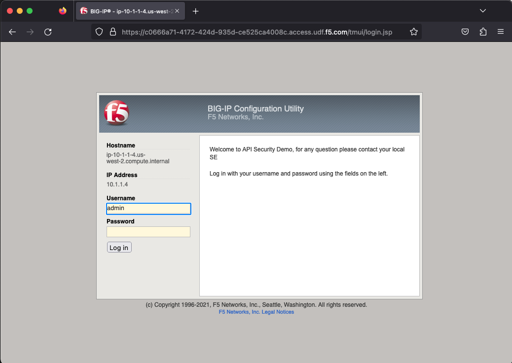

Lab 1.1: Lab En
=========================================

We’re going to be working in the BIG-IP, AS3, and Postman to deploy an ASM template with reference to a hosted swagger definition file. 

1.1.1 Open RDP to the Windows Client linux
~~~~~~~~~~~~~~~~~~~~~~~~~~~~~~~~~~
**For users with Mac's, keystrokes won't show as you type.  Don't worry, just keep typing and login.**

Log into the Linux Client via RDP using the following credentials:

	Username:	f5student

	Password: 	f5DEMOs4u!

.. NOTE:: Copy/Paste doesn't work in XRDP.

.. image:: images/1-module1.png

1.1.2 Log into the BIG-IP
~~~~~~~~~~~~~~~~~~~~~~~~~

Log into the BIG-IP by opening the FireFox browser in the Linux client and selecting the browser bookmark titled :guilabel:`bigip01` using the following credentials:

        Username:	:guilabel:`admin`
    
        Password:	:guilabel:`f5DEMOs4u!` 

1.1.3 Create a policy
~~~~~~~~~~~~~~~~~~~~~

Let’s create an AWAF base policy that we’ll reference later, by navigating to:
		
		Security  ››  Application Security : Security Policies : Policies List

            Click ‘Create’

            .. image:: images/3-module1.png

1.1.4 Configure policy properties
~~~~~~~~~~~~~~~~~~~~~~~~~~~~~~~~~

#Please fix all guilabel tags below. They are not rendering correctly in the remainder of this file

Name the policy :guilabel:`base_policy` and set the following settings:
       
 policy Name:                                            :guilabel:`base_policy` 

 Policy Template:                                        :guilabel:`Rapid Deployment Policy`   

 Enforcement Mode:                                       :guilabel:`Blocking`     

 Auto-Added Signature Accuracy:                          :guilabel:`Medium`  

 Signature Staging:                                      :guilabel:`Disabled` 

 Policy is Case Sensitive:                               :guilabel:`Disabled` 

 Differentiate between HTTP/WS and HTTPS/WSS URLs:       :guilabel:`Disabled`  
 
Click :guilabel:`Save` to save the policy

.. image:: images/4-module1.png

Click :guilabel:`Save` to save the policy

1.1.5 Block traffic from North Korea
~~~~~~~~~~~~~~~~~~~~~~~~~~~~~~~~~~~~

    Navigate to:  Security  ››  Application Security : Security Policies : Policies List
    Select: :guilabel:`base_policy` and scroll to Advanced Settings, Geolocation Enforcement

        We’re going to create a Geo enforcement on this policy to block North Korea form accessing our site.  
        From the ‘Allowed Geolocations’ on the right, find ‘Korea, Democratic People’s Republic of’ and bring it to the left window titled ‘Disallowed Geolocations’:

        .. image:: images/5-module1.png

        Click :guilabel:`Save` 

    Navigate to:  ‘Security  ››  Application Security : Policy Building : Learning and Blocking Settings

        If you expand :guilabel:`IP Addresses and Geolocations` you’ll notice that we’re enforcing blocking of the Geolocation that we created in the previous step as well as access from known malicious IP addresses.

        .. image:: images/6-module1.png
    
    On this same screen, under the section :guilabel:`File types` check the boxes on :guilabel:`Illegal file types` to ‘learn’, ‘alarm’, and ‘block’ as shown below. 

        .. image:: images/7-module1.png

        
        Click :guilabel:`Save` \*\*at the bottom of this screen to save our changes.

        Click :guilabel:`Apply policy` \*\*at the top right of the screen to save our changes.

