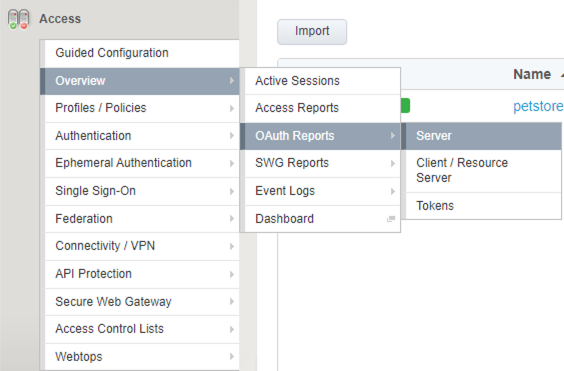
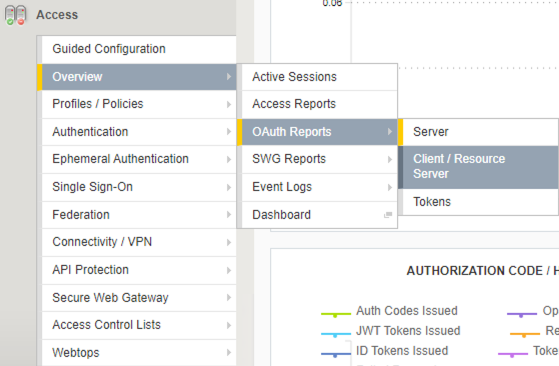

Lab 1.3 - Report on OAuthRequests
====================================

Go to the **Access** module > select **Overview** > **OAuthReports** > **Server**

|
|

|
|

This report gives a summary of JWT token requests that are processed by the OAuthserver.
Mouse over the information you see on the graph. Make a few more requests, come back to
this graph, and click on **Refresh** at the top right-hand side. 
|
|

.. image:: images/apm-rpt2.png
  :width: 600 px

|
|

In the next report, we will review the Client / Resource Server report. 

Click on **Overview** > **OAuthReports** > **Client / Resource Server**

|
|

  
|
|

Access Policy Manager is acting as an OAuthclient, so it logs token validations, along with
authorization failures. Mouse over the graph to see the different request metrics. If you don’t
have enough dataset, go back to Postman, and send a few more requests, with and without the
JWT token. Come back to this report and click **Refresh** in the top right corner. \ck\a