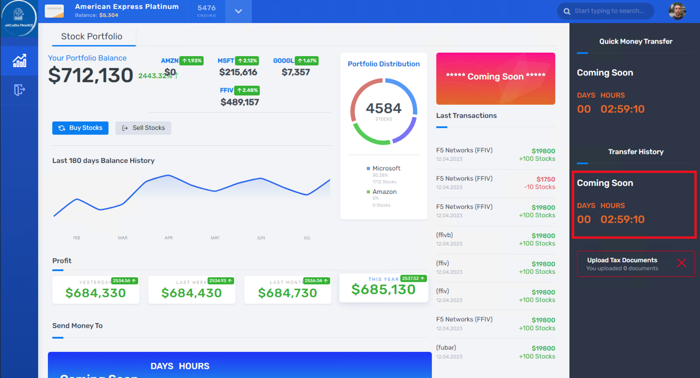

Lab 2.1: Lab Environment 
=================================

We’re going to be working in the BIG-IP, AS3, and Postman to deploy an AWAF template with reference to a hosted swagger definition file. 

Within the Windows Desktop that you used in the previous module, Open Chrome and Postman (will take several seconds).
In Chrome > click the **Arcadia Finance** bookmark

Within **Arcadia Finance**, find the Login page and login using admin/iloveblue as user/password

	Username:	:guilabel:`admin`

	Password: 	:guilabel:`iloveblue`

Navigate the site and perform a couple of actions to familiarize yourself with the apps running. i.e., *Buy Stocks*, *Sell Stocks*, *View Your Last Transactions*.

These three applications (Buy, Sell, Last Transactions) that are serviced by APIs populated by your selections on this frontend site.

Notice the **Coming Soon** countdown on the right side.  We will be deploying that feature later in this lab.

