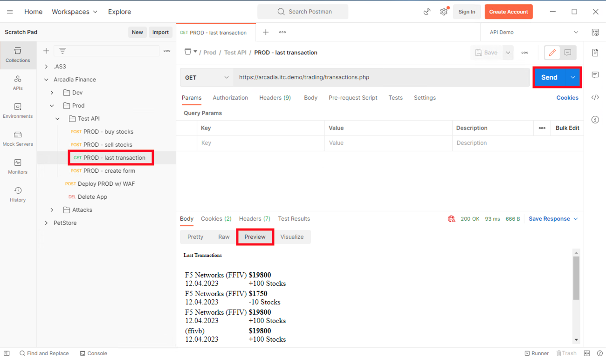

Lab 2.2: Working with APIs in Postman 
=====================================

Review activity in Postman
~~~~~~~~~~~~~~~~~~~~~~~~~~
1. Click on **Postman** and expand **Arcadia Finance** collection.

2. Click *Prod* > *Test API* > *PROD - last transaction* and click **Send**

3. Set the response body to **Preview** for a nicer presentation

.. note:: Your transactions are stored in a NoSQL database (MongoDB)

This completes this lab.
