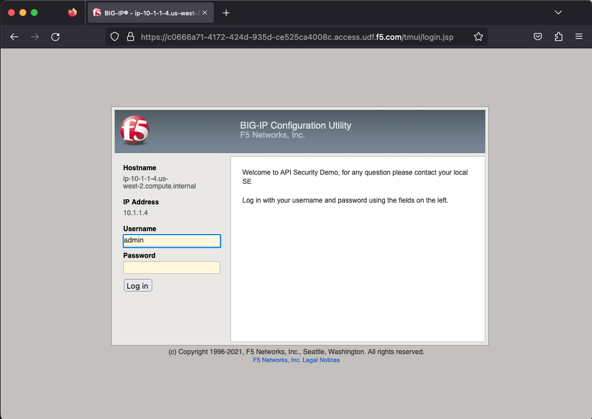

Lab 2.3: Reviewing the BIG-IP Configuration
============================================

Log into the BIG-IP
~~~~~~~~~~~~~~~~~~~

Back on the Lab Components deployment page, click **Access** under *F5 BIG-IP* and select *TMUI*

1. Log into the BIG-IP by launching the **Access** > **TMUI** from the UDF components screen. You make logon to the :guilabel:`F5 BIG-IP` using the following credentials:

        Username:	:guilabel:`admin`
    
        Password:	:guilabel:`admin` 

2. Now navigate to go to **Local Traffic** >> **Virtual Servers**

3. On the top-right, you should see the **Partition** drop-down.
4. Select the “arcadia-prod” partition.
5. You should now see the Arcadia VIP called *vs_arcadia*

.. Note::  If it’s grayed out, make sure you have clicked on Local Traffic >> Virtual Servers
  
  

Review Security Policy
~~~~~~~~~~~~~~~~~~~~~~~~~~~~~~~~~~~~~~~~~~~~~~~~

7. Click on the vs_arcadia VIP and select the Security tab at the top.
Verify the security policy *arcadia_waap_policy* is attached.

Now, let's review the security policy

8. Click on *Security* > *Application Security* > *Security Policies*
Click on **arcadia_waap_policy** 

Review the settings, notice there is no Swagger file associated with this policy 
(Note: If there was a swagger file associated with the policy, you would see the name of the swagger file instead of the upload button)

9. Click on *App Security* >> *URLs* >> *Allowed URLs*

This policy is allowing all HTTP/S URLs via a wildcard.

10. Click on either of the *asterisks*.
Notice we are still enforcing attack signatures on the URLs.
Click on *URL Parameters* at the top and again you can see we are allowing all via wildcard.

11. Click the asterisk parameter and again notice we are enforcing attack signatures.

Question?
~~~~~~~~~
Q: What is this policy doing as far as the APIs are concerned? 

A: *Nothing beyond OWASP Top 10*

More testing with Postman
~~~~~~~~~~~~~~~~~~~~~~~~~~~~

12. Go back to *Postman* within your Windows RDP session
Select the *Arcadia* >> *Prod* >> *Test API* >> *PROD - buy stocks* request and review the *Headers*. Specifically, the *Content-Type* header. 

This value is important for enabling F5 BIG-IP AWAF’s JSON parser.

13. Go back to the BIG-IP security policy, go to allowed URLs and Click one of the *asterisks*.
Make sure the URL Properties drop-down is set to *Advanced* (not Basic)
On the bottom of the page, select Header-based Content Profiles

This is saying if the policy sees application/json as the Content-Type header, it will invoke the “Default” json content profile

14. Click the *Default* json profile

This component tells AWAF to inspect JSON content and parse parameter values for potential security violations. Notice we can also support custom JSON Schema files which can allow your App/Dev teams to get very granular with OpenAPI/Swagger request schemas. 

*For this lab we will not be using this feature.*

