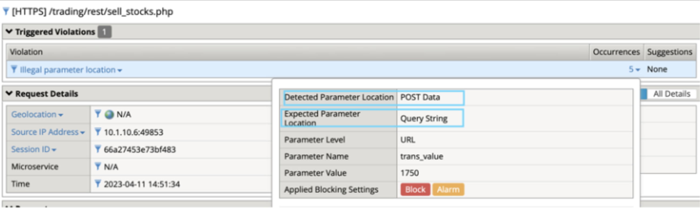

Lab 3.2: Test Security Policy
=============================================================

1. In the Postman *Arcadia Finance* >> *Dev* >> *Test API*, click on *DEV - Buy stocks* and replace the “qty” parameter value of “100” with the value of **“hundred”** and click **Send**

 .. image:: images/postman-qty-hundred.png

2. Review support ID by going to *Application Security* >> *Event Logs* >> *Application*
It should be the request at the top, if not click the filter icon and search for your Support ID

3. Select the request

The request is flagged for an Illegal parameter data type. On the right-side, under *Occurrences*, click the number **1**

4. The policy expects an integer value, based on the OpenAPI file we imported
In Ubuntu CLI, type:

.. code-block:: bash

	grep -n qty /home/ubuntu/repo/arcadia/dev/arcadia-oas3-dev.json -A 6 | head –8

Notice the schema type for qty is “integer” – this sets our security policy configuration

5. Grep for “company” instead of “qty” using the same command above:

.. code-block:: bash

	grep -n company /home/ubuntu/repo/arcadia/dev/arcadia-oas3-dev.json -A 6 | head -8

How does the “string” value reflect in your security policy for this parameter?

6. Select */trading/rest/buy_stocks.php* URL and click *URL Parameters* at the top. 

7. In the BIG-IP, go to the  *Application Security* go to *URLs* >> *Allowed URLs* and select **/trading/rest/buy_stocks.php** URL and click *URL parameters*

8. Select the **“company”** parameter and notice it’s Data Type is set to Alpha-Numeric

Review how the OpenAPI parameter settings (from our last grep command) influence your policy
	required: **true**/false
	in: **body**/query

.. note:: 
	Style: form is required in order to support { key: value } pairs in this format.

.. note:: 
	Explode: true tells the parser to create separate objects for each parameter 

In Postman click on DEV - Buy stocks again and set qty back to 100
Change company to *“fubar”* and hit **Send**

Q: Did the request succeed?  Should it have?

Change the company value to “cat /etc/ssl/certs/*.*” and click **Send**

Q: Did the request succeed?  Review the security event log

In Postman, select the last transaction request and hit **Send**

Set the response body in Postman to *“Preview”*

Notice the blocked request does not make it to the backend database
 

Since we don’t want erroneous values (like fubar) being accepted in our transaction database, let’s see how we can lock this down.

9. On the BIG-IP, go back to the company parameter for the */trading/rest/buy_stocks.php* URL (*Security* >> *Application Security* >> *Parameters* > *Parameter List* )

In the Enum field, add **FFIV** to the list

Click *Update* and be sure to **Apply the policy**

In Postman click the Buy Stocks request and change the company name to FFIV and click send
Request should succeed
Change company value to lower-case ffiv or any word other than FFIV and click Send
Review the security logs 

We have proven we can lock the parameter down to specific values but since we are deploying as code, any changes we make directly to the security policy in the BigIP config will be lost if the application is redeployed.  The changes need to be made permanent by adding them to our OpenAPI Spec file.  Fortunately, OpenAPI allows you to define parameter enumerations.

10. In your Ubuntu CLI, 

.. code-block:: bash
	
	cd /home/ubuntu/repo/arcadia/dev

Use vi/nano to edit *arcadia-oas3-dev.json*

Under the buy_stocks.php path, find the “company” parameter settings and edit the schema object to include enumerations as shown below.

.. code-block:: bash

          {
            "name": "company",
            "in": "body",
            "required": true,
            "style": "form",
            "explode": true,
            "schema": {
              "type": "string",
              "enum": [
 	                  "MSFT",
 	                  "AMZN", 
                    "FFIV"
    		          ]
            }
          },

.. note:: 
	
	If using vi, to edit the json hit ‘i’ and the editor will enter the INSERT state. When done editing hit ESC then type :wq! And hit enter.

When we make changes to our OpenAPI file, AS3 needs to re-import the file for settings to take effect. In this case, we need to delete the current Dev VIP and re-deploy it.

11. Go back to Postman and select the *Arcadia Finance* >> *Dev* >> *Test API*, click on *Delete DEV* request and hit **Send**
Once the Delete DEV request succeeds, Send the **Deploy DEV w/OAS** request to re-deploy and import the new parameter settings.

Troubleshooting Note
~~~~~~~~~~~~~~~~~~~~~~
		If the deployment fails, confirm that you can load the swagger file from the webserver from the Windows RDP session to the following path: http://repo.itc.demo:8282/arcadia/dev/arcadia-oas3-dev.json 

		In the event your deployment fails as a result of a failed python web server, you can relaunch the webserver by using the following commands:

		.. code-block:: bash

			cd /home/ubuntu
			pgrep python3 |xargs kill
			./start-web-server.sh

Back to our regularly scheduled lab...
~~~~~~~~~~~~~~~~~~~~~~~~~~~~~~~~~~~~~~~~~

In Postman, select the *Arcadia Finance > Dev > Test API > DEV* - sell stocks request and click **Send**

Why was the request blocked? Review the security event logs. On the right side, click the "5" under Occurrences.

The policy is expecting our parameters to be sent as part of the query string rather than in the content. This would mean passing parameters in the form of

https://arcdev.itc.demo/trading/rest/sell_stocks.php?trans_value=1750&qty=100&.... 

Based on the production Arcadia deployment, we know this is incorrect and that our parameters are passed as json content. Let's look at the OAS file to find the problem.

12. In Ubuntu CLI:

.. code-block:: bash

	less /home/ubuntu/repo/arcadia/dev/arcadia-oas3-dev.json

Scroll down until you see the sell_stocks path then review the parameters

Chances are whoever created this file did a copy/paste and forgot to edit this value...and then turned it into a lab task.

Compare the parameter settings in OAS file between buy_stocks and sell_stocks
Since we know the requests have the same format, edit the arcadia-oas3-dev.json file sell_stocks parameters so they are located correctly in our security policy.

When you have finished editing the file, you will need to delete and re-deploy your VIP from Postman as you did earlier.
*Arcadia Finance* >> *Dev* >> *Test API*, click on *Delete DEV*
*Arcadia Finance* >> *Dev* >> *Test API*, click on *Deploy Dev w/OAS* - this will update our policy with new settings.

Ensure the security policy is accepting requests for DEV Buy, Sell and Last Transactions

Select either Buy or Sell Stocks and change the Content-Type header to text/plain as you did earlier in Prod, hit **Send**.

	
Q: Why is the request blocked this time?

In this scenario, our security policy is providing more value than just OWASP Top 10, we are also enforcing the API’s rules as a gateway, which is a great way to reduce noise, load and unnecessary risk on your backend containers. 

Now that you are an OpenAPI pro and a JSON editing whiz, it’s time to put your skills to the test by adding the new Money Transfer microservice to our API gateway.
