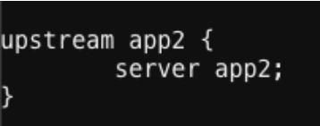
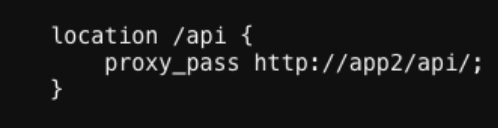
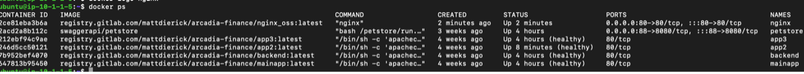
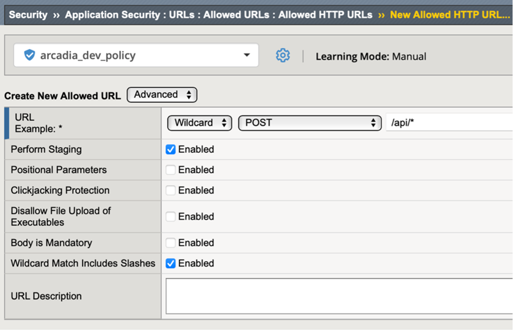
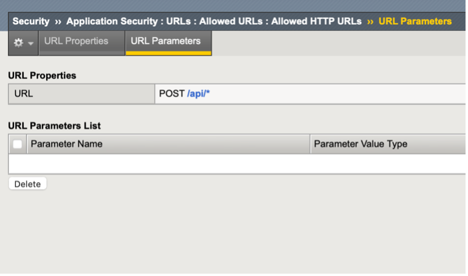
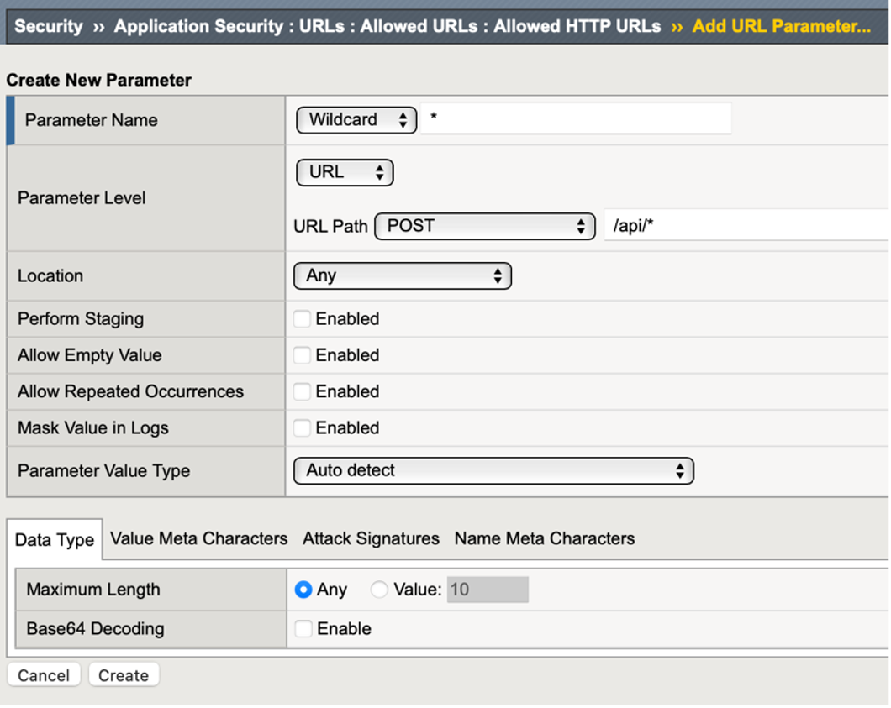
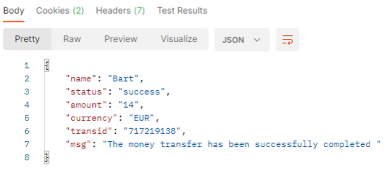

Lab 3.3: Test Money Transfer app
=====================================================

Scenario:  One of the Arcadia App teams has released a new microservice that is ready for security testing. You have been tasked with incorporating the new Money Transfer microservice into our API gateway security policy.

In order to achieve this, we will need to:
-	Launch the container running your new micro-service
-	Update your Nginx Container Ingress to include the service
-	Functional test with the existing security policy
-	Incorporate all changes into OpenAPI file and deploy as code

Task 1 – Deploy Container Running New Microservice
~~~~~~~~~~~~~~~~~~~~~~~~~~~~~~~~~~~~~~~~~~~~~~~~~~~
From Ubuntu CLI enter: 

.. code:: bash
	
	docker start app2

Task 2 – Update Nginx Container Ingress
~~~~~~~~~~~~~~~~~~~~~~~~~~~~~~~~~~~~~~~~~~~~~~~~~~~
	Since this is a lab, Prod and Dev are both using the same pool. Therefore, technically this step breaks Prod. 

1. In the Ubuntu CLI, 

.. code:: bash

	vi /home/ubuntu/nginx.conf 

2. Remove the # in front of upstream app2 (lines 11-13) as well as in front of location /api (lines 33-35) 

Do not remove the # from any other line. Save the file (hit **ESC**,type: **wq!**)

3. From the Ubuntu CLI enter the command: docker stop nginx && docker rm nginx 

Now enter (copy/paste all as one line):  

.. code:: bash

	docker run -dit -h nginx --name=nginx --net=internal --restart=unless-stopped -p 80:80 -v /home/ubuntu/nginx.conf:/etc/nginx/conf.d/default.conf registry.gitlab.com/mattdierick/arcadia-finance/nginx_oss:latest

Then enter, 

.. code:: bash
	
	docker ps

...and you should see six containers are running as seen below:

Task 3 – Test the New Microservice
~~~~~~~~~~~~~~~~~~~~~~~~~~~~~~~~~~~~~~~~~~~~~~~~~~~

1. In Postman, select *Arcadia Finance* >> *Dev* >> *Test API*, click on *DEV transfer money* and click **Send**

As we had previously locked down the URLs allowed, this request is blocked

Review the security event log and then we'll correct the issue.

2. For testing purposes, we will simulate the Prod policy and add wildcard URL and Parameter values to the existing policy.
Go to *Application Security* go to *URLs* >> *Allowed URLs* and Create New HTTP URL:

	Settings
	**URL Example:**  Wildcard – POST - /api/* 

	Click **Create**

3. Since you will be passing parameters in the request, you need to account for that in the 	policy. Go back to your list of allowed URL’s and click on /api/* then select URL 		Parameters at the top.

4. Add another wildcard for testing. Click Create and configure as below

	
5. Click *Create* and go back to *Security Policy* and **Apply Policy**

6. In Postman retry the Money Transfer request and it should now succeed

.. note:: 
		If you get ASM Block with “Illegal HTTP Status Code” and a 404-server response then delete the app2 container and rebuild by the following CLI commands:

.. code:: bash

	docker stop app2 mainapp nginx
	docker rm app2
	docker run -dit -h app2 --name=app2 --net=internal registry.gitlab.com/mattdierick/arcadia-finance/app2:latest
	docker start mainapp nginx

If requests are successful, it is time to make these changes permanent in your OpenAPI file
