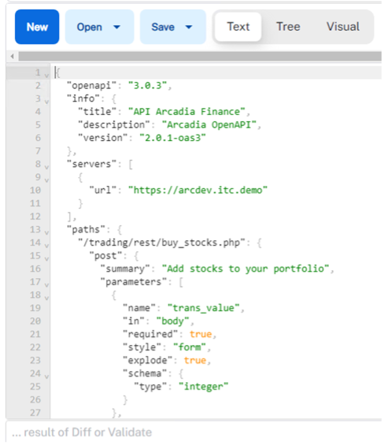
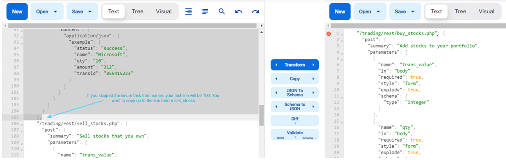
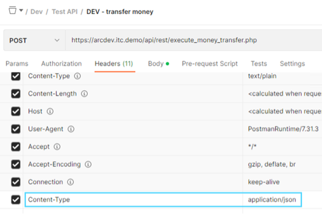
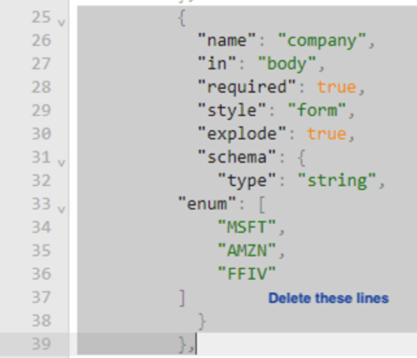
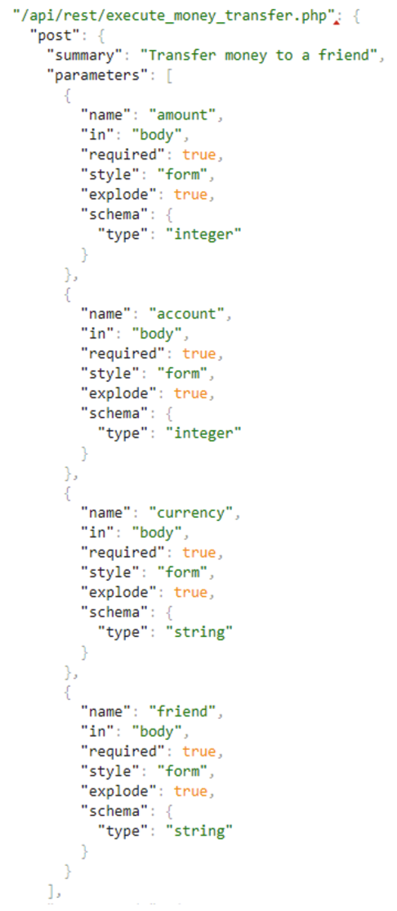
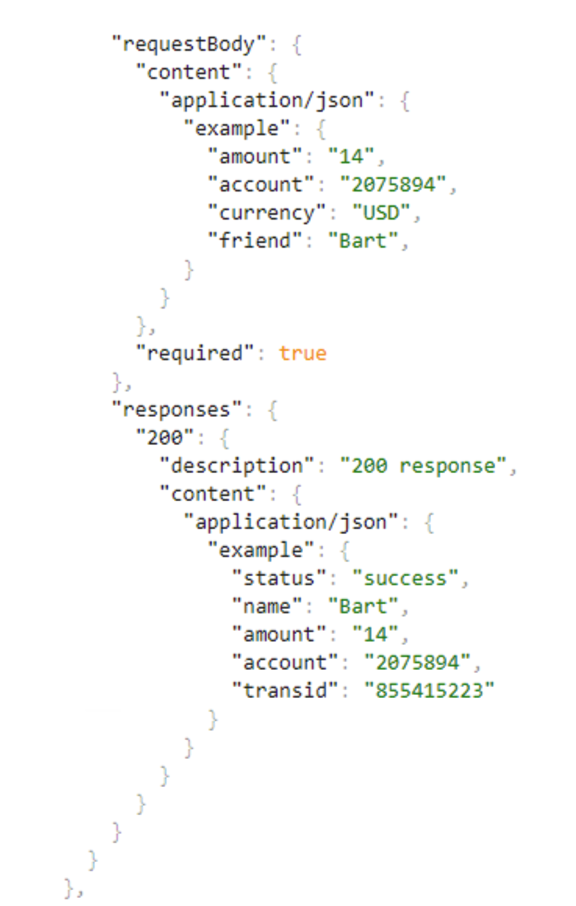
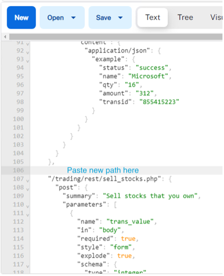
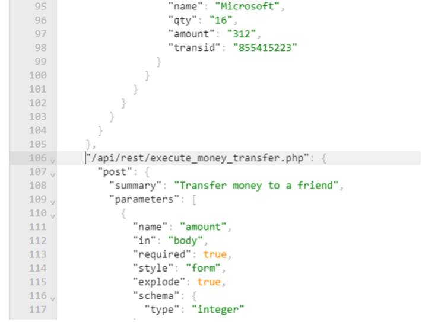
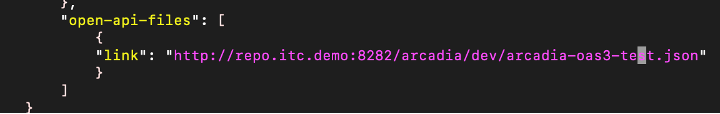

Lab 3.4: Add Money Transfer Service to an OpenAPI File
========================================================

**Configure OpenAPI Spec for New API**

1. Open a new tab in Chrome and click the JSONMate bookmark
Click “New” on the left and right JSONMate window panes.
Copy /repo/arcadia/dev/arcadia-oas3-dev.json (also accessible from: http://repo.itc.demo:8282/arcadia/dev/arcadia-oas3-dev.json) to your clipboard and paste in the left-side JSONMate window

2. Highlight and copy lines 14 thru 105 (From: **"/trading/rest/buy_stocks.php": {**  to **}, )**
Paste the buy stocks path info on the right-side of JSONMate (ignore errors at bottom)

3. We are just using Buy Stocks on the right as a template for the new Money Transfer API.
Edit the right-side so it reflects what we know about the new API.

In Postman, review the transfer money request to help define the OpenAPI file configuration.

From the body and headers here we know the URI path, it contains 4 parameters, what schema type those parameters are (integer, string) and they are passed in JSON

4. Edit the path and parameter values on the right-side JSONMate pane with the new values. 

5. Since buy stocks has 5 parameters and we only need 4, start by deleting the “company” parameter on the right-side (Line 25 – 39) 

- Rename line 1 to /api/rest/execute_money_transfer.php
- Edit line 3 to read as Transfer money to a friend
- Edit the name in line 6 to read “amount”
- Edit the name in line 16 to read “account”
- Edit the name in line 26 to read “currency”
- Edit the name in line 36 to read “friend”
- Change the schema type in line 42 to “string”

When complete, the right-side should resemble the image below:

Make sure to edit the RequestBody and Response examples at bottom
You can review the Postman response body for how to configure your API spec response.

6. Once you have the new spec defined, paste it to the left-side JSONMate pane BEFORE the “/trading/rest/...” line.  If you followed all labs, this should be line 106

Look for any formatting errors in red at bottom of left side. The last character in your output should be a comma ( , ) on line 181

**Create New OAS File for Testing**

7. Copy the left-side JSONMate to clipboard and create a new OAS file in your repo.

.. code:: bash

        nano /home/ubuntu/repo/arcadia/dev/arcadia-oas3-test.json 
        
.. note:: 

        We're using this time to get around paste formatting issues with vi. 

Now you need to update the WAF policy file used in our AS3 declaration to use the newly created OAS file:

.. code:: bash

        vi /home/ubuntu/repo/arcadia/dev/policy-api-arcadia-dev.json

edit openapi spec file location to the test version we just created in the previous step

Redeploy the Dev VIP to update our security policy
8. In Postman, *Arcadia Finance* >> *Dev* >> *delete* and then **re-deploy** the Dev VIP
As long as your JSON file is valid, you should receive a success indication

In Postman send the DEV transfer money request. If you have any issues, resolve them in the OpenAPI file.

Well done! You have successfully created an API gateway policy and added a new service!

“But what if I want even MORE security?” you ask...

Let’s look at an example of how Advanced WAF can enhance security

