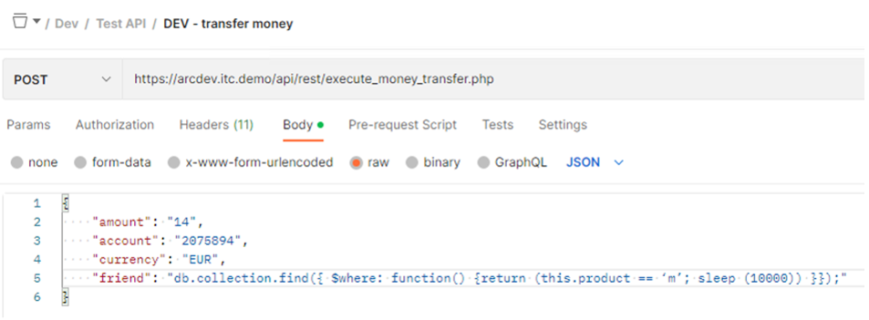
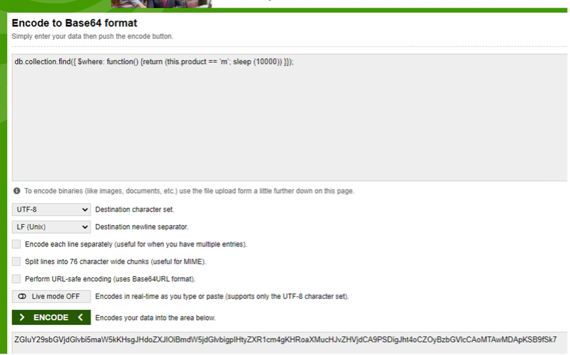
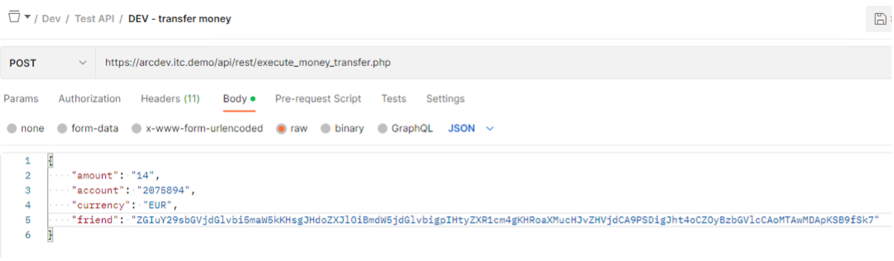
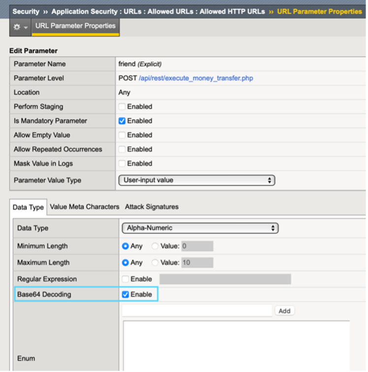
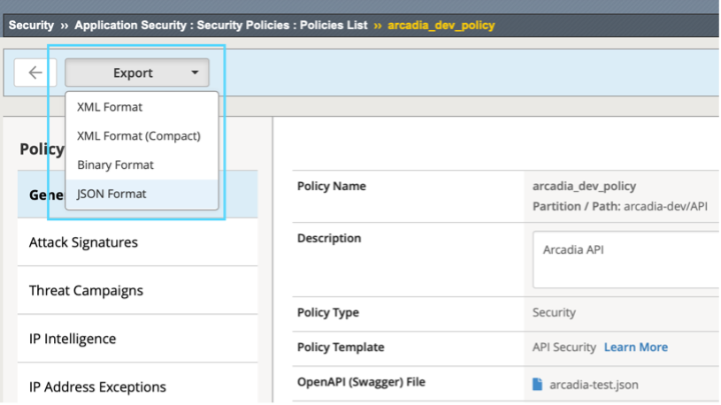

Lab 3.5 Enhance Security with AWAF Features
=========================================================================================================

Task 1 – Attack a Parameter
~~~~~~~~~~~~~~~~~~~~~~~~~~~~~~~~~~~~~~~~~~~~~~~
In Postman, select the *Arcadia Finance* >> *Dev* >> *Test API* >> *transfer money* request again
Since we know the “friend” parameter is accepting alpha-numeric values, and there is a MongoDB backend, let’s see if we can sneak in a NoSQL Injection to our MongoDB

Change the friend value from Bart to the following and click Send

.. code:: 
  
  db.collection.find({ $where: function() {return (this.product == ‘m’; sleep (10000)) }});
 

Predictably, we are blocked for a NoSQL Injection

Task 2 – Encode the Attack and Try Again
~~~~~~~~~~~~~~~~~~~~~~~~~~~~~~~~~~~~~~~~~~~~~~~

Open Chrome and go to the Base64 Encode bookmark
Encode your NoSQL Injection string and copy the results
 

Now in the Money Transfer request, change “friend” to the new encoded string and **Send**
 

|
 

Unfortunately, this type of security is not something OpenAPI has a spec for. To protect your API against base64 encoded attacks, you would need to enable a WAF-specific feature on the parameter.

Task 3 – Tune the BigIP Security Policy
~~~~~~~~~~~~~~~~~~~~~~~~~~~~~~~~~~~~~~~~~~~~~~~`

Go to the Arcadia dev security policy > allowed URLs > money transfer > URL Parameters
Click the “friend” parameter and enable Base64 decoding

Click *Update* and then **Apply the Policy**

Go back to Postman and re-send the same request with encoded “friend” parameter
Check the security logs - The parameter value is now decoded and flagged as a violation.

It’s important to note that changes outside of AS3 will not persist if this VIP is re-deployed. This is just an example of what’s possible. What you can do is customize the policy however you need and then export the entire policy as JSON and reference that in your AS3 declaration as an updated version. 

You can do this from the Security Policies screen by clicking on your arcadia policy and then find the Export button at the top left.
  

Consider the OpenAPI file as a security starting point that will get you enforcement and OWASP protection. For many organizations, that will be enough.

Time for a well-deserved break!  This concludes the Arcadia OpenAPI Security Lab.
