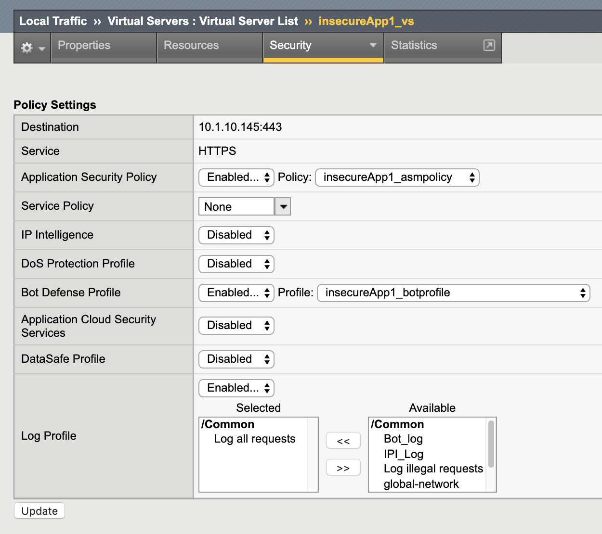
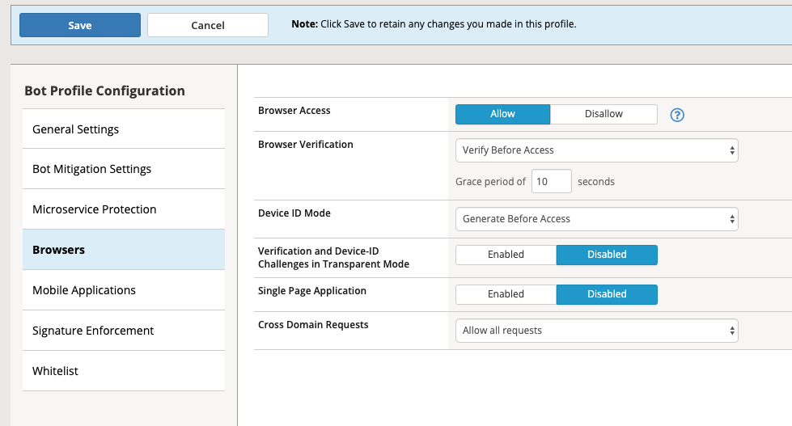
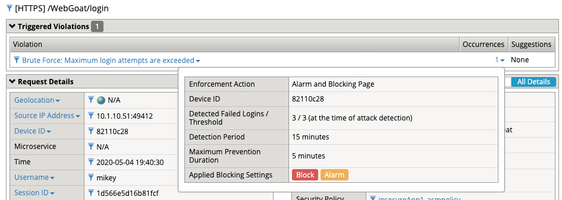
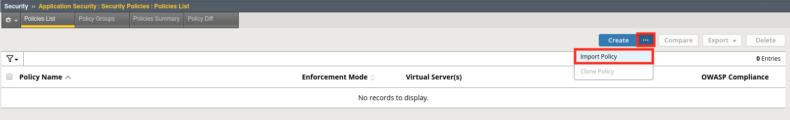
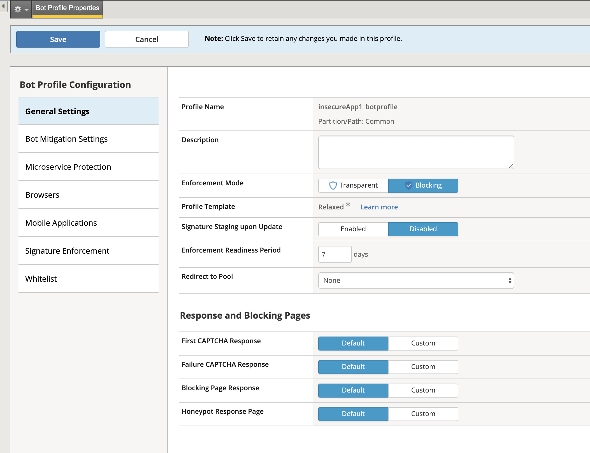
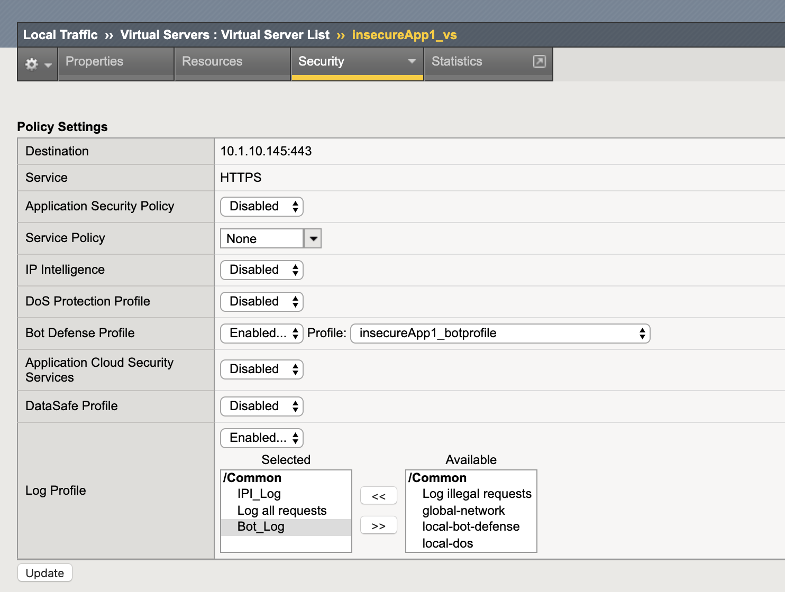
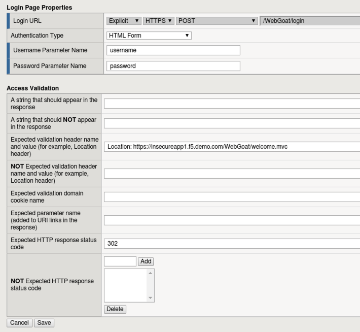
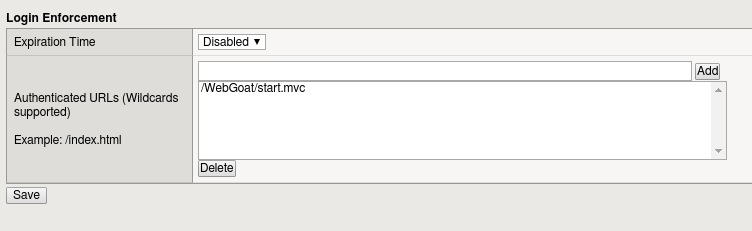
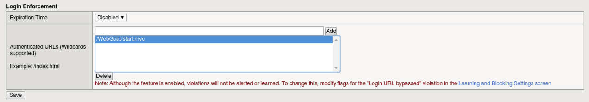
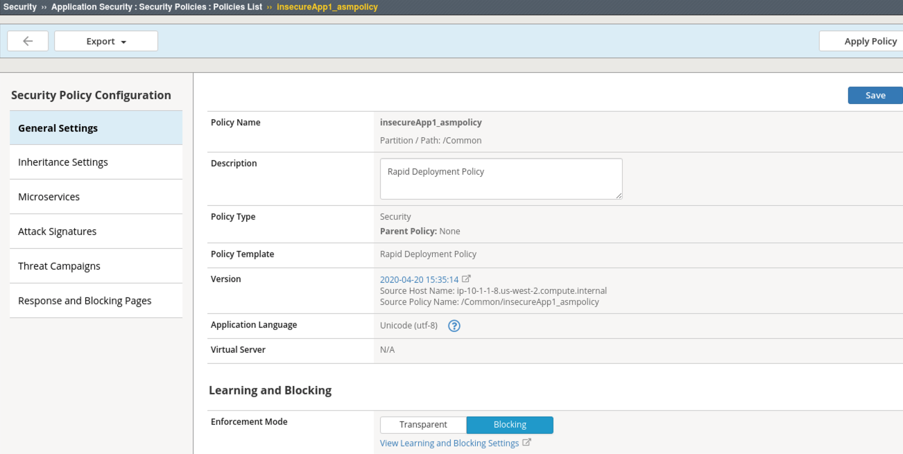

Lab 1.1: Brute Force Attack Prevention
########################################

..  |lab1-1| image:: images/lab1-1.png
        :width: 800px
..  |lab1-2| image:: images/lab1-2.png
        :width: 800px

..  |lab1-3| image:: images/lab1-3.png
        :width: 800px
..  |lab1-3a| image:: images/lab1-3a.png
        :width: 800px
..  |lab1-4| image:: images/lab1-4.png
        :width: 800px

..  |lab1-6| image:: images/lab1-6.png
        :width: 800px

..  |lab41-18| image:: images/lab41-18.png
        :width: 800px
..  |lab41-19| image:: images/lab41-19.png
        :width: 800px
..  |lab41-20| image:: images/lab41-20.png
        :width: 800px
..  |pbd| image:: images/pbd.png
        :width: 800px
..  |lab41-01| image:: images/lab41-01.png
        :width: 800px
..  |log_profile| image:: images/log_profile.png
        :width: 800px
..  |bot_profile| image:: images/bot_profile.png
        :width: 800px

..  |lab41-03| image:: images/lab41-03.png
        :width: 800px

..  |lab41-05| image:: images/lab41-05.png
        :width: 800px

..  |lab41-07| image:: images/lab41-07.png
        :width: 800px

#. RDP to client01. Depending on your RDP client, you may get a empty XRDP login screen such as this.

.. image:: images/xrdp1.png
  :width: 600 px

Simply click in the username field and backspace. Enter the name: **f5student** and in the password field use the **password** provided by the instructor.

#. Launch Chrome browser (please be patient and don't click the icon multiple times)

.. NOTE:: If the Operating system prompts you enter your password for keychain access, please enter the "f5student" password provided by your lab instructor.

.. image:: images/keychain.png
  :width: 600 px

Task 0: Level Set
~~~~~~~~~~~~~~~~~

#.  Open Chrome and navigate to the BIG-IP management interface.  For the purposes of this lab you can find it at ``https://10.1.10.245/`` or by clicking on the **bigip01** shortcut.

#.  Login to the BIG-IP.

#.  Navigate to **Security -> Application Security -> Security Policies**.

#.  Click the **...** button next to create, then click **import policy**.

    |lab41-17|

#.  Navigate to the **waf241** folder and open the **waf141_complete.xml** file.

    |lab41-18|

#.  Ensure that **New Policy** is selected and click **Import**.

    |lab41-19|

#.  You now have a policy like the one below:

    |lab41-20|

#.  Navigate to **Local Traffic > Virtual Servers > Virtual Server List > insecureApp1_vs > Security > Policies** and ensure that the **insecureApp1_asmpolicy** policy and the **Log All requests** log profile are enabled on the **insecureApp1_vs** virtual server as shown below.

    |lab41-01|

#.  Click Update

#.  Navigate to  **Security -> Application Security -> Security Policies -> Policies List** and place the **insecureApp1_asmpolicy** policy in **blocking** mode and click **Save and then Apply Policy**.

    |lab41-007|

Enabling Bot Profile
~~~~~~~~~~~~~~~~~~~~

#.  Navigate to **Security > Bot Defense > Bot Defense Profiles** and check to see if insecureApp1_botprofile has been created.  If not, click **Create**.
#.  Name: **insecureApp1_botprofile**
#.  Profile Template: **Relaxed**
#.  Change the Enforcement Mode to Blocking
#.  Click the **Learn more** link to see an explanation of the options.

        |bot_profile|

#.  Click on the **Bot Mitigation Settings** tab and review the default configuration.
#.  Click on the **Signature Enforcement** tab and review the default configuration.
#.  Click on the **Mobile Applications** tab and review the Mobile SDK Information
#.  Click on the **Browsers** tab on the left and Change the Browser Verification setting to **Verify Before Access**, then ensure that the grace period is set to **10 Seconds**.

        |pbd|

#.  Click **Save**.

Define Login & Logout Pages
~~~~~~~~~~~~~~~~~~~~~~~~~~~~~~~~~~~

        #.  To configure a login page, go to **Security -> Application Security -> Sessions and Logins -> Login Pages List**.  Ensure the **insecureApp1_asmpolicy** is selected at the top of the screen and click **Create**.

        #.  We'll now populate the form with data gathered from your favorite browser or reconnaissance tool.  For expedience, we've gathered the appropriate data for you in advance:

                |lab41-03|

        #.  Populate the form as shown below and click **Create**:

            ``Location: https://insecureapp1.f5.demo/WebGoat/welcome.mvc``

            ``/WebGoat/login``

            ``302``

                |lab41-04|

        #.  From the tab bar select **Logout Pages List** or navigate to **Security -> Application Security -> Sessions and Logins -> Logout Pages List**

        #.  Populate the form as shown below and click **Create and then Apply policy**.

          ``/WebGoat/logout``

                 |lab41-05|

There is more than one kind of brute force attack. In the classic version, hackers attempt to log in to an application by repeatedly guessing users’ account credentials. Because of these attacks, most applications now lock an account when it encounters multiple unsuccessful authentication attempts, at least temporarily. However, this strategy only protects against attack on a single account.
In another version of this attack, commonly called “credential stuffing,” hackers make only one attempt to log in to users’ accounts. They obtain a collection of user name and password combinations from a compromised application and programmatically evaluate them against their target application, looking for accounts where users reused their compromised credentials. When they finish, the hackers know those accounts for which they have valid credentials on the target application.

.. note:: F5 WAF has a number of brute force attack detection capabilities that are beyond the scope of this exercise.  Take some time to examine some of the other options as you work through this lab.  For more information see:  ``https://techdocs.f5.com/en-us/bigip-15-0-0/big-ip-asm-implementations/mitigating-brute-force-attacks.html`` .

Task 1 - Configure Brute Force Attack Prevention
~~~~~~~~~~~~~~~~~~~~~~~~~~~~~~~~~~~~~~~~~~~~~~~~

#. Open a terminal in the RDP client and ssh to the BIG-IP using the **admin** user and provided **password** : ``ssh admin@10.1.10.245``.

#. Run the command ``modify sys db asm.cs_qualified_urls value "/WebGoat/login"``.

#. Run the command ``save sys config``.

#.  Open the BIG-IP GUI interface .

#.  Navigate to **Security -> Application Security -> Brute Force Attack Prevention** and click **Create**.

#.  Select the login page you created earlier or imported as part of lab setup.

    |lab1-1|

#.  Configure **Source-based Brute Force Protection** settings as follows:

    |lab1-2|

#.  Click **Create** .

#.  Click **Apply Policy**.

#. Ensure WAF and Bot policy are both applied to the Virtual as seen and click **update**.

    |lab1-2.1|

Task 2 - Test username based Brute Force Protection
~~~~~~~~~~~~~~~~~~~~~~~~~~~~~~~~~~~~~~~~~~~~~~~~~~~

#.  Open a new Private Browsing window in **Firefox** .

#.  Go to the to WebGoat login page at ``https://insecureapp1.f5.demo/WebGoat/login``

#.  Attempt to login using the same username and password of your choice at least 4 times or until CAPTCHA is displayed. Solve the CAPTCHA.

#.  Examine the most recent requests in the event log by navigating to Security -> Event Logs -> Applications -> Requests:

    You should see two requests for /WebGoat/login , one is the CAPTCHA challenge and the other is the CAPTCHA solve result.

    |lab1-3|

    |lab1-3a|

    Take note of the username field.  The request was considered as a brute force attack with an action of Alarm and CAPTCHA.

#.  Near the **Brute force: Maximum Login Attempts are exceeded** header at the top of the event window click on the number under **Occurrences**:

    |lab1-4|

    The message indicates the number of login attempts by a user exceeded the threshold.

Task 3 - Enable Device ID
~~~~~~~~~~~~~~~~~~~~~~~~~

#. Navigate to **Security -> Bot Defense -> Bot Defense Profiles** and under the **Browsers** tab edit the profile **insecureApp1_botprofile** to enable Device ID mode to "Generate Before Access" for browsers.

Device ID is a unique identifier that F5 WAF generates for each client browser.
You can use the device identifier to identify nefarious clients and diagnose security issues, such as session hijacking, web scraping, brute force login attempts, and others.

#. Click **Save**

    |lab1-5|

Task 4 - Test Device ID based Brute Force Protection
~~~~~~~~~~~~~~~~~~~~~~~~~~~~~~~~~~~~~~~~~~~~~~~~~~~~

#.  Open a new **incognito window** window in **Chrome** .

#.  Go to the to WebGoat login page at ``https://insecureapp1.f5.demo/WebGoat/login``

#.  Attempt to login using a **different username** and password each time until blocked.

#. Once Blocked close the browser and re-open a new **incognito window** in **Chrome**

#. Attempt to login using a different username as in step 3, your first login request should be blocked.

#. Examine the most recent requests in the event log by navigating to Security -> Event Logs -> Applications -> Requests:

    |lab1-6|

#. Click on the Occurrences and notice the Device ID in the request.

    |lab1-7|

|
|

**This concludes Lab 1.1**
