Lab 1.1: Brute Force Attack Prevention
########################################

#. RDP to the Linux Client by choosing the RDP access method from your UDF environment page. You will be presented with the following prompt where you will enter the password only. The f5student account is hard-coded into XRDP for your convenience.

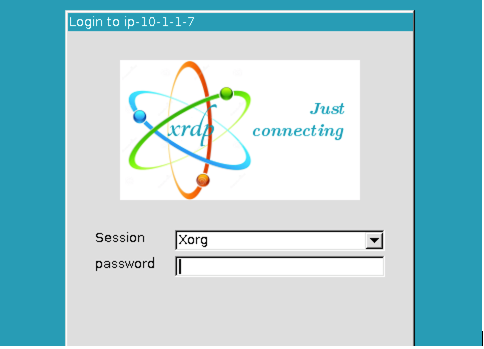

#. Once logged in, launch Chrome Browser. You can double-click the icon or right click and choose execute but do not click multiple times. It does take a few moments for the browser to launch the first time.

Task 0: Level Set
~~~~~~~~~~~~~~~~~

#.  Click the F5 Advanced WAF bookmark and login to TMUI. admin/[password].

- Create a blocking policy using the guided configuration utiliy

- Apply the security policy to an existing virtual server

- Apply a security logging profile to the virtiual server

Create security policy using the Guided Configuration
~~~~~~~~~~~~~~~~~~~~~~~~~~~~~~~~~~~~~~~~~~~~~~~~~~~~~~~~~~~~~~~~

#. On the Main tab to your left, select **Security > Guided Configuration**. This opens the Guided Configuration screen.

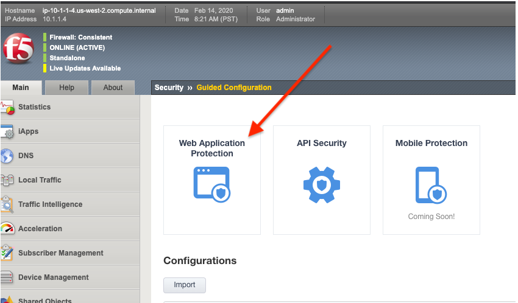

#. Click on the **Web Application Protection** template button.

.. image:: images/webapptemplate.png
  :width: 600 px

#. The guided configuration now provides an overview of what will be configured. Click the  **Next** button.

#. Give your configuration the name ``juice_shop_waf`` this will also name your security policy.

#. Under **Select Enforcement Mode** select **Blocking**

    .. Note:: Typically you would deploy a new policy in a transparent mode so you can observe the logs before blocking to help avoid false positives.  But come on....this is a lab.  We are going to block stuff!  

#. Click on **Show Advanced Settings** button in the upper right hand corner of your page.

.. image:: images/advanced2.png
  :width: 600 px

#. Under **Server Technologies** add the following to the selected window.  Adding these technologies will assist in building a more precise policy.

    - AngularJS
    - Express.js
    - JavaScript
    - JQuery
    - MongoDB
    - Node.js
    - SQLite

#. Press the **Save & Next** Button below.  

.. image:: images/servertechnologies.png
  :width: 600 px

    .. Note:: We are adding these technologies since we know what the application is using.  There is also a feature that can be turned on that can allow the policy to learn these technologies.

#. Check off **Assign Policy to Virtual Server**, under **Virtual Server** choose **Use Existing**, and move the Juice_Shop_VS to the selected window.  Press **Save & Next**

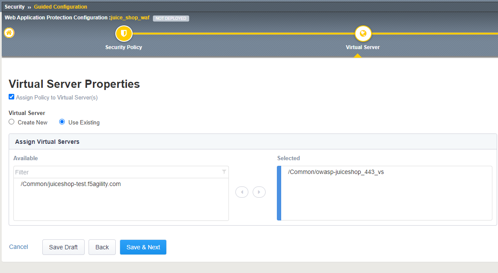

#. The next page will summarize the objects and policy configuration.  Review, and take note that you can also go back and edit if required.  When done click **Deploy** at the bottom of the screen.  It will take a few moments to complete the policy build.

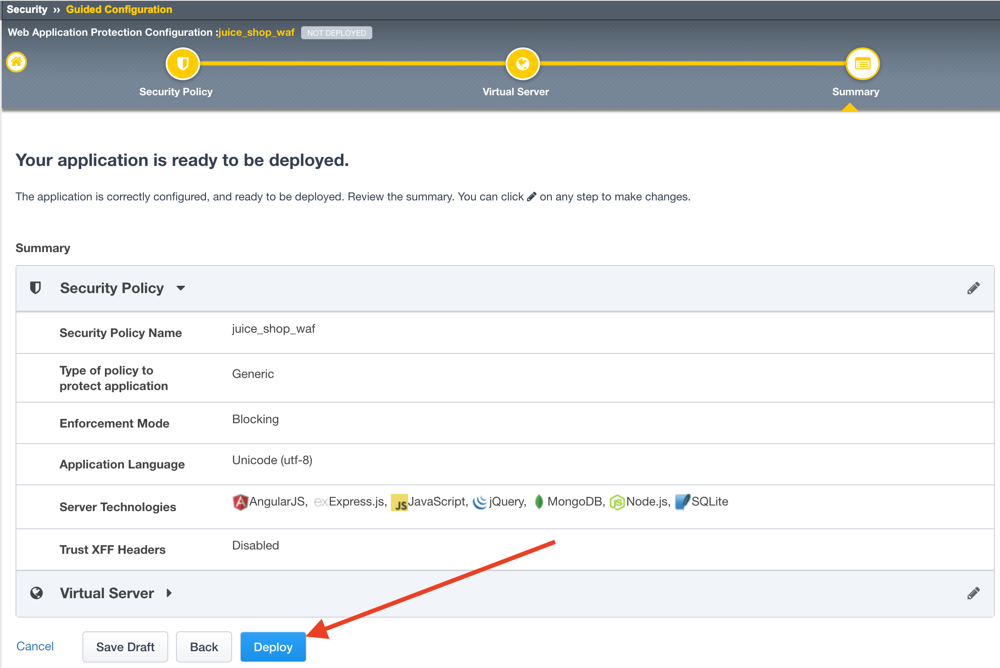

#.  After the policy is created, we will want to apply a logging profile to our new security policy.

    - Go to **Security -> Overview -> Summary**, and the policy you just created should be listed. 
    - Place a check to the left of the **Virtual Server** name that your new security policy is applied to.  
    - Now click the blue **Attach** button above and select **Logging Profile**

.. image:: images/attachlogging1.png
  :width: 600 px

    - Select **Log illegal requests** and press the other **Attach** button below.

.. image:: images/attachlogging2.png
  :width: 600 px

    - You will now see the logging profile is added under the Application Security column.  

Enabling Bot Profile
~~~~~~~~~~~~~~~~~~~~

#.  Navigate to **Security > Bot Defense > Bot Defense Profiles** and check to see if juice_shop_botprofile has been created.  If not, click **Create**.
#.  Name: **juice_shop_botprofile**
#.  Profile Template: **Relaxed**
#.  Change the Enforcement Mode to Blocking
#.  Click the **Learn more** link to see an explanation of the options.

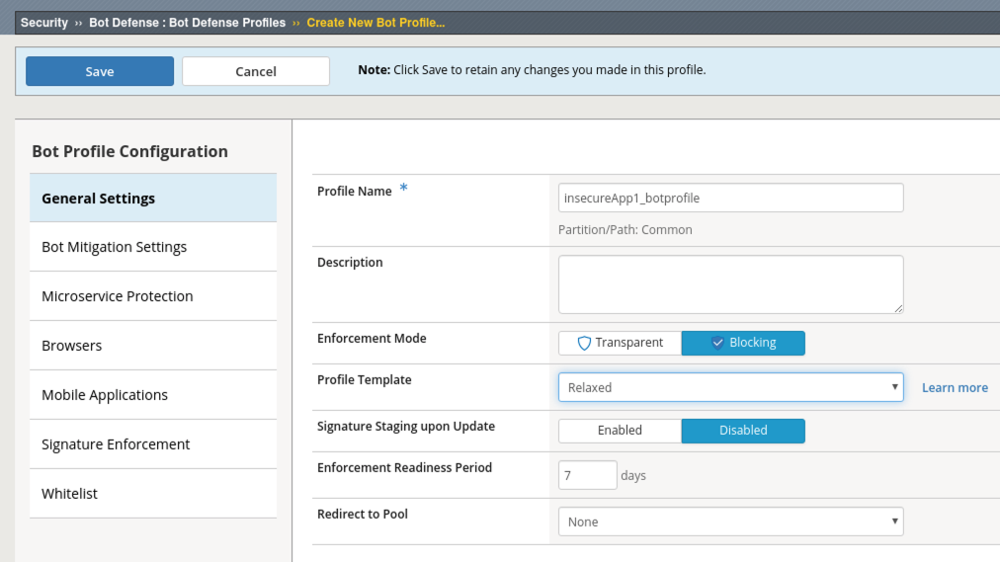

#.  Click on the **Bot Mitigation Settings** tab and review the default configuration. All of the Mitigation Settings should be configured for "Alarm." 

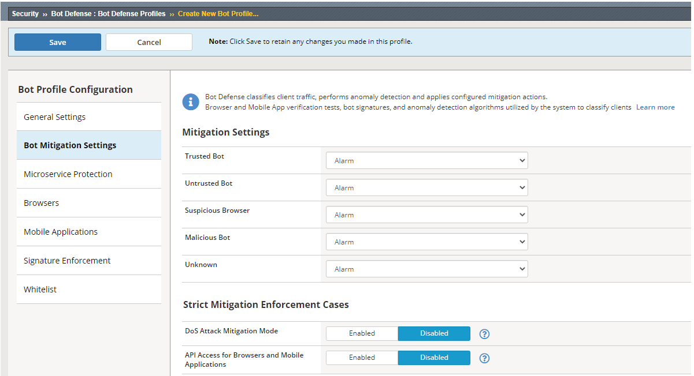

#.  Click on the **Signature Enforcement** tab and review the default configuration.
#.  Click on the **Mobile Applications** tab and review the Mobile SDK Information
#.  Click on the **Browsers** tab on the left and Change the Browser Verification setting to **Verify Before Access**, then ensure that the grace period is set to **10 Seconds**.

.. image:: images/pbd.png
  :width: 600 px

#.  Click **Save**.

Define Login Pages
~~~~~~~~~~~~~~~~~~~~~~~~~~~~~~~~~~~

        #.  To configure a login page, go to **Security -> Application Security -> Sessions and Logins -> Login Pages List**.  Ensure the **juice_shop_waf** is selected at the top of the screen and click **Create**.

        #.  We'll now populate the form with data gathered from your favorite browser or reconnaissance tool.  For expedience, we've gathered the appropriate data for you in advance:

        #.  Populate the form as shown below and click **Create and then Apply Policy**:

.. image:: images/login_enforcement1.png
  :width: 600 px

There is more than one kind of brute force attack. In the classic version, hackers attempt to log in to an application by repeatedly guessing users’ account credentials. Because of these attacks, most applications now lock an account when it encounters multiple unsuccessful authentication attempts, at least temporarily. However, this strategy only protects against attack on a single account.
In another version of this attack, commonly called “credential stuffing,” hackers make only one attempt to log in to users’ accounts. They obtain a collection of user name and password combinations from a compromised application and programmatically evaluate them against their target application, looking for accounts where users reused their compromised credentials. When they finish, the hackers know those accounts for which they have valid credentials on the target application.

.. note:: F5 WAF has a number of brute force attack detection capabilities that are beyond the scope of this exercise.  Take some time to examine some of the other options as you work through this lab.  For more information see:  ``https://techdocs.f5.com/en-us/bigip-15-0-0/big-ip-asm-implementations/mitigating-brute-force-attacks.html`` .

Task 1 - Configure Brute Force Attack Prevention
~~~~~~~~~~~~~~~~~~~~~~~~~~~~~~~~~~~~~~~~~~~~~~~~

#. Open a terminal in the RDP client and ssh to the BIG-IP using the **admin** user and provided **password** : ``ssh admin@10.1.10.245``.

#. Run the command ``modify sys db asm.cs_qualified_urls value "/rest/user/login"``.

#. Run the command ``save sys config``.

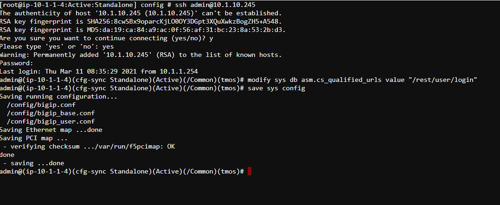

#.  Open the BIG-IP GUI interface .

#.  Navigate to **Security -> Application Security -> Brute Force Attack Prevention** and click **Create**.

#.  Select the login page you created earlier or imported as part of lab setup.

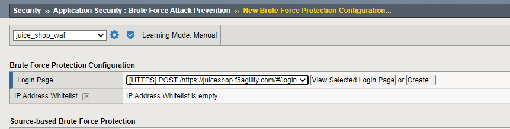

#.  Configure **Source-based Brute Force Protection** settings as follows:

.. image:: images/brute_force2.PNG
  :width: 600 px

#.  Click **Create** .

#.  Click **Apply Policy**.

#. Ensure WAF and Bot policy are both applied to the Virtual as seen and click **update**.

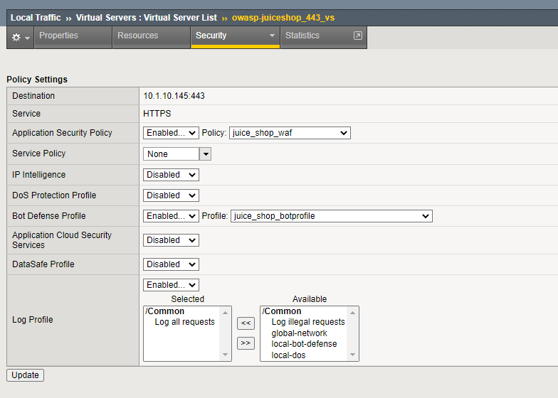

Task 2 - Test username based Brute Force Protection
~~~~~~~~~~~~~~~~~~~~~~~~~~~~~~~~~~~~~~~~~~~~~~~~~~~

#.  Open a new Private Browsing window in **Chrome or Firefox** .

#.  Go to the to WebGoat login page at ``https://juiceshop.f5agility.com/#/login``

#.  Attempt to login using the same username and password of your choice at least 4 times or until CAPTCHA is displayed.

#.  Examine the most recent requests in the event log by navigating to Security -> Event Logs -> Applications -> Requests:

    You should see two requests for /rest/user/login.

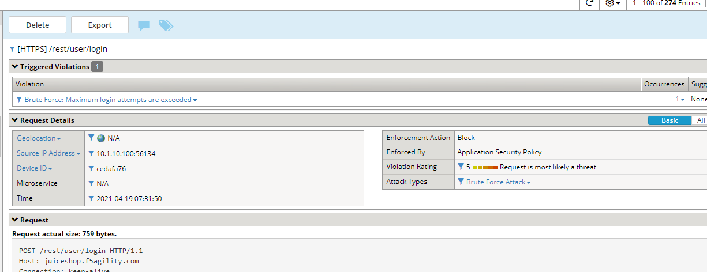

The request was considered as a brute force attack.

#.  Near the **Brute force: Maximum Login Attempts are exceeded** header at the top of the event window click on the number under **Occurrences**:

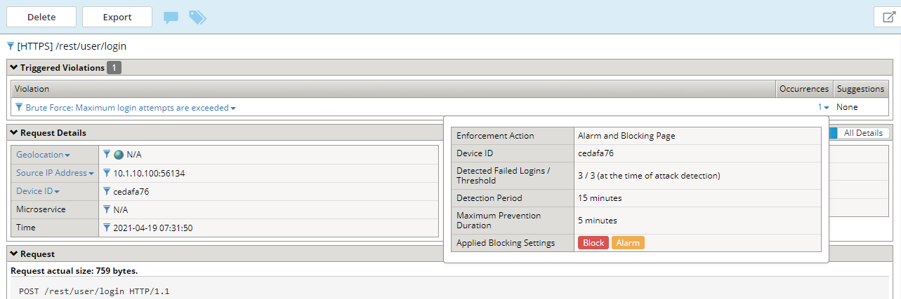

The message indicates the number of login attempts by a user exceeded the threshold.

Task 3 - Enable Device ID
~~~~~~~~~~~~~~~~~~~~~~~~~

#. Navigate to **Security -> Bot Defense -> Bot Defense Profiles** and under the **Browsers** tab edit the profile **juice_shop__botprofile** to enable Device ID mode to "Generate Before Access" for browsers.

Device ID is a unique identifier that F5 WAF generates for each client browser.
You can use the device identifier to identify nefarious clients and diagnose security issues, such as session hijacking, web scraping, brute force login attempts, and others.

#. Click **Save**

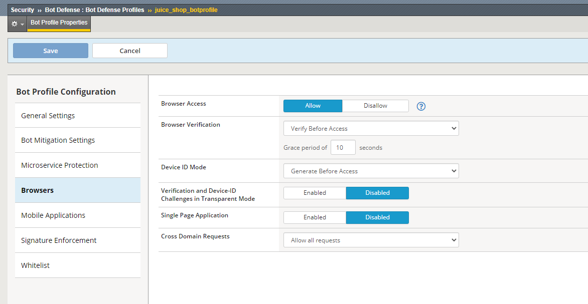

Task 4 - Test Device ID based Brute Force Protection
~~~~~~~~~~~~~~~~~~~~~~~~~~~~~~~~~~~~~~~~~~~~~~~~~~~~

#.  Open a new **incognito window** window in **Chrome** .

#.  Go to the to WebGoat login page at ``https://insecureapp1.f5.demo/WebGoat/login``

#.  Attempt to login using a **different username** and password each time until blocked.

#. Once Blocked close the browser and re-open a new **incognito window** in **Chrome**

#. Attempt to login using a different username as in step 3, your first login request should be blocked.

#. Examine the most recent requests in the event log by navigating to Security -> Event Logs -> Applications -> Requests:

    |lab1-6|

#. Click on the Occurrences and notice the Device ID in the request.

    |lab1-7|

|
|

**This concludes Lab 1.1**
