Lab 2.1: Allowed HTTP Request Methods
----------------------------------------------------------
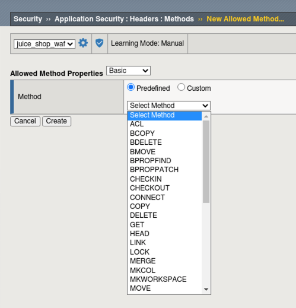
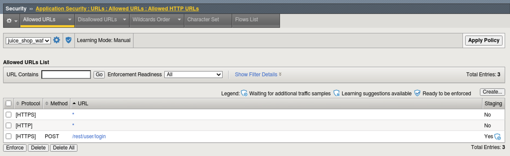
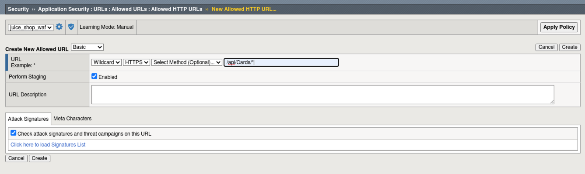
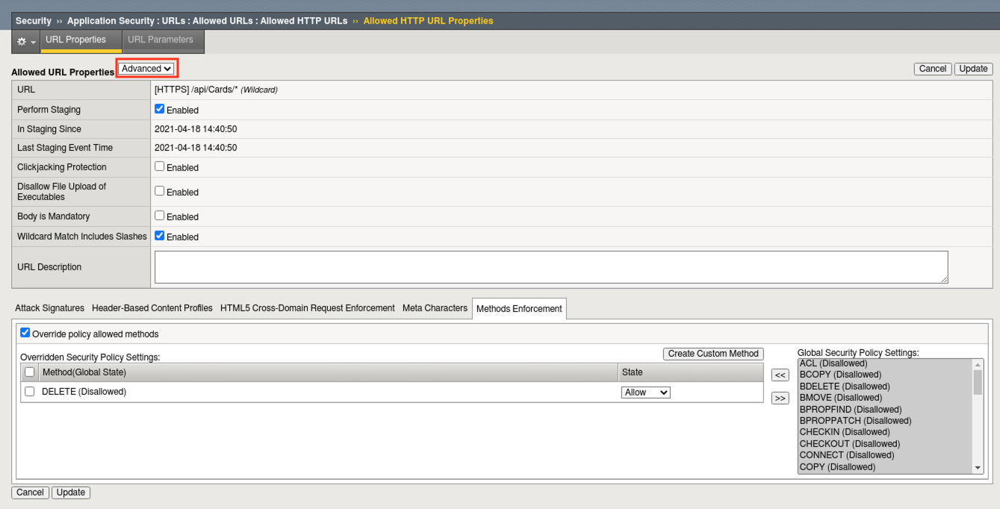
.. |lab2.1-4| image:: images/lab2.1-4.png
        :width: 800px
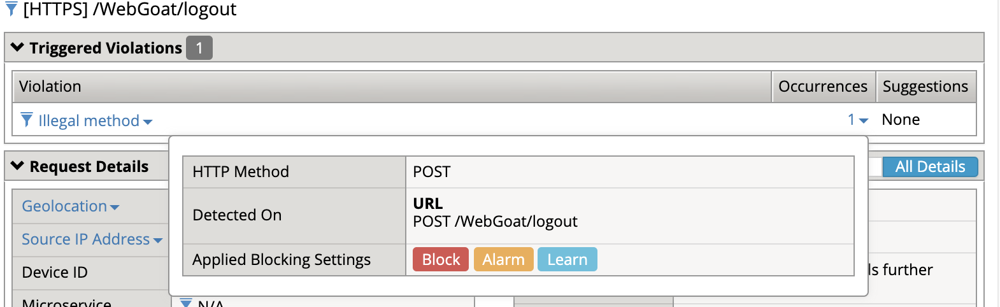
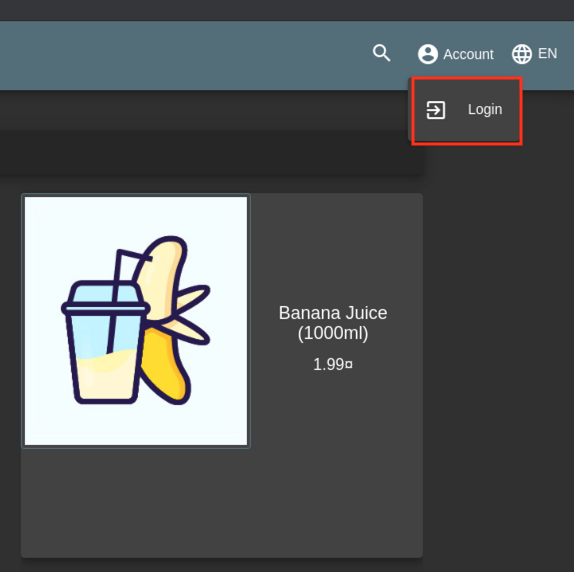
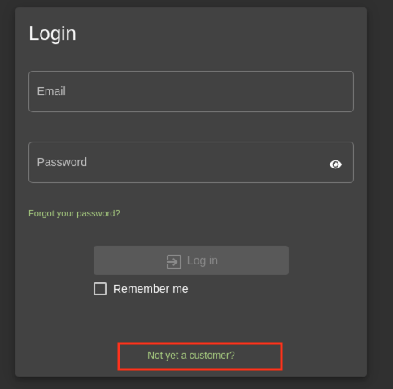
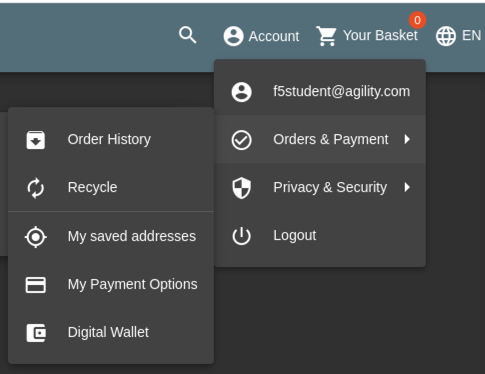
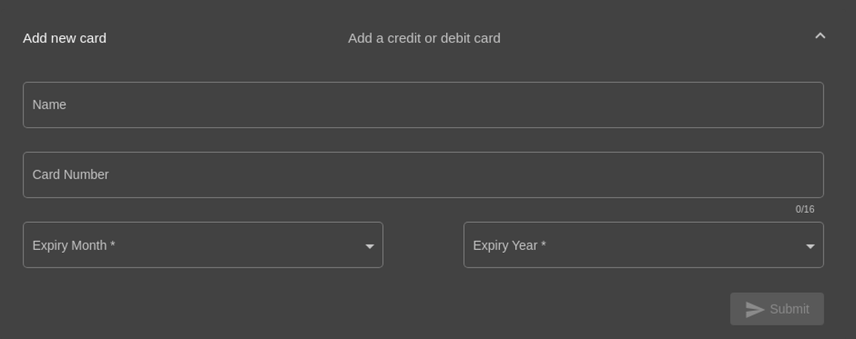
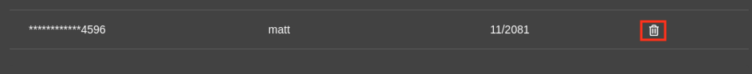
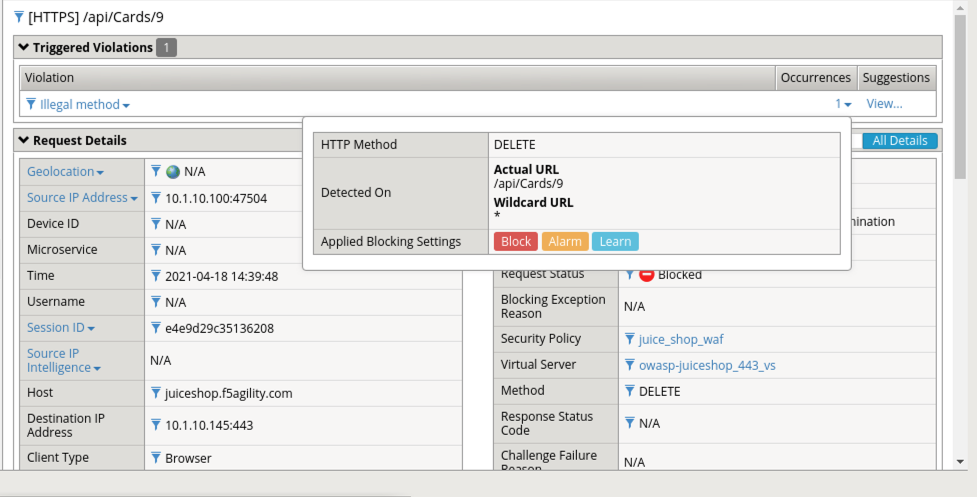

Task 1 - Allowed Methods
~~~~~~~~~~~~~~~~~~~~~~~~~~~~~~~~~~~~~~~~~~~~~~~~~~~~~

#. Sign up for an account on Juiceshop by navigating to Account > Login.  

        |lab2.1-0|

#. On the following page click on "Not yet a customer?".

        |lab2.1-0a|

#. Complete the user registration fields with any information you like and click "Register"  

#. Login to your account

#. Once logged in navigate to **Account > Orders & Payments > My Payment Options**

        |lab2.1-0b|

#. Add a Card, any numbers will work on Juiceshop, just be sure to use 16 digits and click **Submit**.

        |lab2.1-0c|

#. Delete the card by clicking on the 'Delete" Icon as seen. Are you able to delete ? Why ?

        |lab2.1-0d|

#. Examine the most recent requests in the event log by navigating to **Security -> Event Logs -> Applications -> Requests**. You should see a violation for "Illegal Method"

        |lab2.1-0e|

#. In the BIG-IP WebUI navigate to **Security -> Application Security -> Headers -> Methods**.

#. Policy wide Method permissions are configured here.  If your application requires a method beyond the default three, they can be added by clicking the **Create** button.

    |lab2.1-1|

Task 2 - Restricting Method on per URL basis
~~~~~~~~~~~~~~~~~~~~~~~~~~~~~~~~~~~~~~~~~~~~~

#. Let's go to our Allowed URLs list **Security -> Application Security -> URLs -> Allowed URLs**.

#. View the settings for the URLs, notice the method can optionally be specified for the URL while creating:

    |lab2.1-2|

#. Click **Create** to create a new allowed url as seen below 
the URL for /api/Cards/*. 

    |lab2.1-3|

#. Examine the created URI and switch to the advanced view and select the methods enforcement tab and 
check override policy allowed methods and slide "POST" with a state of disallow and click **update** and then click 
**Apply policy**
    |lab2.1-3a|

#. Attempt to delete the card

#. What is the result, and why?  The card is deleted since you now are allowing the DELETE method on the /api/Cards/* uri.

**This concludes section 2.1**
