Lab 3.1: DataSafe
-----------------------

F5 Advanced WAF includes DataSafe which can protect your web applications from credential theft by MITB malware. In this exercise you will configure DataSafe to protect the Juiceshop login page from credential theft.

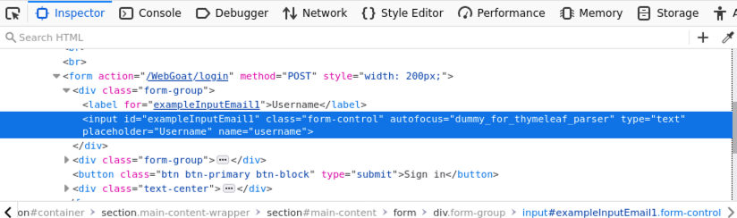
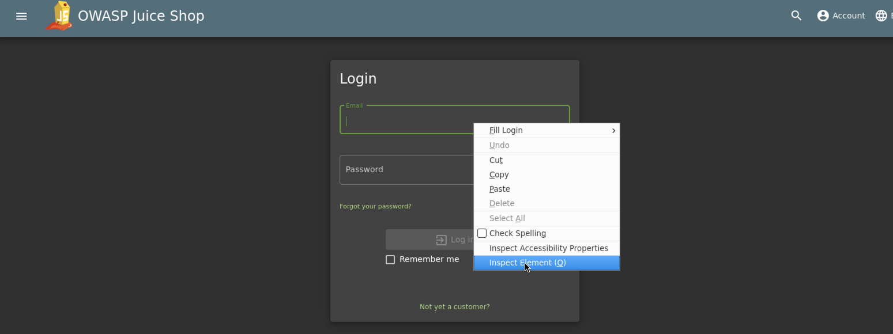
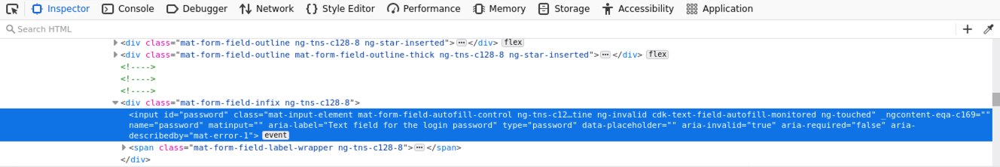
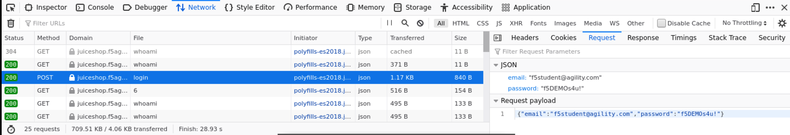
.. |lab3-1| image:: images/lab3-1.png
        :width: 800px
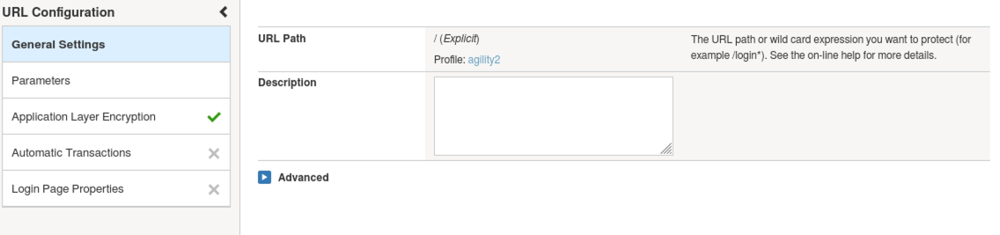
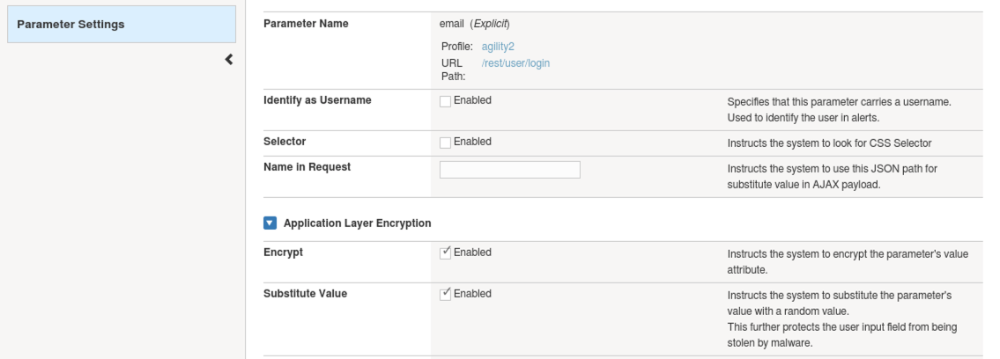
.. |lab3-4| image:: images/lab3-4.png
        :width: 800px
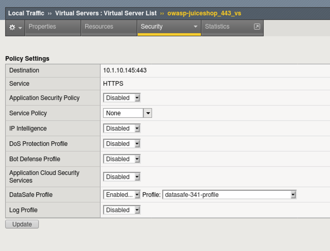
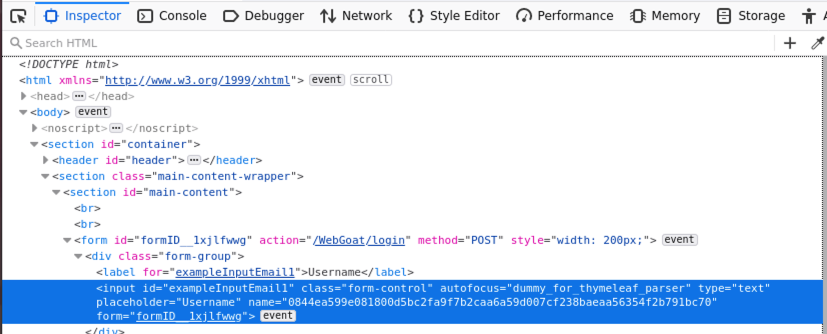
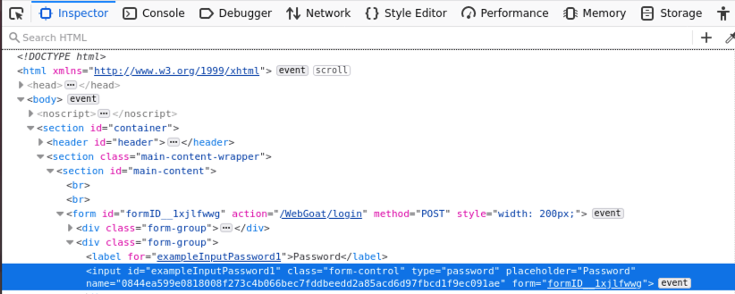
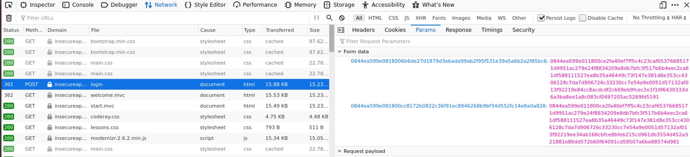
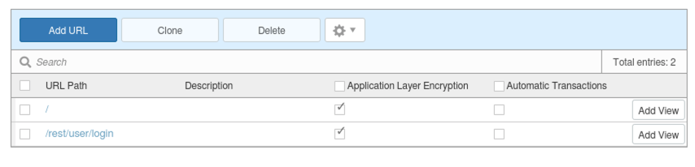
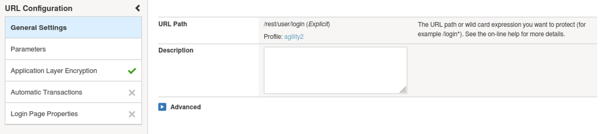

Task 1 - Login Observation
~~~~~~~~~~~~~~~~~~~~~~~~~~~

#. Open a new Firefox Private Browsing window and go to the to Juiceshop login page by clicking **account** and then **login** in the upper right hand corner of the page 

#. Right click in the **email** field and choose **inspect element** (or use CTRL + SHIFT + N). Notice the form field is visible and is named **email**

    |Lab3-00|

    |Lab3-01|

#. Right click in the password field and choose 'inspect element'. Notice the form field is visible and is named 'password'

    |Lab3-02|

#. Click in the **Network** tab in the Firefox Inspector and click **Persist logs**

#. Login to the Juiceshop application as **f5student@agility.com**

#. In the Firefox Inspector Network tab find the POST request to /rest/user/login. Notice the username and password are in clear text in the request and are in a JSON format.

    |Lab3-03|

Task 2 - Configuring DataSafe
~~~~~~~~~~~~~~~~~~~~~~~~~~~~~~~~

#. Browse to the BIGIP GUI.

#. Navigate to **Security -> Data Protection -> BIG-IP Data Safe** and click + to create a new profile.

#. Name the new Data Safe profile **datasafe-341-profile** .

    |Lab3-1|

#. Add 2 urls with settings seen below (notice case on url must be all lowercase)

	|Lab03-02|    

	|Lab3-2|
    
	|Lab3-2a|

#. Add parameter **email** as seen below to the /rest/user/login url.

    |Lab3-3|

   

#. Apply Data Safe Profile to the owasp-juiceshop_443_vs Virtual Server and remove any WAF or other policies.

    |Lab3-5|

Task 3 - Test Data Safe Configuration
~~~~~~~~~~~~~~~~~~~~~~~~~~~~~~~~~~~~~~~

#. Open a new Firefox Private Browsing window and go to the to Juiceshop login page 

#. Login to the Juiceshop application as f5student@agility.com

#. In the Firefox Inspector Network tab find the POST request to /rest/user/login. Notice the JSON username and password fields are no longer in clear text.

    |Lab3-08|

This concludes Lab 3.1.
